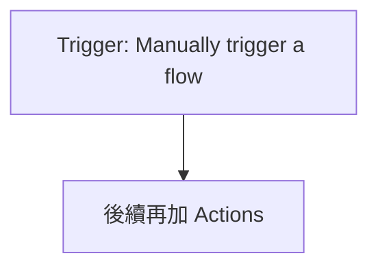
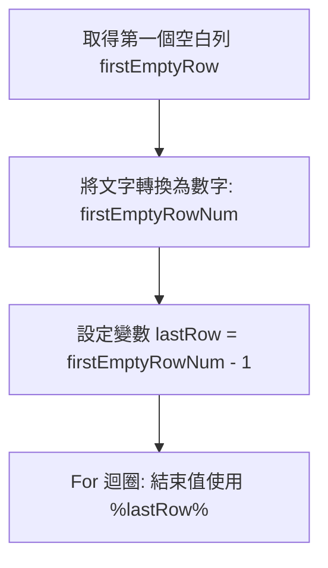

# 檔案查找流程設計

**Created**: 2025-12-14T16:09:05.627857

## User

任務 檔案查找
條件: 請使用者提供路徑及excel檔案
規格: 依照excel檔案中P欄的路徑 查找檔案，如果有找到Q欄填寫Y，沒找到填寫N

## User

任務 檔案查找
條件: 請使用者提供路徑及excel檔案
規格: 依照excel檔案中P欄的路徑 查找檔案，如果有找到Q欄填寫Y，沒找到填寫N

公司檔案在內網檔案伺服器（File System）或是D槽

## AI

### A. 需求理解（摘要）
- 目標：依照 Excel 表格中 **P 欄（路徑）** 去查找檔案是否存在。  
- 觸發：由使用者手動提供「**檔案查找的根路徑/站台**」與「**Excel 檔**」後執行。  
- 資料來源：Excel（P 欄每列一個要查找的檔案路徑）。  
- 資料去向：同一份 Excel 的 **Q 欄** 回寫結果：找到填 **Y**、找不到填 **N**。  
- 成功條件：每一列都完成判斷並回寫，流程失敗時能通知與保留可追查資訊。  
- 限制：Excel 必須是 **Table（表格）**，否則「列出資料列/更新資料列」會失敗。

---

### B. 建議方案（架構選型與原因）
**方案 1（首選）：SharePoint/OneDrive 檔案庫查找（標準連線器）**  
- 用 **SharePoint / OneDrive for Business** 的 **Get file metadata using path（依路徑取得檔案中繼資料）** 來判斷存在與否：成功=存在、失敗=不存在。  
- 好處：最低複雜度、可維運、無需自建服務，回寫 Excel 也用標準 Excel Online（Business）連線器。

**方案 2（替代）：公司檔案在內網檔案伺服器（File System）**  
- 使用 **File System** 連線器（搭配 On-premises data gateway）查檔是否存在，再回寫 Excel。  
- 若你的檔案路徑是 `\\server\share\...` 這類 Windows UNC，多半要走這條。

**【Premium 判斷】**  
- 方案 1：通常 **不需要 Premium**（SharePoint / OneDrive / Excel Online (Business) 一般為標準）。  
- 方案 2：**可能需要 Premium**（File System 連線器與 Gateway 情境常見需要付費方案/組織授權，依租戶授權而定）。

---

### C. Flow 設計（流程圖 + 主要元件）
```mermaid
flowchart TD
  T[Trigger: Manually trigger a flow<br/>輸入：站台/根路徑、Excel檔] --> F1[Create file (SharePoint/OneDrive)<br/>把上傳的Excel存到指定資料夾]
  F1 --> X1[List rows present in a table (Excel Online (Business))]
  X1 --> A1[Apply to each（逐列處理）]
  A1 --> S1[Scope: Try-GetMetadata<br/>Get file metadata using path]
  S1 -->|Success| UY[Update a row (Excel)<br/>Q=Y]
  S1 -->|Fail（run after）| UN[Update a row (Excel)<br/>Q=N]
  UY --> A1
  UN --> A1
  A1 --> END[完成]
  END --> EH[Scope: Error Handler（失敗通知/記錄）]
```

**主要元件**
- Trigger：**Manually trigger a flow**
- Excel：**Excel Online (Business) – List rows present in a table / Update a row**
- 查找檔案：  
  - SharePoint：**Get file metadata using path**（或 OneDrive for Business 同名動作）
- 例外處理：**Scope（Try/Catch）+ Configure run after + 通知（Email/Teams）**

---

### D. 逐步操作教學（Power Automate 一步一步）
> 以下以「檔案都在 SharePoint 文件庫」為首選示範；若你是 OneDrive 同理替換連線器即可。

#### Step 1：建立流程
1) 介面路徑：**Create → Instant cloud flow**  
2) 選 Trigger：**Manually trigger a flow**  
3) 加入輸入（Trigger 內按 *Add an input*）  
   - Input 1：**Text** → 名稱：`SiteAddressOrBasePath`（範例：`https://contoso.sharepoint.com/sites/ABC` 或 根路徑用）  
   - Input 2：**Text** → 名稱：`LibraryRoot`（範例：`/Shared Documents` 或 `Shared Documents` 視你內部習慣統一）  
   - Input 3：**File** → 名稱：`ExcelFile`（使用者上傳 Excel）
4) 需要連線（Connection）：  
   - SharePoint（有讀/寫文件庫權限）  
   - Excel Online (Business)（可存取該 SharePoint 文件庫中的 Excel）

#### Step 2：把使用者上傳的 Excel 存到固定位置（避免後續 Excel 連線器抓不到）
1) 新增 Action：**SharePoint – Create file**  
2) 重要欄位：  
   - **Site Address**：選固定站台（【待確認】或由你管理的站台）  
   - **Folder Path**：例如：`/Shared Documents/PA_Temp`（建議先建好資料夾）  
   - **File Name**：動態內容選 Trigger 的 **File name**  
   - **File Content**：動態內容選 Trigger 的 **File content**  
3) 權限：執行帳號需對該資料夾有「新增/編輯」權限。

> 備註：若你不想建立暫存檔，也可改成「使用者直接提供已在 SharePoint 的 Excel 路徑」，那就不用 Create file，但你原需求是「使用者提供 Excel 檔案」，所以我先用可落地的上傳→存檔作法。

#### Step 3：列出 Excel Table 內所有列（重點：Excel 必須是 Table）
1) 新增 Action：**Excel Online (Business) – List rows present in a table**  
2) 重要欄位：  
   - **Location**：SharePoint Site  
   - **Document Library**：例如 `Documents`  
   - **File**：選 Step 2 Create file 的輸出（通常是 Identifier / Id）  
   - **Table**：選你的表格名稱（例如 `Table1`）  
3) 設定（… → Settings）：  
   - **Pagination**：On  
   - **Threshold**：依資料量（例如 5000/10000）  
4) 大量資料建議：先把後續更新 Excel 的 **Concurrency control 關閉或設為 1**，避免 Excel 鎖定。

#### Step 4：逐列查檔 + 回寫 Q 欄
1) 新增控制：**Apply to each**  
   - 來源：選 Step 3 的 `value`（每列資料）

2) 在 Apply to each 內新增 **Scope**（命名：`TryGetMetadata`）  
   - Action：**SharePoint – Get file metadata using path**  
   - 重要欄位：  
     - **Site Address**：同一個站台（或依你的檔案分布）【待確認】  
     - **File Path**：由 `LibraryRoot` + P 欄組合（見下方範例）

3) 成功分支（找到檔案）：在 `TryGetMetadata` Scope 後新增 **Excel Online (Business) – Update a row**  
   - **Key Column / Key Value**：建議你在 Excel Table 新增一欄 `ID`（唯一值）並用它更新（最穩定）  
   - 欄位對應：  
     - `Q` → 填入 `Y`

4) 失敗分支（找不到檔案）：再新增一個 **Excel Online (Business) – Update a row**（或同一個 Update 動作複製一份）  
   - 右上角 `…` → **Configure run after**：勾選 `TryGetMetadata` 的 **has failed / has timed out**  
   - 欄位對應：  
     - `Q` → 填入 `N`

---

### E. 關鍵設定與範例（條件、公式、欄位映射）
#### 1) 路徑組合（P 欄是相對路徑的情況）
- 假設 P 欄只放：`/ProjectA/Files/abc.pdf`  
- 你希望完整路徑是：`/Shared Documents` + P 欄  
在 **Get file metadata using path → File Path** 可用 Expression：
```text
concat(
  if(startsWith(triggerBody()?['text_2'], '/'), triggerBody()?['text_2'], concat('/', triggerBody()?['text_2'])),
  if(startsWith(items('Apply_to_each')?['P'], '/'), items('Apply_to_each')?['P'], concat('/', items('Apply_to_each')?['P']))
)
```
> 上面假設 `LibraryRoot` 是 Trigger 的第 2 個文字輸入（實際欄位名稱依你命名；我這裡用 `text_2` 只是示意，你在動態內容挑你命名的 `LibraryRoot` 即可）。

#### 2) 若 P 欄已經是完整的 SharePoint server-relative path
- 例如：`/Shared Documents/ProjectA/Files/abc.pdf`  
那 **File Path** 直接用：
```text
items('Apply_to_each')?['P']
```

#### 3) Excel 更新的 Key（強烈建議）
- 在 Excel Table 新增欄位：`ID`（每列唯一，例如 1,2,3…或 GUID）  
- `Update a row`：  
  - **Key Column**：`ID`  
  - **Key Value**：`items('Apply_to_each')?['ID']`  
  - `Q`：填 `Y` 或 `N`

#### 4) 大量資料注意事項
- Excel 連線器容易遇到鎖定/節流：  
  - Apply to each → `…` → **Settings** → **Concurrency control = On，Degree of Parallelism = 1**（或乾脆關閉並讓它序列跑）  
- List rows：Pagination 開啟 + Threshold 設足夠。

---

### F. 測試與驗證（含預期結果）
1) 準備測試資料  
- Excel 必須先把資料區塊轉成 Table（Excel：選取資料 → **插入 → 表格**）  
- P 欄放 3 筆：  
  - 1 筆確定存在的路徑  
  - 1 筆不存在的路徑  
  - 1 筆含空白或多餘斜線的路徑（測試容錯）

2) 執行測試  
- Flow → **Test** → 手動 → 上傳 Excel + 填 `LibraryRoot`  
- 觀察 **Run history**：  
  - `Get file metadata using path`：成功/失敗是否符合預期  
  - `Update a row`：每列是否正確寫入 Q=Y/N

3) 成功標準  
- Excel 每一列 Q 欄都有值（Y 或 N），且與實際檔案存在狀態一致  
- Flow 最終狀態 Success（或即使部分失敗也有通知/記錄）

---

### G. 常見問題與排除（Troubleshooting）
1) **List rows present in a table 找不到 Table / 讀不到資料**  
- 原因：Excel 沒有轉成 Table，或 Table 名稱選錯  
- 解法：在 Excel 內把資料轉 Table、確認 Table 名稱（例如 Table1）

2) **Get file metadata using path 404 / The file does not exist**  
- 原因：路徑格式不對（少了 `/Shared Documents`、斜線方向錯、空白沒處理）  
- 解法：統一 P 欄格式（建議存 server-relative path），或用 `trim()` / `replace()` 清理

3) **Update a row 找不到 Key / 更新到錯列**  
- 原因：沒有穩定的唯一鍵  
- 解法：新增 `ID` 欄並確保唯一；Update a row 用 `ID` 來更新

4) **Excel 被鎖住 / 429 Too Many Requests / 節流**  
- 原因：並行更新太多列或頻繁寫入  
- 解法：Apply to each Concurrency=1、必要時分批（例如每 200 筆寫一次/或加 Delay）

5) **權限不足（Access denied / Forbidden）**  
- 原因：連線帳號沒有對文件庫/檔案路徑的讀取權限或沒有對暫存資料夾寫入權限  
- 解法：確認 SharePoint 權限（至少讀取；若要上傳 Excel 暫存檔需寫入），必要時改用服務帳號並控管

6) **P 欄是 Windows UNC（\\server\share）但你用 SharePoint 動作**  
- 原因：資料來源不是 SharePoint/OneDrive  
- 解法：改用方案 2（File System + Gateway），或先把檔案集中到 SharePoint/OneDrive

---

### H. 上線與維運建議
- 權限  
  - Flow Owner 用服務帳號（最小權限：暫存資料夾寫入、目標路徑讀取、Excel 檔讀寫）  
  - 需要給其他人跑：設定 **Run-only users**，避免共用個人連線造成離職/換密碼斷線
- DLP 與資料安全  
  - 若 P 欄包含敏感路徑/客戶資料，限制可存取該 Excel 的人員  
  - 組織層級設定 DLP（避免把資料送到不允許的連線器）
- 監控告警  
  - 加一個「失敗通知」Scope：Flow 失敗時寄 Email/Teams（包含 Run link、錯誤訊息）  
  - 對 `Get file metadata using path` 設定適當 Retry policy（避免暫時性錯誤）
- 版本管理  
  - Flow 命名：`檔案查找_回寫Excel_YN_v1`  
  - 建議 Dev/Test/Prod 分環境，並用 Solution 管理（可搬移與控管）

---

### I. 【待確認】清單（為了能100%落地）
1) 你要查找的檔案實際放在哪裡？**SharePoint 文件庫 / OneDrive / 內網檔案伺服器(UNC)**  
2) P 欄的路徑格式是什麼？（例：`/Shared Documents/...`、`/Project/...`、或 `\\server\share\...`）  
3) 是否需要「使用者上傳 Excel」後立即處理，還是 Excel 已固定存放在某個 SharePoint 路徑？  
4) Excel 裡是否已經有「唯一鍵」欄位（例如 `ID`）？如果沒有，我建議加一欄。可接受嗎？  
5) 目標檔案可能跨多個 Site/Library 嗎？還是都在同一個文件庫底下？  
6) 資料量級大約幾列？（例如 100、5,000、50,000）  
7) 找到檔案的定義：只要同名檔存在就算？還是必須完全符合路徑（含副檔名）？  
8) 除了回寫 Q=Y/N，是否還要回寫「找到的檔案連結/最後修改時間」等欄位？

---

如果你先回答上面【待確認】第 1、2、4 題（最關鍵），我就能把「File Path 組合公式、站台/文件庫選擇、以及 Update a row 的 Key 設定」替你直接對到你們的真實格式，流程就可以照著一步一步做完並上線。

## AI

### A. 需求理解（摘要）
- 目前你尚未提供具體情境（觸發來源/資料來源/輸出去向/成功條件），因此我無法直接「照做就能成功」地落地一支 Flow。  
- 我先提供一個**最常見、最低複雜度、可維運**的「通用範本」：**SharePoint 清單建立/更新 → 發起審核 → 回寫狀態 → 通知 → 失敗告警**。  
- 待你補齊【待確認】資訊後，我可以把範本改成完全符合你公司資料源（例如：Forms/Excel/Teams/Email/Dataverse/ERP）與欄位映射。  
- 成功條件（暫定）：建立或更新一筆資料後，能正確送出審核、審核結果回寫、通知送達、失敗時可追蹤與告警。  

---

### B. 建議方案（架構選型與原因）
**方案 1（首選｜標準連線器｜好維運）**：SharePoint List 作為主資料表  
- 觸發：SharePoint「When an item is created」或「When an item is created or modified」  
- 優點：標準連線器、權限治理清楚、欄位型別完整、好追蹤、容易擴充審核/通知/附件。  
- 適用：需求單、採購申請、請假、報修、任何「表單→流程→狀態回寫」場景。

**方案 2（替代｜若不能用 SharePoint）**：Microsoft Forms + Excel/OneDrive（或郵件）  
- 觸發：Forms「When a new response is submitted」→ 取回回覆 → 寫入 Excel Table（注意必須是 Table）→ 審核/通知  
- 優點：上手快、前端填寫友善。  
- 風險：Excel 容易遇到鎖定、併發、效能限制；大量資料不建議。

**【Premium 判斷】**  
- 方案 1：**不需要 Premium（通常）**，使用 SharePoint / Approvals / Outlook / Teams 等標準連線器即可。  
- 若你要接 **Dataverse、HTTP、SQL、SAP、ServiceNow** 等，可能需要 Premium（依租戶授權而定）【待確認】。

---

### C. Flow 設計（流程圖 + 主要元件）
> **暫定（以 SharePoint 審核流程範本示範）**

```mermaid
flowchart TD
  T[Trigger: SharePoint - When an item is created] --> G[Get item (optional, for full fields)]
  G --> I[Initialize variable: varRequestId / varRequesterEmail]
  I --> C{Condition: 狀態是否為 '送審'?}
  C -- 否 --> End[Terminate: Not submitted]
  C -- 是 --> A[Start and wait for an approval]
  A --> U[Update item: 回寫審核結果/狀態/簽核人/簽核時間]
  U --> N[Send email / Post message in Teams]
  N --> S[Scope Success End]
  T --> EH[Scope Error Handler (run after has failed)]
  EH --> NE[Notify admin + Create log item]
  NE --> Term[Terminate: Failed]
```

**主要元件（Actions）**
- Trigger：**SharePoint – When an item is created**（或 created or modified）  
- Actions：  
  - **Get item**（可選）  
  - **Initialize variable**（多個）  
  - **Condition**  
  - **Approvals – Start and wait for an approval**  
  - **SharePoint – Update item**  
  - **Office 365 Outlook – Send an email (V2)** 或 **Microsoft Teams – Post a message**  
  - 錯誤處理：**Scope + Configure run after + Terminate**

---

### D. 逐步操作教學（Power Automate 一步一步）
> 以下用「SharePoint 清單：Requests」示範（欄位名稱也以示範給你，可改成你的實際欄位）

#### Step 1｜建立清單與欄位（SharePoint）
1) 進入 SharePoint 站台 → **Site contents** → **New → List**  
2) 建立清單名稱：`Requests`  
3) 建議欄位（範例）  
   - `Title`（單行文字）＝申請主旨  
   - `Status`（選項）：Draft / Submitted / Approved / Rejected  
   - `Requester`（人員 Person）  
   - `Approver`（人員 Person）或 `ApproverEmail`（單行文字）  
   - `ApprovalComment`（多行文字）  
   - `ApprovedBy`（人員）  
   - `ApprovedTime`（日期時間）

> 權限：Flow 連線帳號至少要有此清單「編輯」權限。

#### Step 2｜建立 Flow
1) Power Automate → 左側 **Create → Automated cloud flow**  
2) Flow Name：`SP-Requests-Approval`  
3) Trigger 選：**SharePoint – When an item is created** → Create

#### Step 3｜設定 Trigger
1) Trigger：**When an item is created**  
2) Site Address：選你的站台  
3) List Name：`Requests`

#### Step 4｜（可選）Get item 取完整欄位
1) 新增 Action：**SharePoint – Get item**  
2) Site Address：同上  
3) List Name：`Requests`  
4) Id：選 Trigger 的 `ID`

> 若 Trigger 已含你要的欄位，可省略；但很多情況 Get item 比較穩。

#### Step 5｜初始化變數（方便維護與表達式）
1) Action：**Initialize variable**  
   - Name：`varStatus`（String）  
   - Value：`Status`（來自 Trigger 或 Get item）
2) Action：**Initialize variable**  
   - Name：`varApproverEmail`（String）  
   - Value（擇一）：  
     - 若用 Person 欄位 `Approver`：選 `Approver Email`  
     - 若用文字欄位：選 `ApproverEmail`
3) Action：**Initialize variable**  
   - Name：`varTitle`（String）  
   - Value：`Title`

#### Step 6｜條件判斷：只在 Submitted 才送審
1) Action：**Condition**  
2) Left：`varStatus`  
3) Operator：**is equal to**  
4) Right：`Submitted`

- 如果 **No**：  
  - Action：**Terminate**  
  - Status：`Succeeded`  
  - Message：`Not in Submitted status, skip.`

#### Step 7｜送出審核
1) 在 Condition 的 **Yes** 分支新增 Action：**Approvals – Start and wait for an approval**  
2) Approval type：`Approve/Reject – First to respond`（單一簽核人）  
3) Title：`Approval: @{variables('varTitle')}`  
4) Assigned to：`varApproverEmail`  
5) Details：填入申請內容摘要（可放欄位，例如 Requester、說明等）

> 若需要多位簽核：改用 `Everyone must approve` 或拆成階段式流程（可後續再擴充）。

#### Step 8｜回寫結果到 SharePoint
1) Action：**SharePoint – Update item**  
2) Site Address：同上  
3) List Name：`Requests`  
4) Id：選 Trigger 的 `ID`  
5) 欄位回寫（範例）
   - `Status`：用表達式（見下一節）  
   - `ApprovalComment`：`Outcome` + `Comments`（可組字串）  
   - `ApprovedBy`：`Responder`（Approvals 的回應人，若型別不合改存 Email/DisplayName）  
   - `ApprovedTime`：`Response date`

#### Step 9｜通知申請人（Email 或 Teams）
- Email（標準）：  
  1) Action：**Office 365 Outlook – Send an email (V2)**  
  2) To：`Requester Email`（若 Requester 是 Person 欄位可選其 Email）  
  3) Subject：`Your request is @{outputs('Start_and_wait_for_an_approval')?['body/outcome']}`  
  4) Body：放結果、簽核意見、連回清單項目連結（可用 `Link to item`）

---

### E. 關鍵設定與範例（條件、公式、欄位映射）
#### 1) 審核結果→狀態回寫（可直接貼）
- 假設 Approvals 動作名稱為 `Start_and_wait_for_an_approval`
- 將 `Status` 設為：
```text
if(equals(outputs('Start_and_wait_for_an_approval')?['body/outcome'],'Approve'),'Approved','Rejected')
```

#### 2) 組合審核留言（示範）
```text
concat('Outcome: ', outputs('Start_and_wait_for_an_approval')?['body/outcome'],
       '\nComment: ', outputs('Start_and_wait_for_an_approval')?['body/comments'])
```

#### 3) 大量資料與迴圈注意
- 本範本通常不需要 Apply to each；若你要針對多筆或多簽核人：  
  - 開啟 **Concurrency control**（Apply to each 設定）避免鎖死  
  - SharePoint/Outlook 有節流風險，建議分批或佇列化（可用清單狀態 + 排程 Flow）

---

### F. 測試與驗證（含預期結果）
1) 在 SharePoint `Requests` 新增一筆資料  
   - Status = `Submitted`  
   - Approver 有填 Email 或 Person  
2) 到 Power Automate → 該 Flow → **Run history**  
3) 檢查重點輸出  
   - Condition 是否走 **Yes**  
   - Approval 是否成功產生並可回覆  
   - Update item 是否成功把 `Status/ApprovedTime/Comment` 寫回  
   - Email/Teams 是否送達  
4) 成功標準  
   - 審核人收到 Approval 卡片並可回覆  
   - SharePoint 該筆 `Status` 變更為 Approved/Rejected  
   - 申請人收到通知

---

### G. 常見問題與排除（Troubleshooting）
1) **Approvals 發不出去 / Assigned to 空白**  
   - 原因：`ApproverEmail` 沒值或 Person 欄位取錯屬性  
   - 解法：在 Run history 看 `varApproverEmail`，確認取的是 `Email`；必要時先加一步 **Compose** 印出值。

2) **Update item 失敗：欄位型別不合（例如 ApprovedBy）**  
   - 原因：你把 Approvals 的 Responder（文字）寫到 Person 欄位  
   - 解法：改存到「單行文字」欄位（例如 `ApprovedByEmail`），或用「人員欄位需要 claims 格式」的寫法（較複雜）。

3) **Condition 永遠不進 Submitted**  
   - 原因：Status 選項值大小寫/顯示名稱不同（Submitted vs 送審）  
   - 解法：在 Condition 右側改成實際選項值；或先用 Compose 印出 Status。

4) **重複送審（created or modified 觸發很常見）**  
   - 原因：用「When an item is created or modified」時，Update item 也會再觸發  
   - 解法：  
     - 用 `When an item is created`（首選）  
     - 或加條件：只有 Status 從 Draft→Submitted 才送審（需比較前後值，或用額外欄位 `SubmittedTime` 防重）。

5) **權限不足（403/Access denied）**  
   - 原因：連線帳號對清單沒編輯權或站台權限不足  
   - 解法：確認 Flow 使用的 Connection 帳號，並在 SharePoint 給至少 Contribute；必要時用服務帳號並控管權限。

---

### H. 上線與維運建議
- 權限：  
  - Owner 建議用「服務帳號」持有 Flow；使用者用 Run-only users（若是手動觸發）  
  - SharePoint 清單權限分層：申請人只能看自己的項目（若涉及個資/敏感資料）
- 安全治理：  
  - 涉及個資（姓名、Email、申請內容）請確認 DLP policy、最小權限、稽核紀錄保留  
  - 避免把敏感資料直接發到群組 Teams 頻道
- 監控告警：  
  - 失敗時寄信給管理者 + 在清單寫一筆 Log（建議另建 `FlowLogs` 清單）  
  - Scope + Configure run after + 重試策略（重要動作開啟 retry）
- 版本管理：  
  - 命名：`[Env]-[System]-[Process]-v1`  
  - Dev/Test/Prod 分環境，使用 Solution 打包部署（若你有 ALM 需求）

---

### I. 【待確認】清單（請回覆我，最多 8 題）
1) 你的**觸發**是什麼？（SharePoint/Forms/Email/Teams/排程/Power Apps 按鈕…）  
2) 你的**資料來源**與**資料去向**是？（SharePoint 清單、Excel、Dataverse、SQL、ERP…）  
3) 是否需要**審核**？審核人如何決定（固定人/依部門/依金額/多階段）？  
4) 目前已有欄位/表單嗎？請提供欄位清單（名稱+型別）或截圖。  
5) 是否有**附件**要跟著流程走？附件要存到哪（SharePoint/OneDrive）？  
6) 預估量級：每天/每週大約幾筆？是否有大量歷史資料要回補？  
7) 通知要用哪種：Outlook 郵件 / Teams 私訊 / Teams 頻道 / 推播？  
8) 是否有任何**Premium 限制**或租戶政策（DLP 禁用某些連線器）？

把以上資訊貼上來後，我會把範本「改成你的實際 Flow」，並補上完整欄位映射、表達式、錯誤處理與上線設定。

## User

任務 檔案查找 
觸發條件: 手動
條件: 啟動後一開始，就請使用者提供路徑及excel檔案，檔案在內網檔案伺服器（File System）或是D槽 
規格: 依照excel檔案中P欄的路徑 查找檔案，如果有找到Q欄填寫Y，沒找到填寫N

## User

任務 檔案查找 
觸發條件: 手動
條件: 啟動後一開始，就請使用者提供路徑及excel檔案，檔案在內網檔案伺服器（File System）或是D槽 
規格: 依照excel檔案中P欄的路徑 查找檔案，如果有找到Q欄填寫Y，沒找到填寫N 

範例檔案 如附件
範例路徑: D:\公槽\第159期新進人員訓練

## AI

### A. 需求理解（摘要）
- 你要做一個**手動啟動**的流程，啟動後先由使用者輸入「根路徑（檔案伺服器/本機 D 槽）」與「Excel 檔案路徑」。
- Flow 需讀取 Excel 內 **P 欄**每列的「檔案路徑（通常含檔名）」，逐筆到**內網檔案伺服器（File System）或 D 槽**去查找檔案是否存在。
- 若找到，該列 **Q 欄寫入 `Y`**；找不到寫入 `N`，並存回原 Excel。
- 你提供的範例檔（InviteList_159.xlsx）中，`detail` 工作表第 **P=ExpectedDocPath(第16欄)**、**Q=FileExitst(第17欄)**，而 P 欄內容看起來是「相對路徑（沒有 D:\，用 / 分隔）」。

---

### B. 建議方案（架構選型與原因）
#### 方案 1（首選｜最貼近你的環境：檔案在 D 槽/檔案伺服器）
**Cloud flow（手動）→ 呼叫 Power Automate Desktop（PAD）在指定機器上直接開 Excel、檢查檔案、回寫 Y/N**
- 優點：  
  - 可直接存取 **D:\** 或內網分享路徑（UNC），也能直接操作「原始 Excel」  
  - **不需要把 Excel 搬到 OneDrive/SharePoint**  
  - Excel 不必先做成 Table（PAD 讀寫儲存格即可）
- 缺點：需要 RPA 能力（授權/機器）【見 Premium 判斷】

#### 方案 2（替代｜不想用 RPA 的情況）
**Cloud flow（手動）→ File System(經 Gateway) 取 Excel → 複製到 OneDrive/SharePoint → Excel Online 逐列更新 → 再寫回 File System**
- 優點：多數情況可用標準連線器完成（但需要 Gateway）
- 缺點：Excel Online **必須是 Table**（你範例檔目前不是 Table），而且要多一步「檔案複製來回」，維運較複雜。

#### 【Premium 判斷】
- **方案 1：可能需要 Premium**（因為「雲端 Flow 呼叫 PAD / Unattended RPA」通常需要 RPA 授權與機器 Runtime/Unattended）  
- **方案 2：通常不需要 Premium**（OneDrive/SharePoint + Excel Online + File System(經 On-premises data gateway) 多為標準連線器；但仍受你租戶授權與 DLP 影響）

> 你目前需求「Excel 在 D 槽/檔案伺服器且要直接回寫同一個檔」，我建議先走 **方案 1** 最穩。

---

### C. Flow 設計（流程圖 + 主要元件）
#### 方案 1（首選：Cloud → PAD）
```mermaid
flowchart TD
  T[Trigger: Manually trigger a flow] --> P1[Input: RootPath, ExcelPath, SheetName(optional)]
  P1 --> R[Run a flow built with Power Automate for desktop]
  R --> N[Send email/Teams: 完成通知(可選)]
  R --> EH[Scope Catch: 失敗通知/記錄]
```

**Cloud Flow 元件**
- Trigger：**Manually trigger a flow**
- Actions：
  - **Run a flow built with Power Automate for desktop**
  -（可選）**Send an email (V2)** / Teams 通知
  - 錯誤處理：**Scope + Configure run after + Terminate**

**PAD Flow 元件（在內網機器上跑）**
- Launch Excel（開啟 Excel 檔）
- 讀取 `detail` 工作表 UsedRange
- 逐列讀 P 欄 → 組合/正規化路徑 → 檢查檔案存在 → 寫回 Q 欄 Y/N
- Save & Close Excel
-（可選）輸出統計（找到/未找到筆數）

---

### D. 逐步操作教學（Power Automate 一步一步）
## 方案 1（首選）Cloud Flow
### Step 1｜建立 Cloud Flow（手動）
1) Power Automate → **Create → Instant cloud flow**  
2) Flow name：`Manual_FileCheck_UpdateExcel`  
3) Trigger 選：**Manually trigger a flow** → Create  

### Step 2｜在 Trigger 加入輸入欄位（給使用者填）
在 **Manually trigger a flow** 下面按 **+ Add an input**：
1) **Text**：`RootPath`  
   - 範例：`D:\` 或 `D:\公槽\第159期新進人員訓練\` 或 `\\FileServer\Share\公槽\`  
2) **Text**：`ExcelPath`  
   - 範例：`D:\公槽\第159期新進人員訓練\InviteList_159.xlsx`  
3)（可選）**Text**：`SheetName`（預設 detail）  
   - 範例：`detail`

> 權限：填入的路徑必須是「PAD 執行機器看得到」的路徑（非常重要）。

### Step 3｜呼叫 PAD Desktop flow
1) 新增 Action：**Run a flow built with Power Automate for desktop**  
2) 設定：
   - **Desktop flow**：選你等一下要建立的 PAD Flow（例如 `DF_FileCheck_UpdateExcel`）
   - **Machine / Machine group**：選安裝了 Power Automate machine runtime 的那台內網機器
   - **Inputs**：對應填入  
     - `in_RootPath` = Trigger 的 `RootPath`  
     - `in_ExcelPath` = Trigger 的 `ExcelPath`  
     - `in_SheetName` = Trigger 的 `SheetName`（或固定填 `detail`）

### Step 4｜加上錯誤處理（建議必做）
1) 在 Cloud Flow 用 **Scope** 包起來  
   - Scope：`Main`（包含 Run desktop flow）  
   - Scope：`Catch`（錯誤處理）
2) `Catch` 的 **Configure run after** 勾選：`has failed`, `has timed out`（針對 Main）
3) `Catch` 內加：
   - **Send an email (V2)** 給管理者/自己，附上：
     - `ExcelPath`、`RootPath`
     - `Run desktop flow` 的 error message
   - **Terminate**：Status = Failed

---

## 方案 1（首選）Power Automate Desktop（PAD）Flow
> 在內網那台有權限存取 D 槽/檔案伺服器的電腦建立

### Step 1｜建立 Desktop flow
1) 開啟 **Power Automate Desktop** → New flow  
2) Flow name：`DF_FileCheck_UpdateExcel`

### Step 2｜建立輸入參數
1) 右側 Variables → **Input/Output** → 新增 Input：
   - `in_RootPath`（Text）
   - `in_ExcelPath`（Text）
   - `in_SheetName`（Text，預設 `detail`）

### Step 3｜開啟 Excel
1) Action：**Launch Excel**  
   - Launch Excel：`Open document`  
   - Document path：`%in_ExcelPath%`  
   - Visible：建議先勾（測試階段），上線可不勾  
   - Save document：勾選（避免關閉沒存到）

### Step 4｜選擇工作表 & 取得 UsedRange
1) Action：**Activate worksheet**  
   - Worksheet name：`%in_SheetName%`（或固定 `detail`）
2) Action：**Get first free column/row from Excel worksheet**（可選）  
3) Action：**Read from Excel worksheet**  
   - Retrieve：`Values from a range of cells`  
   - Range：留空或用 UsedRange（依你習慣）  
   - Store into：`dtExcel`

> 你的範例檔第 1 列是標題列，所以資料從第 2 列開始。

### Step 5｜逐列檢查 P 欄路徑，回寫 Q 欄
1) Action：**For each**  
   - Value to iterate：`%dtExcel%`
2) 在迴圈內（假設你把資料列索引控制好；常見做法是用「For loop」從列號 2 跑到最後一列更直覺）  
   **建議用 For loop（最不容易搞錯欄位）**：
   - Action：**Get worksheet dimension**（或自行算最後一列）
   - Action：**For**  
     - Start：`2`  
     - End：`%LastRow%`  
     - Increment：`1`  
3) For 迴圈內：
   - Action：**Read from Excel worksheet**（讀單一儲存格）  
     - Cell：`P%CurrentIndex%`  
     - Store into：`txtPathInP`
   - Action：**Set variable**（正規化路徑，把 `/` 轉 `\`）  
     - `txtNormalized = Replace(txtPathInP, "/", "\")`
   - Action：**If**（判斷是否為絕對路徑）
     - 條件：`txtNormalized` **Contains** `:\`  或 `txtNormalized` **Starts with** `\\`
     - **Yes**：`fullPath = txtNormalized`
     - **No**：  
       - 先確保 RootPath 結尾是 `\`（可用 If 追加）  
       - `fullPath = in_RootPath + txtNormalized`
   - Action：**If file exists**  
     - File：`%fullPath%`
     - If Yes：寫入 `Y`
     - If No：寫入 `N`
   - Action：**Write to Excel worksheet**（寫回 Q 欄）
     - Value：`Y` 或 `N`
     - Cell：`Q%CurrentIndex%`

### Step 6｜儲存並關閉
1) Action：**Save Excel**  
2) Action：**Close Excel**（Close document and quit）

---

### E. 關鍵設定與範例（條件、公式、欄位映射）
#### 1) 欄位對應（以你範例檔）
- P 欄：`ExpectedDocPath`（第 16 欄）＝要找的檔案路徑（通常含檔名）  
- Q 欄：`FileExitst`（第 17 欄）＝輸出 `Y/N`

#### 2) 路徑組合（PAD 內邏輯）
- `txtNormalized = Replace(txtPathInP, "/", "\")`
- 絕對路徑判斷（任一成立即視為絕對路徑）  
  - Contains `:\`（例：`D:\xxx`）  
  - StartsWith `\\`（例：`\\server\share\xxx`）
- 否則：`fullPath = in_RootPath + txtNormalized`

#### 3) 大量資料注意事項
- 若筆數上千：  
  - PAD 建議用「讀單格 + 寫單格」雖慢但穩；要更快可用批次讀取區塊再批次寫回，但複雜度高  
  - 檔案伺服器 I/O 會是瓶頸，避免同時多人跑（或排程分批）

---

### F. 測試與驗證（含預期結果）
1) 準備測試：挑 3 筆 P 欄  
   - 1 筆確定存在  
   - 1 筆確定不存在  
   - 1 筆用相對路徑（驗證 RootPath 拼接）
2) 手動執行 Cloud Flow：填入  
   - RootPath：`D:\公槽\第159期新進人員訓練\`（示例）  
   - ExcelPath：`D:\...\InviteList_159.xlsx`
3) 驗證結果：  
   - Excel `detail` 工作表每列 Q 欄出現 `Y/N`  
   - Run history：`Run a flow built with Power Automate for desktop` 成功完成

---

### G. 常見問題與排除（Troubleshooting）
1) **找不到檔案，但其實檔案存在**
   - 原因：使用的是「映射磁碟（例如 Z:\）」但 PAD/服務帳號看不到映射；或 RootPath 拼接錯
   - 解法：改用 **UNC 路徑 `\\server\share\...`**；在 PAD 先把 `fullPath` 寫到 log/訊息框確認。

2) **Excel 被鎖定無法寫入/存檔**
   - 原因：有人正開著該 Excel、或檔案唯讀
   - 解法：流程前先通知使用者關檔；PAD 可加「If file is locked」的判斷（或失敗時寄信提示）。

3) **P 欄有空值導致錯誤**
   - 原因：某些列 P 欄空白
   - 解法：迴圈內先加 If：若 `isEmpty(txtPathInP)` → Q 寫 `N` 或 `Blank` 並 continue。

4) **路徑含非法字元或全形符號造成比對失敗**
   - 原因：路徑中有不可見字元、前後空白
   - 解法：加 `Trim()`；必要時把路徑輸出到文字檔檢查。

5) **Cloud Flow 呼叫 PAD 失敗**
   - 原因：Machine runtime 沒連線、機器離線、使用者沒權限、RPA 授權不足
   - 解法：確認 Machine online、Connection 正確、使用者有權限執行該 Desktop flow；先用 PAD 本地跑通再串雲端。

---

### H. 上線與維運建議
- 權限  
  - PAD 執行機器的 Windows 帳號需有：讀取目標資料夾、修改 Excel 檔案權限  
  - 若走檔案伺服器，建議用「服務帳號」並最小權限控管
- 安全與治理  
  - 若 Excel/路徑含個資或敏感檔名：限制 Flow 可執行人員、保留稽核（Run history）、注意 DLP
- 監控告警  
  - Cloud Flow `Catch` 一律寄信/Teams 給管理者，並可記錄到 SharePoint List（Log）
- 版本管理  
  - Flow 與 PAD flow 命名含版本：`..._v1`；變更前先複製一份 v2 測試

---

### I. 【待確認】清單（為了讓你「完全照做就能上線」）
1) P 欄的路徑是**完整檔案路徑（含檔名）**還是**資料夾路徑**？（目前範例看起來含檔名 `.doc`）  
2) 你要查找的是「檔案存在」即可，還是要比對**特定副檔名/檔名**規則？  
3) 檔案伺服器路徑你們習慣用 **UNC（\\server\share\）** 還是 **映射磁碟（Z:\）**？（我強烈建議 UNC）  
4) 這支流程會不會需要「多人同時跑」？（會影響 Excel 鎖定策略）  
5) 你們是否允許/具備 **Power Automate Desktop（RPA）授權與 machine runtime**？若沒有我就幫你改走方案 2（不用 RPA）。  

如果你回覆我第 1、3、5 點，我就能把 PAD 內「路徑組合規則」寫到更精準（例如把 `公槽/` 自動對應到 `D:\公槽\` 或 `\\server\share\公槽\`），讓你直接套到正式檔。

## User

Power Automate → Create → Instant cloud flow
Trigger 選：Manually trigger a flow → Create

找不到

## User

方案 1（首選）Power Automate Desktop（PAD）Flow

我想先試看看這個方案
這是我應用程式的詳細資料

Version: 11.2511.178.0
Component: Designer
Client ID: 4D6DCECA390F4039A22BB9022B1627AF
Session ID: d5706163-6be8-4fa8-9c79-ea56a0b31758
Correlation ID: 8d13e1cb-d248-4eef-ba2b-eca7ce10228c

我在應用程式看到的是中文
你提供的是英文 請調整

## AI

### A. 需求理解（摘要）
- 你要做的是一支 **手動觸發** 的 Power Automate Flow。啟動後由使用者提供「Excel 檔案（或其路徑）」與（必要時）檔案根目錄路徑。  
- Flow 會逐列讀取 Excel **P 欄（你提供的檔案中對應欄位為 `ExpectedDocPath`）** 的檔案路徑，到內網檔案伺服器（File System / D 槽）查找檔案是否存在。  
- 若找到，回寫 Excel **Q 欄（你檔案中對應欄位為 `FileExitst`）** 為 `Y`；找不到回寫 `N`。  
- 成功條件：整份 Excel 都完成回寫、並輸出一份更新後的 Excel（或覆蓋原檔，依你選擇）。限制：雲端 Flow 要存取內網檔案系統必須透過 **On-premises data gateway**。

---

### B. 建議方案（架構選型與原因）
**方案 1（首選｜Cloud flow + Gateway｜標準連線器｜可維運）**  
- 用 **File System 連線器**（經由 On-premises data gateway）檢查檔案是否存在  
- Excel 讀寫用 **OneDrive for Business / SharePoint + Excel Online (Business)**（因為 Excel Online 只能處理雲端檔）  
- 流程做法：把內網 Excel 先「複製到 OneDrive/SharePoint 暫存」→ 逐列檢查 → 回寫 → 再輸出回內網資料夾（或寄給使用者）

**方案 2（替代｜完全不碰 OneDrive/SharePoint）**  
- 用 **Power Automate Desktop (PAD)** 直接在有存取 D 槽/檔案伺服器的電腦上開 Excel、改 Q 欄、存檔  
- 優點：純內網、最直覺；缺點：多數情境 **可能需要 Premium（RPA 授權/無人值守）**，且要有執行機器與排程治理。

**【Premium 判斷】**  
- 方案 1：通常 **不需要 Premium**（File System/Excel Online/OneDrive/SharePoint 多為標準），但**必須**有 On-premises data gateway。  
- 方案 2：**可能需要 Premium**（PAD/RPA 授權視你的執行模式而定）。

---

### C. Flow 設計（流程圖 + 主要元件）
```mermaid
flowchart TD
  T[Trigger: Manually trigger a flow] --> F1[File System: Get file content using path (讀取Excel原檔)]
  F1 --> C1[OneDrive/SharePoint: Create file (建立暫存Excel)]
  C1 --> E1[Excel Online: List rows present in a table]
  E1 --> L{Apply to each 每列}
  L --> P1[Compose: 組出完整檔案路徑(From P欄)]
  P1 --> X1[File System: Get file metadata using path (檢查存在)]
  X1 -->|成功| UY[Excel Online: Update a row (Q=Y)]
  X1 -->|失敗(找不到)| UN[Excel Online: Update a row (Q=N)]
  UY --> L
  UN --> L
  L --> OUT[OneDrive/SharePoint: Get file content (取回更新後Excel)]
  OUT --> FSOUT[File System: Create file (輸出回內網資料夾)]
  FSOUT --> NTF[通知/結果摘要]
```

**主要元件**
- Trigger：**Manually trigger a flow**
- File System：**Get file content using path / Get file metadata using path / Create file**
- OneDrive for Business（或 SharePoint）：**Create file / Get file content**
- Excel Online (Business)：**List rows present in a table / Update a row**
- 例外處理：Scope + 通知（管理者/發起者）

---

### D. 逐步操作教學（Power Automate 一步一步）

#### 事前準備（必要）
1) **安裝 On-premises data gateway**（在一台能存取檔案伺服器與 D 槽的內網機器上）  
2) Power Automate → **Data → Gateways**，確認 Gateway Online  
3) Power Automate → **Connections** 建立：
   - **File System**（選你的 Gateway，使用有權限讀寫該檔案伺服器的帳號）
   - **OneDrive for Business** 或 **SharePoint**
   - **Excel Online (Business)**

> ✅ 安全提醒：File System 連線帳號務必最小權限，只給需要的資料夾讀寫；並確保 DLP 政策允許這些連線器。

---

#### Step 1｜建立 Flow 與輸入參數
1) Power Automate → **Create → Instant cloud flow**  
2) Flow name：`檔案查找-依ExcelP欄回寫Q欄`  
3) Trigger：**Manually trigger a flow**  
4) 在 Trigger 新增 Inputs（建議用文字，最穩）：
   - `ExcelFullPath`（Text）範例：`\\FS01\Dept\InviteList_159.xlsx` 或 `D:\Data\InviteList_159.xlsx`
   - `OutputFolderPath`（Text）範例：`\\FS01\Dept\Output`
   - `RootPath`（Text，可選）範例：`\\FS01\講師資料`（只有當 P 欄是相對路徑才需要）
   - `TableName`（Text）預設：`tblDetail`

---

#### Step 2｜讀取內網 Excel 原檔
1) 新增 Action：**File System – Get file content using path**  
2) File Path：`ExcelFullPath`（Trigger 輸入）

---

#### Step 3｜把 Excel 放到 OneDrive/SharePoint 暫存（給 Excel Online 用）
1) 新增 Action：**OneDrive for Business – Create file**（或 SharePoint – Create file）  
2) Folder Path：`/PA_Temp/`（先在 OneDrive 建立此資料夾）  
3) File Name（Expression 範例）：
   ```text
   concat('Checked_', formatDateTime(utcNow(),'yyyyMMdd_HHmmss'), '.xlsx')
   ```
4) File Content：選 Step 2 的 File Content

---

#### Step 4｜列出 Excel Table 的所有列
1) 新增 Action：**Excel Online (Business) – List rows present in a table**  
2) Location：OneDrive for Business（或 SharePoint Site）  
3) File：選 Step 3 建立的檔案（Identifier）  
4) Table：`TableName`（Trigger 輸入）  
5) 進階設定：
   - **Pagination：On**
   - Threshold：依量級（例如 5000）

> ⚠️ Excel 必須是「Table」：請在 Excel 內選取資料範圍 → 插入 → 表格（Table），並命名為 `tblDetail`。否則這一步會失敗。

---

#### Step 5｜逐列組路徑、查找檔案、回寫 Q 欄
1) 新增：**Apply to each** → 來源選 Step 4 的 `value`  
2) 在迴圈內新增 Action：**Compose – NormalizePath**  
   - Inputs（把 `/` 改成 `\`）：
     ```text
     replace(items('Apply_to_each')?['ExpectedDocPath'],'/','\')
     ```
3) 新增 Action：**Compose – FullPath**（若 P 欄可能是相對路徑就補 RootPath）
   - Inputs：
     ```text
     if(
       or(startsWith(outputs('NormalizePath'),'\\'), contains(outputs('NormalizePath'),':\')),
       outputs('NormalizePath'),
       concat(triggerBody()['text_RootPath'],'\', outputs('NormalizePath'))
     )
     ```
   > `text_RootPath` 會依你 Trigger 輸入名稱而不同（例如 RootPath）。建立後請用動態內容選到正確欄位。

4) 新增 Action：**File System – Get file metadata using path**  
   - File Path：選 `FullPath` 的輸出

5) 新增 Action：**Excel Online (Business) – Update a row**（命名：`UpdateRow_Found`）  
   - File：Step 3 暫存檔  
   - Table：`TableName`  
   - **Key Column：`SessionId`**（你提供的檔案中此欄位是唯一值）  
   - Key Value：`items('Apply_to_each')?['SessionId']`  
   - 欄位 `FileExitst`：填 `Y`

6) 再新增一個 **Excel Online (Business) – Update a row**（命名：`UpdateRow_NotFound`）  
   - 其他設定同上，但 `FileExitst`：填 `N`  
   - 點此動作右上角 `...` → **Configure run after**  
     - 勾選：**has failed、has timed out**（針對「Get file metadata using path」那一步）

> ✅ 重點：Excel Online 更新同一份檔案很容易鎖定，建議把 Apply to each 的 **Concurrency control 關掉（設 1）**：  
Apply to each → Settings → Concurrency control = On → Degree of parallelism = 1

---

#### Step 6｜輸出更新後 Excel 回內網資料夾
1) 迴圈結束後新增 Action：**OneDrive for Business – Get file content**（針對暫存檔）  
2) 新增 Action：**File System – Create file**  
   - Folder Path：`OutputFolderPath`  
   - File Name：
     ```text
     concat('InviteList_Checked_', formatDateTime(utcNow(),'yyyyMMdd_HHmmss'), '.xlsx')
     ```
   - File Content：選 Step 6-1 的 File Content

> 若你要「覆蓋原檔」：需要再加 **Delete file**（先刪）或改檔名策略（避免鎖檔/覆蓋失敗）。我建議先輸出新檔最安全。

---

### E. 關鍵設定與範例（條件、公式、欄位映射）
- **P 欄（路徑）欄位名**：你檔案中是 `ExpectedDocPath`（第 16 欄 / P）  
- **Q 欄（結果）欄位名**：你檔案中是 `FileExitst`（第 17 欄 / Q）  
- **更新 Key 欄位**：你檔案中 `SessionId` 是唯一（90 筆皆不重複），適合當 Key Column  
- 路徑正規化（可直接貼）：
  ```text
  replace(items('Apply_to_each')?['ExpectedDocPath'],'/','\')
  ```
- 相對路徑補 RootPath（可直接貼）：
  ```text
  if(
    or(startsWith(outputs('NormalizePath'),'\\'), contains(outputs('NormalizePath'),':\')),
    outputs('NormalizePath'),
    concat(triggerBody()['RootPath'],'\', outputs('NormalizePath'))
  )
  ```

---

### F. 測試與驗證（含預期結果）
1) 準備測試 Excel：確認資料已轉成 Table（`tblDetail`），且 `SessionId/ExpectedDocPath/FileExitst` 欄位存在  
2) 手動執行 Flow，輸入：
   - ExcelFullPath：指到內網 Excel  
   - OutputFolderPath：指到可寫入的資料夾  
   - RootPath（若需要）  
   - TableName：`tblDetail`
3) 到 **Run history** 檢查：
   - `List rows present in a table` 有抓到筆數  
   - 任一列：`Get file metadata using path` 成功 → `UpdateRow_Found` 寫入 Y  
   - 失敗（檔案不存在）→ `UpdateRow_NotFound` 寫入 N  
4) 預期結果：輸出資料夾生成一份新 Excel，Q 欄已填滿 Y/N

---

### G. 常見問題與排除（Troubleshooting）
1) **List rows present in a table 找不到 Table**  
   - 原因：Excel 沒轉成 Table 或 Table 名稱不同  
   - 解法：在 Excel → 插入 → 表格，命名 `tblDetail`；Flow 的 TableName 要一致

2) **Update a row 失敗（Key not found / 更新不到）**  
   - 原因：Key Column 選的欄位不唯一或值有空白  
   - 解法：確認 `SessionId` 每列唯一且不為空；不行就新增一欄 `RowID`（流水號）當 Key

3) **File System 連線 403 / Access denied**  
   - 原因：Gateway 使用的帳號沒該路徑權限  
   - 解法：給連線帳號目標資料夾「讀取」（查檔）與輸出資料夾「寫入」權限；用 UNC 路徑更穩

4) **路徑含 `/` 或相對路徑導致找不到**  
   - 原因：P 欄不是完整 UNC/D:\ 路徑  
   - 解法：用我上面的 Normalize + RootPath 組合；並確認 RootPath 結尾不要多一個 `\`

5) **Excel 被鎖住/更新很慢/失敗**  
   - 原因：Apply to each 並行更新同一檔案造成鎖定  
   - 解法：Apply to each Concurrency 設為 1；必要時降低筆數或拆批次

---

### H. 上線與維運建議
- 權限：  
  - Gateway 服務帳號：最小權限（只限必要分享資料夾）  
  - Flow Owner：建議用團隊/服務帳號管理，避免人員異動失效
- DLP / 資料安全：  
  - 這個流程會把 Excel 暫存到 OneDrive/SharePoint（即使只是暫存），請確認公司政策允許；若含敏感資料要控管存取與保留期
- 監控告警：  
  - 建議加一段「摘要通知」：缺檔清單、總筆數、Y/N 統計  
  - 重大錯誤（Gateway 離線、權限拒絕）→ 寄信/Teams 給管理者
- 版本管理：  
  - Flow 名稱含版本：`v1/v2`；修改前先 Save as，並在描述寫變更點

---

### I. 【待確認】清單（請回覆，讓我把流程完全落地）
1) 你 Excel 的 **P 欄路徑**是「完整 UNC/D:\」還是「相對路徑」？（你提供的檔案看起來像相對路徑）  
2) 你的檔案查找目標是在同一台 Gateway 機器可存取的 **網路分享路徑**嗎？（例如 `\\server\share\...`）  
3) 你希望結果 Excel：**輸出新檔** 還是 **覆蓋原檔**？  
4) Excel 是否已能配合改成 **Table（tblDetail）**？（若不能，我再給你 PAD 方案落地步驟）  
5) 查找的檔案量級大約多少列？（<500、5000、>20000）我會調整 Pagination/批次策略

你回覆這 5 點後，我可以把「RootPath 組路徑邏輯」跟「輸出/覆蓋策略、摘要通知」寫成你們可直接上線的最終版設定。

## AI

### A. 需求理解（摘要）
- 你目前卡在「建立手動觸發 Flow」的第一步：在 Power Automate 入口找不到 **Create → Instant cloud flow → Manually trigger a flow**。
- 這通常不是功能消失，而是因為你現在使用的入口不同（例如 Teams 的 Workflows、Solutions 區、或左側選單被收合/新版介面分類不同）。
- 我下面給你 **4 條可直接建立手動 Flow 的路徑**（任一路徑成功就能往下做 Excel 查找任務）。
- 成功條件：你能建立出一支 Flow，設計器第一個方塊是 **Manually trigger a flow（手動觸發流程）**。 citeturn0search4turn0search1

---

### B. 建議方案（架構選型與原因）
- 方案 1（首選）：**用瀏覽器進 make.powerautomate.com 建立「Instant cloud flow」**  
  - 最直覺、最完整的設計器介面，文件也是以此介面為主。 citeturn0search1turn0search4
- 方案 2（替代）：**在 Teams 的 Workflows 建立「Create a flow」後跳到完整設計器**  
  - 若你平常都在 Teams 操作，這條路徑也能建立手動觸發（但入口長得不一樣）。 citeturn0search2
- 【Premium 判斷】  
  - 這一步「建立手動 Flow」本身通常不牽涉 Premium；Premium 多半是後面接 PAD/RPA 或特定連線器才會遇到。

---

### C. Flow 設計（流程圖 + 主要元件）
> 先把「手動觸發」Flow 建起來（你現在卡住的點），後面我再帶你加：輸入 ExcelPath/RootPath → 逐列查檔 → 回寫 Q 欄。


- Trigger 名稱：**Manually trigger a flow（手動觸發流程）** citeturn0search4

---

### D. 逐步操作教學（Power Automate 一步一步）
下面 4 種「入口」你照著做，**任一種成功即可**。

#### 入口 1｜最常見（建議用這個）
1) 用瀏覽器開：`https://make.powerautomate.com/`（確定是 Power Automate 站台） citeturn0search1  
2) 左側選單點 **Create（建立）**  
3) 在 **Start from blank（從空白開始）** 區塊找 **Instant cloud flow（立即雲端流程）** citeturn0search9turn0search4  
4) Flow name 隨便取，例如：`Manual_FileCheck_UpdateExcel`  
5) 選 Trigger：搜尋 **Manually trigger a flow**（中文常顯示「手動觸發流程」）→ **Create**

#### 入口 2｜如果你左側沒有 Create（常見是選單被收合）
1) 進到 make.powerautomate.com 後  
2) 先看左上角是否有「≡」漢堡選單 → 點一下展開  
3) 再找 **Create（建立）** → 依入口 1 操作

#### 入口 3｜從「我的流程」新增（有些租戶這條比較好找）
1) 左側點 **My flows（我的流程）**  
2) 上方找 **New flow（新增流程）**  
3) 選 **Instant cloud flow（立即雲端流程）** → 再選 **Manually trigger a flow** → Create  
>（不同租戶介面文字可能略不同，但核心是「New flow → Instant」）

#### 入口 4｜你是在 Teams 裡操作（Workflows）
1) Teams 左側 **Apps** → 搜尋並開啟 **Workflows（工作流程）** citeturn0search2  
2) 右上角找 **Create a flow**（不是選模板）→ 會開到完整 Power Automate 設計器 citeturn0search2  
3) 接著建立 **Instant cloud flow / Manually trigger a flow**

---

### E. 關鍵設定與範例（條件、公式、欄位映射）
你目前這一步只要先建立出「手動觸發」即可。建立成功後，下一步我會請你在 Trigger 加 2 個輸入欄位：
- `RootPath`（例：`D:\公槽\第159期新進人員訓練\`）
- `ExcelPath`（例：`D:\公槽\第159期新進人員訓練\InviteList_159.xlsx`）

---

### F. 測試與驗證（含預期結果）
- 你照上述任一入口建立後，打開 Flow 設計器  
- 第一個卡片若顯示 **Manually trigger a flow（手動觸發流程）** 就代表你已過關。 citeturn0search4

---

### G. 常見問題與排除（Troubleshooting）
1) **你其實不在 Power Automate 設計器（在 Teams 模板頁/Workflows 模板頁）**  
   - 原因：Teams Workflows 預設先給模板  
   - 解法：在 Workflows 找 **Create a flow**（不是選模板）讓它跳到完整設計器。 citeturn0search2

2) **左側沒有 Create（建立）**  
   - 原因：左側選單被收合或視窗太窄  
   - 解法：點左上「≡」展開，或把瀏覽器放大。

3) **你看到的是 Automated cloud flow / Scheduled cloud flow，但沒有 Instant cloud flow**  
   - 原因：新版介面把 Instant 放在「Start from blank」區塊，位置不一定在同一列  
   - 解法：Create 頁往下捲，找 **Start from blank → Instant cloud flow**。 citeturn0search9turn0search4

4) **搜尋不到 “Manually trigger a flow”**  
   - 原因：語系不同（中文顯示「手動觸發流程」）、或搜尋關鍵字不對  
   - 解法：改搜 `manual` 或 `手動`；或先選 Instant cloud flow 後再選觸發器。 citeturn0search4

5) **在 Solutions 裡找不到建立入口**  
   - 原因：你在 Solution 內只看到「+ New」但沒有正確類型  
   - 解法：改用「入口 1」先在 My flows 建好，再加入 Solution（或用 Solution 的 Automation/Cloud flow 建立）。

---

### H. 上線與維運建議
- 建議固定用 `make.powerautomate.com` 建立（最完整、跟文件一致），避免 Teams/不同入口造成操作教學對不上。 citeturn0search1  
- 後續若要接內網 D 槽/檔案伺服器（你要查檔並回寫 Excel），通常會牽涉到 PAD/機器權限/帳號治理：  
  - 用服務帳號、最小權限、Run history 稽核、DLP 規範（避免把內網路徑/個資外送）。

---

### I. 【待確認】清單（請你回我 3 個就能快速定位你為何找不到）
1) 你現在是在 **瀏覽器的 make.powerautomate.com** 還是 **Teams 的 Workflows**？（請回「瀏覽器/Teams」即可）  
2) 你左側有看到哪些選單？（例如：Home / Create / My flows / Solutions…）  
3) 你目前的 UI 語系是中文嗎？（是/否）

> 你先照「入口 1」試一次；如果還是找不到，把你看到的左側選單名稱貼給我，我就能精準對應你租戶/入口的實際介面，帶你點到正確位置。

## AI

### A. 需求理解（摘要）
- 你要先用 **Power Automate Desktop（PAD）** 做一支桌面流程：啟動後由使用者輸入「根路徑 RootPath」與「Excel 檔案路徑 ExcelPath」。
- PAD 會開啟 Excel（範例檔含 `detail` 工作表），逐列讀取 **P 欄（ExpectedDocPath）** 的路徑，去檢查檔案是否存在。
- 找到則同列 **Q 欄（FileExitst）寫入 `Y`**；找不到寫入 `N`，最後儲存並關閉 Excel。
- 限制：流程執行的那台電腦必須**能存取 D 槽或檔案伺服器路徑**；Excel 檔案不可被其他人同時開啟鎖定。

---

### B. 建議方案（架構選型與原因）
**方案 1（首選｜你指定要先試）**：只做 PAD（先不串 Cloud Flow）
- 優點：最直覺、最接近「在內網電腦上手動查檔並回寫 Excel」，不必搬檔到雲端。
- 先用「有人值守（Attended）」方式跑通，成功後再看要不要接雲端手動觸發（可選）。

**方案 2（替代｜之後再做）**：Cloud Flow 手動觸發 → 呼叫 PAD
- 優點：可讓使用者在 Power Automate 網頁按一下就跑、集中 Run history。
- 缺點：需要機器設定與（可能）RPA 授權配套。

**【Premium 判斷】**
- **只用 PAD 手動跑（Attended）**：通常不牽涉 Premium（視你們授權而定）。  
- **雲端 Flow 呼叫 PAD / Unattended**：多半 **可能需要 Premium / RPA 授權**（依租戶與授權方案）。

---

### C. Flow 設計（流程圖 + 主要元件）
```mermaid
flowchart TD
  S[開始] --> I[顯示輸入對話框: RootPath, ExcelPath, SheetName]
  I --> E[啟動 Excel: 開啟文件]
  E --> A[啟用工作表: detail]
  A --> R1[取得第一個空白列(用於算最後一列)]
  R1 --> F[For 迴圈: 從第2列到最後一列]
  F --> RP[讀取儲存格: P{row}]
  RP --> N1[文字處理: 修剪/取代 / -> \\, 組成完整路徑]
  N1 --> FE{檔案是否存在?}
  FE -- 是 --> WY[寫入儲存格: Q{row}=Y]
  FE -- 否 --> WN[寫入儲存格: Q{row}=N]
  WY --> F
  WN --> F
  F --> SV[儲存 Excel]
  SV --> CL[關閉 Excel]
  CL --> END[結束]
```

**主要元件（中文介面常見名稱）**
- 「**顯示輸入對話框**」
- Excel：
  - 「**啟動 Excel**（開啟文件）」
  - 「**啟用工作表**」
  - 「**取得 Excel 工作表中的第一個空白列/欄**」
  - 「**從 Excel 工作表讀取**」（讀單一儲存格）
  - 「**寫入 Excel 工作表**」（寫單一儲存格）
  - 「**儲存 Excel**」「**關閉 Excel**」
- 系統：
  - 「**檔案是否存在**」
- 控制：
  - 「**If**（如果）」「**For**（迴圈）」
  -（建議）「**在區塊發生錯誤時**（On block error）」做錯誤處理

---

### D. 逐步操作教學（Power Automate 一步一步｜全中文）
> 以下以你的範例檔為準：工作表 `detail`、P 欄=ExpectedDocPath、Q 欄=FileExitst、資料從第 2 列開始

#### Step 1｜建立 PAD 流程
1) 開啟 **Power Automate Desktop**  
2) 點 **新增流程**  
3) 流程名稱：`DF_Excel檔案查找_寫回YorN`

#### Step 2｜讓使用者一開始輸入 RootPath / ExcelPath
1) 左側「動作」搜尋：**顯示輸入對話框**（或「顯示輸入對話」）  
2) 拖進流程，設定：
   - 標題：`檔案查找設定`
   - 說明：`請輸入根路徑與 Excel 檔案路徑`
   - 輸入欄位（建議 3 個）：
     1. `RootPath`（例如：`D:\公槽\第159期新進人員訓練\` 或 `\\Server\Share\公槽\第159期新進人員訓練\`）
     2. `ExcelPath`（例如：`D:\公槽\第159期新進人員訓練\InviteList_159.xlsx`）
     3. `SheetName`（預設：`detail`）
   - 將輸出儲存到變數：例如 `dlgResult`

> 若你的「顯示輸入對話框」是一次只能一個欄位，也可以連續放 3 個輸入對話框，分別存到 `RootPath/ExcelPath/SheetName`。

#### Step 3｜啟動 Excel 並開啟檔案
1) 動作搜尋：**啟動 Excel**  
2) 設定：
   - 啟動 Excel：選 **開啟文件**
   - 文件路徑：`%ExcelPath%`
   - 可見：建議先 **是**（測試）
   -（若有）「儲存文件」：**是**

#### Step 4｜切到 detail 工作表
1) 動作：**啟用工作表**  
2) 工作表名稱：`%SheetName%`（或直接填 `detail`）

#### Step 5｜抓出最後一列（避免讀到空白）
1) 動作：**取得 Excel 工作表中的第一個空白列/欄**  
2) 設定：
   - 取得：選 **第一個空白列**
   - 依據欄：建議用資料穩定的欄位，例如 A 欄（或你的資料一定有值的欄）
   - 儲存到：`firstEmptyRow`
3) 動作：**設定變數**（或使用「計算」類動作）
   - `lastRow = firstEmptyRow - 1`

> 若你資料中間可能有空白列，改用「UsedRange」方式會更準，但設定較多；先用這個最簡單。

#### Step 6｜For 迴圈逐列處理（從第2列開始）
1) 動作：**For**（迴圈）  
2) 設定：
   - 起始值：`2`
   - 結束值：`%lastRow%`
   - 增量：`1`
   - 迴圈變數：`rowIndex`

#### Step 7｜每列讀 P 欄路徑
在 For 迴圈內加入：
1) 動作：**從 Excel 工作表讀取**  
2) 設定：
   - 讀取：**單一儲存格**
   - 儲存格：`P%rowIndex%`
   - 儲存到：`pathP`

#### Step 8｜路徑正規化與組完整路徑
在 For 迴圈內接著做（建議用 PAD 內建文字動作，避免語法差異）：

1) 動作：**修剪文字**（Trim text）
   - 文字：`%pathP%`
   - 儲存到：`pathP_trim`

2) 動作：**取代文字**（Replace text）
   - 原始文字：`%pathP_trim%`
   - 要尋找：`/`
   - 取代為：`\`
   - 儲存到：`pathP_norm`

3) 動作：**If**（如果）判斷是「絕對路徑」還是「相對路徑」
   - 條件（擇一做法）：
     - `pathP_norm` **包含** `:\`  **或**
     - `pathP_norm` **開頭為** `\\`
4) If = 是（絕對路徑）：
   - 動作：**設定變數**
     - `fullPath = pathP_norm`
5) If = 否（相對路徑）：
   - 先確保 RootPath 末尾有 `\`
     - If：`RootPath` **結尾不是** `\`
       - 設定變數：`RootPath = RootPath + "\"`
   - 設定變數：`fullPath = RootPath + pathP_norm`

> 你的範例 P 欄看起來像 `公槽/第159期新進人員訓練/...doc` 這種相對路徑，因此 RootPath 很關鍵。

#### Step 9｜檢查檔案是否存在 → 寫回 Q 欄
1) 動作：**檔案是否存在**  
   - 檔案：`%fullPath%`
   - 結果（True/False）存到：`isExist`

2) 動作：**If**
   - 條件：`%isExist%` 等於 `True`

3) If True：寫入 `Y`
   - 動作：**寫入 Excel 工作表**
     - 寫入：單一儲存格
     - 儲存格：`Q%rowIndex%`
     - 值：`Y`

4) If False：寫入 `N`
   - 動作：**寫入 Excel 工作表**
     - 儲存格：`Q%rowIndex%`
     - 值：`N`

#### Step 10｜儲存並關閉 Excel
跳出 For 迴圈後：
1) 動作：**儲存 Excel**  
2) 動作：**關閉 Excel**
   - 關閉文件並結束 Excel：是（建議）

---

### E. 關鍵設定與範例（條件、公式、欄位映射）
#### 欄位映射（依你範例檔）
- 工作表：`detail`
- P 欄（第16欄）：`ExpectedDocPath`（讀取）
- Q 欄（第17欄）：`FileExitst`（寫入 Y/N）
- 資料起始列：第 2 列（第 1 列是標題）

#### 路徑組合規則（你可以照這個跑）
- 把 `/` 轉成 `\`
- 若 P 欄已是 `D:\...` 或 `\\server\...`：直接拿去查
- 否則：用 `RootPath + P欄` 組成 `fullPath`

---

### F. 測試與驗證（含預期結果）
1) 準備測試 Excel：挑 2–3 列 P 欄
   - 1 列填確定存在的檔案完整路徑（或相對路徑 + RootPath）
   - 1 列填不存在的檔案
2) 在 PAD 按 **執行**，輸入：
   - RootPath：例如 `D:\公槽\第159期新進人員訓練\`
   - ExcelPath：你的 Excel 完整路徑
   - SheetName：`detail`
3) 預期結果：
   - Q 欄對應列出現 `Y` 或 `N`
   - Excel 檔案已儲存（重新開啟確認仍保留）

---

### G. 常見問題與排除（Troubleshooting）
1) **明明檔案存在但都寫 N**
   - 原因：RootPath 拼錯、少了反斜線、或 P 欄路徑含多餘空白/不可見字元
   - 解法：務必做「修剪文字」；把 `fullPath` 用「顯示訊息」暫時印出來核對。

2) **用 Z:\ 之類映射磁碟找不到**
   - 原因：映射磁碟是「使用者登入後才有」，不同帳號/權限可能看不到
   - 解法：改用 **UNC**：`\\伺服器\共享資料夾\...`

3) **Excel 儲存失敗或被鎖定**
   - 原因：有人開著同一個 Excel；或檔案唯讀
   - 解法：跑流程前先關檔；必要時把檔案複製一份再跑（可加「複製檔案」動作）。

4) **P 欄有空白造成錯誤**
   - 原因：空字串拿去組路徑/查檔
   - 解法：在讀到 `pathP` 後先 If：若為空白 → Q 寫 `N` 或跳過。

5) **檔案路徑含特殊字元導致比對失敗**
   - 原因：全形空白、特殊符號
   - 解法：增加「取代文字」把全形空白換半形、或先把路徑輸出到 log 檔查看。

---

### H. 上線與維運建議
- 權限：執行 PAD 的 Windows 帳號要有「讀取目標檔案路徑」與「修改 Excel」權限。
- 安全：若 Excel 內容含個資/敏感資料，請限制可執行此流程的人員，避免把路徑/檔名輸出到公開位置。
- 監控：建議加一個「寫入文字檔」紀錄每次執行（開始時間、ExcelPath、找到/未找到筆數、錯誤訊息）。
- 版本管理：流程名稱加版本號（例如 `_v1`），修改前先複製一份 `_v2` 測試。

---

### I. 【待確認】清單（我先讓你跑得起來；但這些會影響準確度）
1) P 欄內容是「**一定包含檔名**」嗎？還是有些只有資料夾？（只有資料夾的話，查檔要改成查資料夾存在）  
2) 你要查找的目標路徑主要是 **D:\** 還是 **檔案伺服器（\\server\share）**？（我可幫你把 RootPath 預設與規則更固定）  
3) Excel 會不會常被多人同時開啟？（若會，需要加「複製檔案到暫存再處理」策略）

---

如果你願意，我也可以把 **PAD 流程的畫面層級設定**（每個動作要選哪個下拉、哪個欄位填什麼）再寫得更「逐格對照」，但我需要你回覆：你現在的「顯示輸入對話框」動作是一次能放多欄位嗎？還是一次只能問一個值。

## AI

### A. 需求理解（摘要）
- 你在 PAD 使用的是「**顯示輸入對話方塊**」動作（你截圖那個），但找不到我先前說的「輸入欄位（3 個）」。
- 你要在流程一開始讓使用者提供 **RootPath / ExcelPath / SheetName** 三個值，後續用來開 Excel、讀 P 欄路徑並回寫 Q 欄 Y/N。
- 你目前的動作畫面只有一個輸入框（即使輸入類型選「多行」也仍是一個框），所以你卡住了。

---

### B. 建議方案（架構選型與原因）
#### 方案 1（首選｜最直覺、最好維護）
用 **3 個「顯示輸入對話方塊」**，各問一次：RootPath → ExcelPath → SheetName  
- 優點：不用解析字串、不容易輸入錯格式、最容易照做成功。

#### 方案 2（替代｜只想出現 1 次輸入框）
用 **1 個「顯示輸入對話方塊（多行）」**，要求使用者輸入 3 行或用分隔符號，然後再「分割文字」拆成三個變數  
- 優點：只彈一次視窗  
- 缺點：需要加「分割/檢查」步驟，使用者輸入格式要一致。

#### 【Premium 判斷】
- 目前這段（PAD 本機輸入/處理）不涉及 Premium；Premium 主要出現在「雲端 Flow 呼叫 PAD / Unattended」階段。

---

### C. Flow 設計（流程圖 + 主要元件）
```mermaid
flowchart TD
  S[開始] --> I1[顯示輸入對話方塊: RootPath]
  I1 --> I2[顯示輸入對話方塊: ExcelPath]
  I2 --> I3[顯示輸入對話方塊: SheetName(預設 detail)]
  I3 --> Next[後續: 開Excel/讀P欄/查檔/寫Q欄]
```

主要元件（你畫面看到的中文名稱）：
- **顯示輸入對話方塊**（每次只會產生一個輸入值變數：`UserInput`）
-（可選）**分割文字**（若用方案 2）

---

### D. 逐步操作教學（Power Automate Desktop 一步一步）
> 先回答你最關鍵的疑問：  
> ✅ 你截圖這個「顯示輸入對話方塊」**本來就只有一個輸入框**，PAD 這個動作**不能在同一個動作裡面做 3 個欄位**。  
> 所以要嘛「放 3 次」，要嘛「一次多行再拆」。

## 方案 1（首選）：放 3 次「顯示輸入對話方塊」
### Step 1｜輸入 RootPath
1) 加入動作：**顯示輸入對話方塊**  
2) 欄位填法：
   - **輸入對話方塊標題**：`檔案查找設定 - 1/3`
   - **輸入對話方塊訊息**：`請輸入 RootPath（資料夾根路徑），例如：D:\公槽\第159期新進人員訓練\`
   - **預設值**：你可以先填 `D:\公槽\第159期新進人員訓練\`
   - **輸入類型**：`單行` 或 `多行` 都可（建議單行）
3) 按「儲存」後，底下會看到「變數已產生：UserInput、ButtonPressed」
4) 立刻加一個動作：**設定變數**
   - 變數：`RootPath`
   - 值：`%UserInput%`

### Step 2｜輸入 ExcelPath
1) 再加一次動作：**顯示輸入對話方塊**  
2) 欄位：
   - 標題：`檔案查找設定 - 2/3`
   - 訊息：`請輸入 Excel 檔案完整路徑，例如：D:\公槽\第159期新進人員訓練\InviteList_159.xlsx`
   - 預設值：可先填你的範例
3) 再加：**設定變數**
   - 變數：`ExcelPath`
   - 值：`%UserInput%`

### Step 3｜輸入 SheetName（預設 detail）
1) 再加一次：**顯示輸入對話方塊**  
2) 欄位：
   - 標題：`檔案查找設定 - 3/3`
   - 訊息：`請輸入工作表名稱（預設 detail）`
   - 預設值：`detail`
3) 再加：**設定變數**
   - 變數：`SheetName`
   - 值：`%UserInput%`

> ✅ 做完後，你就會有三個乾淨的變數：`RootPath`、`ExcelPath`、`SheetName`  
> 後面「啟動 Excel / 啟用工作表 / 讀 P 欄 / 查檔 / 寫 Q 欄」就能直接接上。

---

## 方案 2（替代）：只彈一次視窗（多行）再拆
### Step 1｜只用一個輸入框（多行）
1) 動作：**顯示輸入對話方塊**  
2) 設定：
   - 標題：`檔案查找設定`
   - 訊息：`請依序輸入三行：RootPath、ExcelPath、SheetName（例如 detail）`
   - 輸入類型：`多行`
   - 預設值（建議直接放三行範例）：
     - 第 1 行：`D:\公槽\第159期新進人員訓練\`
     - 第 2 行：`D:\公槽\第159期新進人員訓練\InviteList_159.xlsx`
     - 第 3 行：`detail`

### Step 2｜把 UserInput 拆成三個值
> 這一步因為不同版本 UI 文字可能略不同，但概念固定：用「分割文字」拆行。

1) 動作：**分割文字**  
   - 文字：`%UserInput%`
   - 分隔符號：建議你改用更穩定的 `|`（避免換行符號在不同電腦不一致）
2) 所以你的輸入訊息改成請使用者輸入：  
   `RootPath|ExcelPath|SheetName`  
   例如：  
   `D:\公槽\第159期新進人員訓練\|D:\公槽\第159期新進人員訓練\InviteList_159.xlsx|detail`
3) 分割結果存到：`listParts`
4) 動作：**取得清單項目**
   - 清單：`%listParts%`
   - 索引：`0` → 存到 `RootPath`
5) 再做兩次：
   - 索引 `1` → `ExcelPath`
   - 索引 `2` → `SheetName`

> 如果你想堅持用「換行」分割，我也能教你，但容易遇到 `\r\n` / `\n` 差異；先用 `|` 成功率最高。

---

### E. 關鍵設定與範例（條件、公式、欄位映射）
- 你截圖看到的「變數已產生」：
  - `UserInput`：就是那個輸入框的內容（每放一次動作就會更新一次）
  - `ButtonPressed`：使用者按的是「確定/取消」（可用來判斷取消就結束流程）
- 建議加一個取消判斷（每次輸入後）：
  - **如果** `ButtonPressed` = `取消` → **終止流程**（或顯示訊息後結束）

---

### F. 測試與驗證（含預期結果）
1) 先只做「輸入三段 + 顯示訊息」測試：  
   - 加一個動作：**顯示訊息**  
   - 訊息內容：`RootPath=%RootPath%` 換行 `ExcelPath=%ExcelPath%` 換行 `SheetName=%SheetName%`
2) 確認三個變數拿得到、內容正確後，再接續 Excel 動作。

---

### G. 常見問題與排除（Troubleshooting）
1) **為什麼我選「多行」還是只有一個輸入框？**  
   - 原因：這個動作本來就只有「單一欄位」，多行只是讓同一個欄位可換行。  
   - 解法：用 3 次輸入框（方案1）或一次輸入後分割（方案2）。

2) **每次輸入都變成 UserInput，會蓋掉前一次？**  
   - 原因：是的，UserInput 會被覆蓋。  
   - 解法：每次輸入後立刻用「設定變數」存到 RootPath/ExcelPath/SheetName。

3) **使用者按取消怎麼辦？**  
   - 解法：用 `ButtonPressed` 做 If，取消就結束，避免後面出錯。

4) **RootPath 少了最後的反斜線 `\` 會怎樣？**  
   - 原因：組路徑會黏在一起。  
   - 解法：後面我會教你加一段「如果結尾不是 \ 就補 \」。

5) **用 Z:\ 映射磁碟找不到**  
   - 解法：盡量用 `\\server\share\...` UNC 路徑。

---

### H. 上線與維運建議
- 先用方案 1（3 次輸入）把流程跑通最重要；穩了再優化成方案 2（一次輸入）。
- 若未來要給多人用，建議把 RootPath 做成「固定/下拉」更不容易輸入錯（可用多個選項讓使用者選）。

---

### I. 【待確認】清單
1) 你希望「一次彈 3 次」可以接受嗎？（我建議先這樣做）  
2) 你的 RootPath 未來會固定一種（例如永遠是 `D:\公槽\第159期新進人員訓練\`）還是每次都不同？

---

你現在照 **方案 1** 做就能立刻解卡。  
如果你願意，把你流程畫面中「顯示輸入對話方塊」後面目前接了哪些動作（截圖或文字列出）貼上來，我就幫你把下一段「啟動 Excel → 讀 P 欄 → 查檔 → 寫 Q 欄」用全中文逐步接起來。

## User

建議加一個取消判斷（每次輸入後）：

如果 ButtonPressed = 取消 → 終止流程（或顯示訊息後結束）

這個要怎麼做

## AI

### A. 需求理解（摘要）
- 你使用 PAD 的「**顯示輸入對話方塊**」會產生 `UserInput` 與 `ButtonPressed` 兩個變數。
- 你希望在每次彈出輸入框後，如果使用者按「**取消**」，流程就要**立即結束**（避免後面開 Excel/查檔報錯）。
- 你要的做法就是：**在每個輸入對話方塊後面接一個「如果 (If)」判斷 `ButtonPressed`**，成立就「顯示訊息（可選）→ 終止流程」。

---

### B. 建議方案（架構選型與原因）
**方案 1（首選｜最穩）**：每個輸入對話方塊後面都加一段  
- If `ButtonPressed` = 取消（或 Cancel）→（可選）顯示訊息→「終止流程」

**方案 2（替代｜更嚴謹）**：同時判斷「取消」與「空白輸入」  
- 如果按取消 → 終止  
- 如果按確定但 `UserInput` 空白 → 顯示提示 → 終止（或重新詢問）

**【Premium 判斷】**  
- 這段純 PAD 控制流程，不涉及 Premium。

---

### C. Flow 設計（流程圖 + 主要元件）
```mermaid
flowchart TD
  A[顯示輸入對話方塊] --> B{如果 ButtonPressed=取消?}
  B -- 是 --> C[顯示訊息(可選)] --> D[終止流程]
  B -- 否 --> E[繼續下一步]
```

主要元件：
- **如果 (If)**
- **顯示訊息**（可選）
- **終止流程**（或「停止流程/結束流程」，不同版本名稱略不同）

---

### D. 逐步操作教學（Power Automate Desktop 一步一步）
以下以你目前的畫面「顯示輸入對話方塊」為例，做在它的**下一個動作**：

#### Step 1｜在輸入對話方塊後加入「如果」
1) 在「顯示輸入對話方塊」下面按 **＋**  
2) 左側動作搜尋 **「如果」**（有些版本顯示「If」）→ 加入

#### Step 2｜設定判斷條件（ButtonPressed 是否為取消）
> 注意：有些 PAD 版本即使中文介面，`ButtonPressed` 仍可能回傳 **`Cancel`**（英文）。所以我建議你做「兩種都判斷」最保險。

在「如果」裡設定條件（用 **或 OR**）：

- 條件 1：  
  - 左邊：`%ButtonPressed%`  
  - 運算子：**等於**  
  - 右邊：`取消`

- 按「新增條件」並切換成 **或（OR）**  
- 條件 2：  
  - 左邊：`%ButtonPressed%`  
  - 運算子：**等於**  
  - 右邊：`Cancel`

> 如果你的「如果」介面沒有 OR 切換：  
> 先只比對一個值（例如 `Cancel`），跑一次用「顯示訊息」把 `%ButtonPressed%` 印出來確認實際回傳，再改成正確值即可。

#### Step 3｜在「如果 = 是」分支加：顯示訊息（可選）
1) 在 If 的「是」區塊內按 **＋**  
2) 搜尋動作 **「顯示訊息」**（Message box）→ 加入  
3) 訊息填：`使用者已取消，流程結束。`

（可不加，直接終止也可以）

#### Step 4｜在「如果 = 是」分支加：終止流程
1) 在 If 的「是」區塊內按 **＋**  
2) 搜尋動作：  
   - 可能叫 **「終止流程」** / **「停止流程」** / **「結束流程」**（不同版本翻譯略不同）
3) 設定（若有欄位）：  
   - 結果/狀態：選 **成功**（或維持預設）  
   -（若有訊息欄位）填：`Canceled by user`

> 這樣按取消就會直接停在這裡，不會再往下跑。

#### Step 5｜「如果 = 否」分支不用放東西，直接接你後續動作
- If 的「否」不用加任何動作  
- 在 If 動作後面接：`設定變數 RootPath = %UserInput%`（或你原本下一步）

---

### E. 關鍵設定與範例（條件、公式、欄位映射）
**建議你每個輸入框都套用同一段模板：**
1) 顯示輸入對話方塊  
2) 如果 `%ButtonPressed%` = `取消` **或** `Cancel` → 終止流程  
3)（沒取消）才把 `%UserInput%` 存到 `RootPath/ExcelPath/SheetName`

（可選加強）如果按確定但輸入空白：
- 條件：`%UserInput%` 為空白 → 顯示提示 → 終止流程（或重新詢問）

---

### F. 測試與驗證（含預期結果）
1) 執行 PAD 流程  
2) 在第一個輸入對話方塊按 **取消**  
3) 預期結果：  
   - 若你有加「顯示訊息」→ 會跳提示「使用者已取消…」  
   - 流程在 Run 記錄中顯示已結束，**不會執行後面的 Excel 動作**

---

### G. 常見問題與排除（Troubleshooting）
1) **我比對「取消」但一直沒進 If**
   - 原因：`ButtonPressed` 實際回傳是 `Cancel`（英文）
   - 解法：條件改成同時比對 `取消` 與 `Cancel`（用 OR）

2) **找不到「終止流程」動作**
   - 原因：不同版本翻譯不同
   - 解法：用關鍵字搜尋：`終止 / 停止 / 結束 / Exit`，通常在「流程控制」類別裡

3) **按取消後還是往下跑**
   - 原因：終止動作放在 If 外面、或放在「否」分支
   - 解法：確認「終止流程」是在 If 的「是」區塊內

4) **我想取消時不要顯示訊息**
   - 解法：把「顯示訊息」刪掉，只留「終止流程」

5) **按確定但沒輸入內容導致後面錯誤**
   - 解法：再加一個 If 檢查 `%UserInput%` 是否空白，空白就提示並終止

---

### H. 上線與維運建議
- 先把「取消就終止」這段模板做成每個輸入框固定套路，後續加 Excel/查檔動作會穩很多。
- 若你要給同事用，建議把 RootPath 設預設值，減少打錯路徑機率。

---

### I. 【待確認】清單
- （非必填，但可讓你一次就對）你的 `ButtonPressed` 在你環境按取消時回傳的是 **`取消` 還是 `Cancel`**？  
  - 如果你不確定，就先照我上面 OR 兩種都比對，最省事。

---

如果你願意，把你「如果 (If)」那個條件設定畫面截圖貼一下，我可以幫你確認 OR 條件是不是放對，以及「終止流程」你那版 PAD 叫什麼名稱。

## User

如何設定這個變數為數值，目前被設定為文字

## AI

### A. 需求理解（摘要）
- 你在 PAD 取到 `firstEmptyRow` 後，用 `lastRow = firstEmptyRow - 1` 想拿來做 **For 迴圈結束值**。
- 但你目前看到 `%lastRow%` 被當成「文字」，導致無法正常做數值運算或迴圈範圍。
- 目標：把 `lastRow`（以及 `firstEmptyRow`）確保是 **數值型（Number）**，或在使用前做型別轉換。

---

### B. 建議方案（架構選型與原因）
#### 方案 1（首選｜最簡單最穩）
用 PAD 的 **「將文字轉換為數字」**（或「轉換文字為數字」）動作，把 `firstEmptyRow` 轉成 Number，再做減法。

#### 方案 2（替代｜不改變原變數型別）
保留 `lastRowText` 為文字，但在 For 的結束值使用「轉換成數字」後的變數（不建議，維護比較痛）。

#### 【Premium 判斷】
- 這是 PAD 內部變數型別處理，不涉及 Premium。

---

### C. Flow 設計（流程圖 + 主要元件）


---

### D. 逐步操作教學（PAD 中文介面一步一步）
> 以下假設你目前已經有：`firstEmptyRow`（可能是文字）

#### Step 1｜確認「取得第一個空白列」輸出變數
1) 點你的動作 **「取得 Excel 工作表中的第一個空白列/欄」**
2) 看右邊設定「儲存到變數」：例如 `firstEmptyRow`

> 有些情況 PAD 會把它當成文字（尤其後續被你拼接字串或顯示訊息後再拿來用）。

#### Step 2｜把 firstEmptyRow 轉成數值
1) 在它的下一步新增動作（左側搜尋）：  
   - 關鍵字可試：`轉換`、`數字`、`文字轉數字`  
   常見名稱之一：**「將文字轉換為數字」** / **「轉換文字為數字」**
2) 設定：
   - **要轉換的文字**：`%firstEmptyRow%`
   - **儲存到變數**：`firstEmptyRowNum`（建議新變數，避免混淆）

#### Step 3｜計算 lastRow（數值）
1) 新增動作：**設定變數**
2) 設定：
   - 變數：`lastRow`
   - 值：`%firstEmptyRowNum% - 1`

> 這裡 `lastRow` 會是「數值」。

#### Step 4｜For 迴圈使用 lastRow
1) 動作：**For**
2) 設定：
   - 起始值：`2`
   - 結束值：`%lastRow%`
   - 增量：`1`

---

### E. 關鍵設定與範例（條件、公式、欄位映射）
#### 常見踩雷點：為什麼會變成文字？
- 你用過 **「文字」動作把它串接**（例如 `fullPath = "P" + firstEmptyRow`），導致某些變數被你後續拿來當字串處理。
- 你把數字放進「顯示訊息」再複製回變數（這一定會變字串）。

#### 建議命名避免搞混
- `firstEmptyRowNum`（數值）  
- `lastRow`（數值）  
- `rowIndex`（數值）  
- `cellAddress`（文字，例如 `P%rowIndex%`）

---

### F. 測試與驗證（含預期結果）
1) 在 `設定變數 lastRow` 後面加一個 **顯示訊息**（暫時測試用）
   - 訊息：`firstEmptyRowNum=%firstEmptyRowNum% / lastRow=%lastRow%`
2) 執行流程  
3) 預期：
   - 顯示的 lastRow 是正確數字
   - For 迴圈能跑到最後一列，不會報「型別錯誤」或「無效範圍」

---

### G. 常見問題與排除（Troubleshooting）
1) **找不到「將文字轉換為數字」**
   - 原因：不同版本名稱不同
   - 解法：用關鍵字搜尋：`轉換`、`數字`、`解析`、`to number`、`Convert`

2) **轉換失敗（例如有空白或逗號）**
   - 原因：輸入文字含空白/格式（如 `1,234`）
   - 解法：先用「修剪文字」Trim，再用「取代文字」把逗號移除再轉換

3) **lastRow 變成 0 或負數**
   - 原因：Excel 可能只有標題列或空表
   - 解法：加 If：若 `firstEmptyRowNum <= 2`，就直接結束流程或提示「沒有資料」

4) **For 迴圈結束值仍被當字串**
   - 原因：你用的是 `%lastRowText%` 之類的文字變數
   - 解法：確保 For 的結束值使用的是 `lastRow`（數值變數）

5) **firstEmptyRow 取得不準**
   - 原因：你指定的「依據欄」有空白
   - 解法：改用一個「一定有值」的欄位作依據（通常 A 欄或員工編號欄）

---

### H. 上線與維運建議
- 數值/文字變數分開命名（Num / Text），避免後面維護時搞混。
- 在正式上線前先把「顯示訊息」移除，改成寫 log（可選）。

---

### I. 【待確認】清單
- 你現在 `firstEmptyRow` 是從哪個動作輸出的？（「取得第一個空白列」還是你自己算的）  
  > 不用急著回，我上面做法用「先轉成數字」基本都能解。

---

如果你願意貼一張你目前變數窗格中 `%firstEmptyRow%` / `%lastRow%` 的型別顯示（或你用哪個動作算 lastRow 的截圖），我可以精準告訴你要在哪一步做轉型最乾淨。

## User

請將這個對話 彙整輸出成一個md檔案 供我下載
md檔案中請說明
1. 需求概述
2. 假設條件
3. 詳細操作步驟
其他 請你補充

目前正在評估Power Automate 雲端版及Desktop版
這個範例是在Desktop完成 想要評估相同的需求能否在雲端版執行

## AI

from pathlib import Path

content = """# Power Automate 檔案查找流程評估與實作彙整（Desktop 範例）

## 1. 需求概述
本需求目的是建立一個自動化流程，協助使用者根據 Excel 檔案中的路徑資訊，檢查實體檔案是否存在，並將結果回寫至 Excel。  
流程特點如下：

- **啟動方式**：手動啟動
- **輸入項目**：
  - 根目錄路徑（RootPath，例如 D:\\ 或 \\\\Server\\Share\\）
  - Excel 檔案完整路徑
  - 工作表名稱（預設 detail）
- **處理邏輯**：
  - 逐列讀取 Excel 中 P 欄（ExpectedDocPath）
  - 組合實體檔案完整路徑
  - 檢查檔案是否存在
  - 若存在於 Q 欄（FileExitst）填寫 `Y`，否則填寫 `N`
- **產出結果**：Excel 原檔被更新並儲存

此文件以 **Power Automate Desktop（PAD）** 為實作範例，並作為後續評估是否能以 **Power Automate 雲端版（Cloud Flow）** 完成相同需求的依據。

---

## 2. 假設條件
在本範例中，以下條件被視為成立：

1. 流程執行的電腦：
   - 可直接存取本機 D 槽或內網檔案伺服器（UNC Path）
   - 已安裝 Power Automate Desktop
2. Excel 檔案：
   - 非多人同時開啟（避免鎖定）
   - P 欄內容為「檔案路徑（可能為相對或絕對路徑，通常含檔名）」
   - Q 欄為流程寫入結果用
3. 使用者：
   - 以互動方式（Attended）執行 PAD 流程
   - 具備檔案與 Excel 的存取權限

---

## 3. 詳細操作步驟（Power Automate Desktop）

### 3.1 使用者輸入（三段式）
依序放置三個 **「顯示輸入對話方塊」**：

1. **RootPath**
   - 提示文字：請輸入檔案根目錄路徑
   - 範例：`D:\\公槽\\第159期新進人員訓練\\`
2. **ExcelPath**
   - 提示文字：請輸入 Excel 檔案完整路徑
   - 範例：`D:\\公槽\\第159期新進人員訓練\\InviteList_159.xlsx`
3. **SheetName**
   - 提示文字：請輸入工作表名稱
   - 預設值：`detail`

每個輸入對話方塊後：
- 使用「如果 (If)」判斷 `ButtonPressed = 取消 或 Cancel`
- 若成立 →（可選）顯示訊息 → **終止流程**
- 否則將 `UserInput` 存入對應變數

---

### 3.2 啟動與操作 Excel
1. **啟動 Excel**
   - 動作：啟動 Excel（開啟文件）
   - 文件路徑：`ExcelPath`
2. **啟用工作表**
   - 工作表名稱：`SheetName`

---

### 3.3 計算資料列範圍
1. **取得第一個空白列**
   - 依據欄：選擇一定有值的欄位（如 A 欄）
   - 輸出：`firstEmptyRow`
2. **轉換為數值**
   - 動作：將文字轉換為數字
   - 輸出：`firstEmptyRowNum`
3. **計算最後一列**
   - `lastRow = firstEmptyRowNum - 1`

---

### 3.4 For 迴圈逐列處理
- For 迴圈：
  - 起始值：2
  - 結束值：`lastRow`

迴圈內動作：

1. **讀取 P 欄**
   - 儲存格：`P{rowIndex}`
2. **文字處理**
   - 修剪空白
   - 將 `/` 取代為 `\\`
3. **組合完整路徑**
   - 若已是 `D:\\` 或 `\\\\Server\\` 開頭 → 直接使用
   - 否則 → `RootPath + 相對路徑`
4. **檔案是否存在**
5. **寫回 Q 欄**
   - 存在 → `Y`
   - 不存在 → `N`

---

### 3.5 結束處理
1. 儲存 Excel
2. 關閉 Excel
3. 流程結束

---

## 4. 錯誤處理與穩定性建議
- 使用者取消輸入即終止流程，避免例外
- 路徑處理前先 Trim，避免不可見字元
- 儘量使用 UNC Path，避免映射磁碟（Z:\\）
- 可加強：
  - P 欄空白檢查
  - 檔案被鎖定的例外處理
  - 寫入執行 Log（文字檔或 Excel）

---

## 5. Power Automate Desktop vs 雲端版（Cloud Flow）評估

### 5.1 Desktop 版（本範例）
**優點**
- 可直接存取 D 槽與內網檔案伺服器
- 不需轉換 Excel 為 Table
- 操作直覺，適合內部流程

**限制**
- 需在特定電腦上執行
- 不適合大量並行或完全無人值守（需額外授權）

---

### 5.2 雲端版（Cloud Flow）可行性評估
若要用雲端版完成相同需求，需考慮：

- 檔案位置：
  - 需透過 **On-Premises Data Gateway + File System Connector**
- Excel 處理：
  - 必須轉成 **Excel Table**
  - 需使用 OneDrive 或 SharePoint
- 風險與成本：
  - 效能、鎖定、節流限制
  - 架構複雜度提升
  - 某些情境可能需 Premium

👉 **結論建議**  
- 若檔案「必須留在內網/本機」：**PAD 較適合**
- 若檔案可雲端化、流程需集中管理：可再評估 Cloud Flow + Gateway

---

## 6. 後續延伸建議
- 將 RootPath 改為下拉選單（避免輸入錯誤）
- 流程封裝為 Cloud Flow + PAD（混合式）
- 加入執行結果統計（找到/未找到筆數）
- 納入公司 DLP / 資安政策評估

---

（本文件由對話彙整產出，可作為設計說明與評估文件使用）
"""

path = Path("/mnt/data/PowerAutomate_檔案查找_PAD_雲端評估.md")
path.write_text(content, encoding="utf-8")

str(path)

## AI

已幫你把**整個對話彙整成一份 Markdown（.md）文件**，內容包含：

- ✅ 需求概述  
- ✅ 假設條件  
- ✅ Power Automate **Desktop 版完整操作步驟（可直接照做）**  
- ✅ 取消判斷、型別處理、穩定性建議  
- ✅ **Desktop vs 雲端版（Cloud Flow）可行性與限制評估**  
- ✅ 架構選型與後續延伸建議  

你可以直接下載這個檔案使用：

👉 **[下載 PowerAutomate_檔案查找_PAD_雲端評估.md](sandbox:/mnt/data/PowerAutomate_檔案查找_PAD_雲端評估.md)**

---

### 補充說明（給你現在「評估階段」用）
這份 md 很適合用來：
- 內部技術評估 / PoC 文件  
- 向主管或資安/IT 說明「為什麼這個案例先用 Desktop 比較合理」  
- 比較 **Cloud Flow + Gateway + Excel Table** vs **PAD 直連檔案系統** 的成本與風險  

如果你下一步想做的是：
- 🔁 把這個 PAD 範例「改寫成雲端版架構圖 + Flow 設計」
- 📊 做一張「Desktop vs Cloud 功能/限制/成本」對照表
- 🧩 設計「混合式（Cloud 觸發 + PAD 執行）」正式上線架構

直接跟我說你要 **「評估文件版」還是「正式上線設計版」**，我可以在這份 md 基礎上再幫你補強一版。
