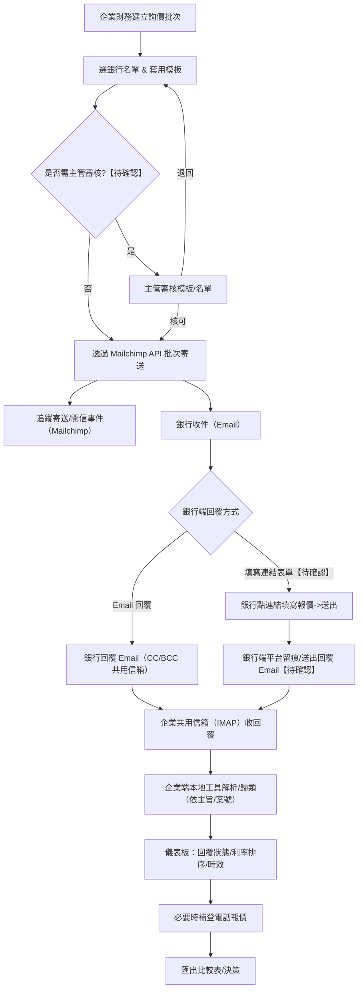
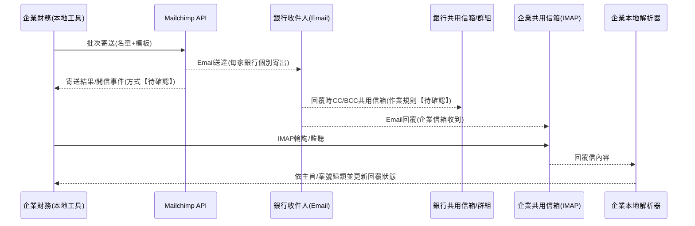
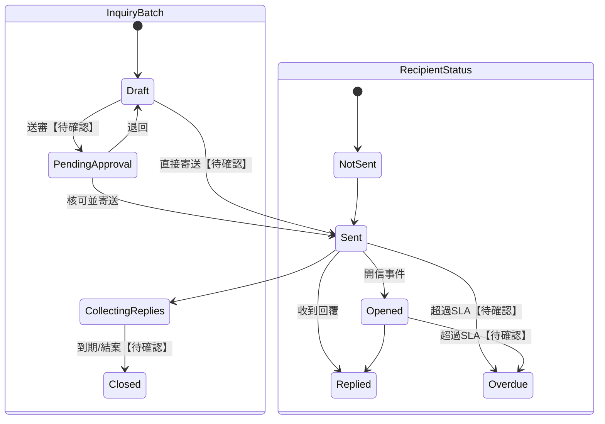
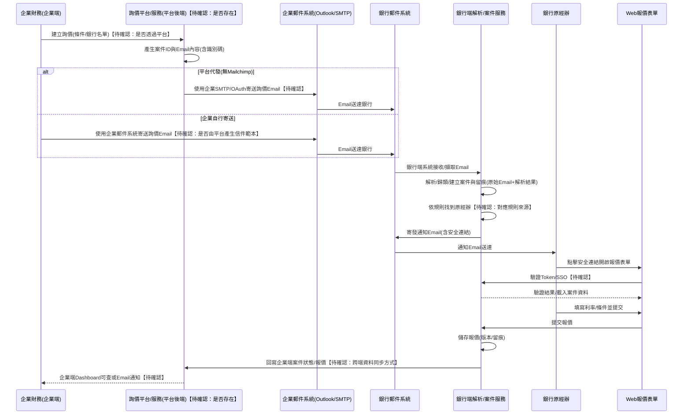
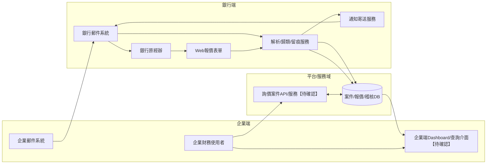
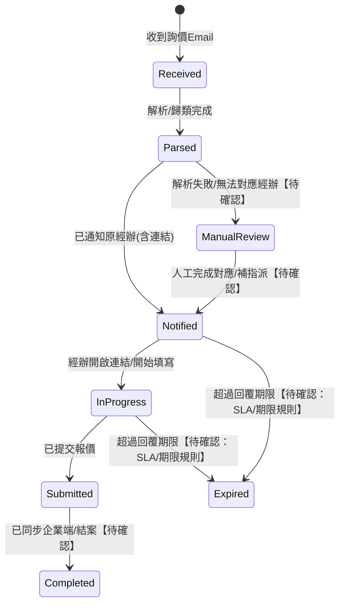
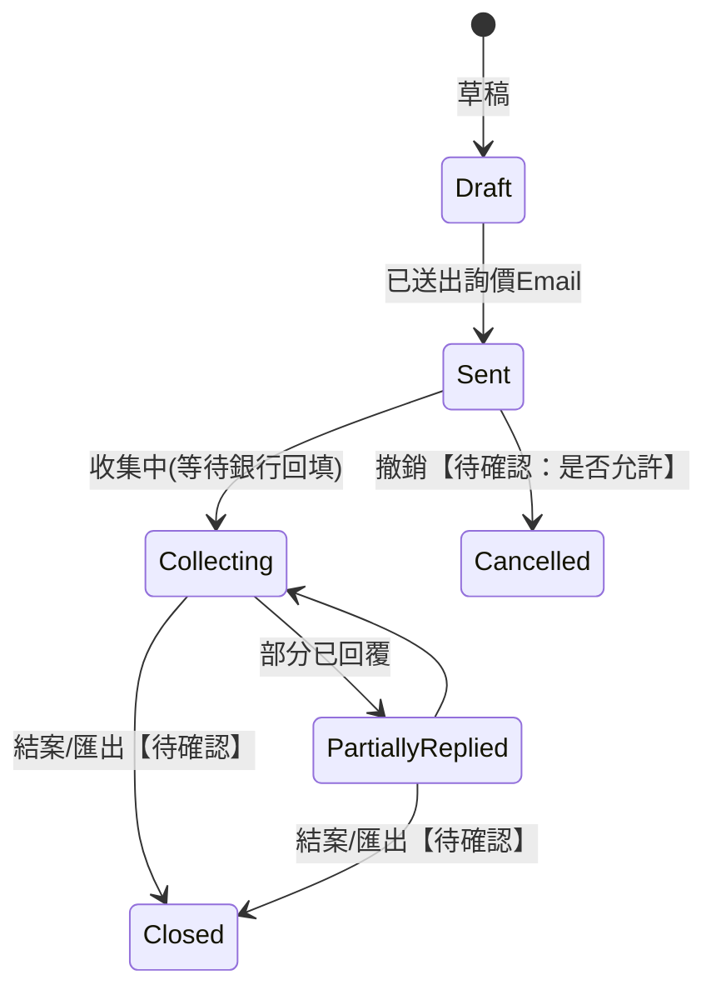

# 分支 · 需求彙整與功能規格

**Created**: 2025-12-17T11:47:40.607322

## User

# 提示詞名稱：報價前—需求彙整與功能規格包（內部版）

你是一位資深系統分析師（SA）兼解決方案架構師（Solution Architect），擅長將「會議紀錄、對客戶說明、雛型畫面（wireframe/mockup）」轉化為可用於**內部討論與報價**的「功能規格與架構文件包」。  
本次任務的目標是：在不臆測、不腦補的前提下，整理出完整需求、系統範圍、架構與流程，並標記待確認事項，協助我們評估報價與技術風險。

---

## 0) 輸入資料（我將在此訊息後貼上/附上）
你會收到以下一種或多種資料，請全部閱讀後再產出文件：
1. 會議紀錄（逐字或條列）
2. 我對客戶的說明內容（提案、信件、Line/Email摘要）
3. 雛型畫面（截圖/連結/畫面描述）
4. 既有系統或介接環境資訊（如有）
5. 任何限制條件（預算、時程、資安、部署、法規、資料來源等）

---

## 1) 產出要求（非常重要）
### 1.1 不可腦補
- 任何需求/規格若**輸入沒有明確提到**，不得自行補齊或推測。
- 若需要合理假設才能往下寫，請用：`【假設】...（影響：... / 需客戶確認：是）`  
- 若不確定，請用：`【待確認】...`，並列出要問客戶的精準問題。

### 1.2 可追溯性（對內控與報價很重要）
- 每一項功能/需求都要標註**來源**，格式如下：
  - `來源：會議紀錄#(段落或頁碼/時間戳)` 或 `來源：雛型畫面#(畫面名稱)` 或 `來源：對客戶說明#(段落)`
- 若來源不明確：`來源：不明（需補資料）`

### 1.3 以「內部討論與確認」為目的
- 文件要讓工程、PM、資安、維運與業務能快速對齊：範圍、流程、介接、風險、工作量。
- 內容使用**正體中文（台灣）**，語氣專業、可直接拿去內部review。

---

## 2) 最終交付物：文件包（請一次產出，並可直接貼到Markdown）
請依序輸出以下文件（以Markdown標題區隔即可）：

### 文件 A：需求與範圍彙整（PRD/FRD 摘要版）
必須包含：
1. 專案背景與目標（要解決什麼問題、成功指標/KPI如有）
2. 利害關係人與角色（使用者類型、權限層級）
3. 系統範圍（In Scope / Out of Scope）
4. 主要使用情境（2–6條，含前置條件、觸發、結果）
5. 功能清單（模組化）
   - 模組 → 功能點 → 欄位/規則 → 權限 → 例外處理
6. 非功能需求（NFR）
   - 資安/權限、稽核、效能、可用性、備援、維運、可觀測性、相容性、瀏覽器/裝置、資料留存
7. 需求缺口與待確認清單（依優先順序）
8. 報價假設與切分建議（MVP / Phase 2）
   - 每項假設要寫「影響報價」與「需不需要客戶簽認」

### 文件 B：資訊架構與資料設計（IA + Data）
必須包含：
1. 資訊架構（頁面/功能導覽樹）
2. 核心資料實體（建議用 ERD 的文字版描述）
   - 主要Entity、關聯、關鍵欄位（含唯一鍵/索引建議，如輸入有提）
3. 資料來源與流向（誰提供、何時同步、是否主檔）
4. 資料品質與治理（必填、格式、驗證、去重、版本、歷程）

### 文件 C：系統架構說明（SAD 架構版）
必須包含：
1. 邏輯架構（前端/後端/資料庫/外部系統/第三方服務）
2. 部署架構（雲端/地端/混合，若未知則列出選項與差異）
3. 介接清單（API/檔案/DB/訊息佇列/Email等）
   - 介接方式、頻率、認證、錯誤重試、超時、限流（若輸入未提則列`【待確認】`）
4. 權限與身份（SSO/AD/帳密/多租戶等）
5. 稽核與Log策略（誰做了什麼、何時、從哪裡）
6. 風險點與技術注意事項（例如：資料量、尖峰、外部限制、資安掃描、弱點修補、上線流程）

### 文件 D：流程圖與互動圖（請用 Mermaid 產出）
至少要有以下幾種（若資料不足就用`【待確認】`補齊後再畫）：
1. **端到端主流程**（Flowchart 或 BPMN風格）
2. **關鍵情境的 Sequence Diagram**（前端→後端→外部系統）
3. **資料流向圖（DFD，簡化版亦可）**
4. （如適用）狀態機（例如：單據狀態、任務狀態、審核狀態）

> Mermaid 必須可直接渲染，請用 ```mermaid 區塊。

### 文件 E：測試與驗收建議（Test Plan 摘要）
必須包含：
1. 驗收範圍與驗收方式（UAT）
2. 測試類型：功能、權限、例外、效能（如適用）、資安（如適用）
3. 每個模組至少列出 3–5 條驗收條件（Given/When/Then 或條列）

### 文件 F：工作拆解與估算用清單（WBS / Backlog）
必須包含：
1. Epics → Features → Tasks 的層級
2. 每項工作標註：
   - 依賴（Dependency）
   - 風險（Risk）
   - 不確定性（Uncertainty：高/中/低）
   - 需要客戶提供的前置（如帳號、API文件、樣本資料）
3. 交付里程碑建議（MVP / Phase 2）

---

## 3) 輸出格式規範
- 全部用 Markdown 輸出
- 表格請用 Markdown table（可讀性優先）
- 每份文件請以 H1/H2 清楚分段
- 所有【待確認】請集中再列一次「待確認清單（彙總）」並標註優先度（P0/P1/P2）
- **禁止出現**「我認為」「可能」「應該」這類模糊詞；若不確定請用【待確認】或【假設】

---

## 4) 開始執行
請先做「輸入資料盤點」：
1. 你收到哪些資料（條列）
2. 哪些資料不足以形成可報價規格（條列）
3. 接著直接產出文件 A～F（不要再問我問題；問題請寫進【待確認】清單）

現在開始。

## User

Original custom instructions no longer available

## AI

The output of this plugin was redacted.

## AI

The output of this plugin was redacted.

## AI

The output of this plugin was redacted.

## AI

The output of this plugin was redacted.

## AI

The output of this plugin was redacted.

## AI

The output of this plugin was redacted.

## AI

The output of this plugin was redacted.

## AI

The output of this plugin was redacted.

## AI

The output of this plugin was redacted.

## AI

The output of this plugin was redacted.

## AI

The output of this plugin was redacted.

## AI

The output of this plugin was redacted.

## AI

The output of this plugin was redacted.

## AI

The output of this plugin was redacted.

## AI

The output of this plugin was redacted.

## AI

The output of this plugin was redacted.

## AI

The output of this plugin was redacted.

## AI

The output of this plugin was redacted.

## AI

The output of this plugin was redacted.

## AI

The output of this plugin was redacted.

## AI

The output of this plugin was redacted.

## AI

The output of this plugin was redacted.

## AI

The output of this plugin was redacted.

## AI

The output of this plugin was redacted.

## AI

# 輸入資料盤點

## 1) 已收到資料（條列）
1. 《企業資金詢價平台v1.pdf》：痛點、PoC模組與功能摘要（企業端視角）。fileciteturn2file0L7-L34  
2. 《企業資金詢價平台v2.pdf》：雙端架構（企業端本地工具＋銀行端回覆管理介面 Optional）、信任/公正性風險與治理解法（含 Hash 驗證）。fileciteturn2file1L19-L31 fileciteturn2file5L16-L35  
3. 《企業資金詢價平台.pdf》：雙端架構總覽、企業端模組價值、安裝設定流程（IMAP、Mailchimp API）、資料風險與對應措施。fileciteturn2file7L2-L16 fileciteturn2file2L6-L21  
4. 《企業資金詢價平台 網站雛形.pdf》：雛型畫面（企業端/銀行端）—以「雛型畫面#畫面名稱」作為來源標註（本檔案以圖片為主，未能在本次檢索工具中穩定取得可逐行引用的文字層，因此不在段落內附 filecite 行號）。  
5. 《玉山-企業資金-202511201700.txt》：會議逐字（關鍵：共用信箱 CC/BCC、銀行端 Dashboard、用連結/表單回填、指派/主管審核、歷史報價可視）。fileciteturn2file14L1-L9 fileciteturn2file15L1-L5  
6. 《玉山-企業資金-202512100930.txt》：會議逐字（關鍵：報價/專案評估、需求文件需補齊）。fileciteturn2file4L3-L7  

> 另外依照既有系統檢索結果：turn0file4、turn0file5 亦包含本案摘要內容（見 fileciteturn0file4、fileciteturn0file5）。

## 2) 目前不足以形成「可報價規格」的資料（條列）
1. **部署邊界未定**：銀行端回覆管理介面是由銀行內網承載、雲端承載、或與企業端同一套平台承載—未明確（影響：資安/網段/SSO/弱掃/維運成本）。來源：不明（需補資料）  
2. **身份與權限模型未定**：企業端（財務/主管/稽核）與銀行端（分行/承辦/主管）之登入方式、SSO/AD、帳號生命週期—未定。來源：不明（需補資料）  
3. **Email/表單回覆的「標準格式」與解析規則未定**：是否強制走「連結表單回填」或允許自由 Email 回覆並用 AI/規則解析—會影響準確率與工期。來源：會議紀錄（可行性討論）fileciteturn2file11L3-L7 fileciteturn2file16L9-L13  
4. **第三方服務範圍未定**：Mailchimp 僅寄送與開信追蹤、是否需要替代方案（企業既有 EDM/SMTP/Exchange）。來源：既有方案提到 Mailchimp API fileciteturn2file7L11-L14、安裝流程提到註冊與輸入 API Key fileciteturn2file2L12-L19  
5. **資料留存與稽核要求未定**：留存年限、不可竄改、是否需提供稽核報表（企業/銀行內控）。來源：有「權限與稽核/留痕」方向，但細節未定 fileciteturn2file0L33-L34  
6. **量體與效能假設不足**：銀行數量（15–50）與詢價頻率、同時批次、尖峰回覆量、附件量—未定。來源：銀行數量範圍僅見概述 fileciteturn2file0L9-L10  

---

# 文件 A：需求與範圍彙整（PRD/FRD 摘要版）

## A1. 專案背景與目標
| 項目 | 內容 | 來源 |
|---|---|---|
| 背景/痛點（企業端） | 企業財務每次資金調度需逐一聯絡多家銀行、耗時且難追蹤、資訊分散。 | 來源：v1 痛點 fileciteturn2file0L9-L13 |
| 背景/痛點（銀行端） | 銀行端容易漏接詢價 Email、缺乏集中管理、難以掌握企業短期需求週期。 | 來源：平台挑戰 fileciteturn2file3L3-L7 |
| 目標（解決方向） | 建立「企業端本地詢價工具」協助一鍵詢價寄送、回覆整合、視覺化追蹤；銀行端可選配回覆管理介面以提升回覆效率與內部流程。 | 來源：v2 架構總覽 fileciteturn2file1L19-L31、v1 模組 fileciteturn2file0L21-L34 |
| 成功指標/KPI（已明確者） | 節省作業時間（文件載明「節省 90% 作業時間」）、降低漏信風險、可視化開信率/回覆狀態/利率排序/回覆時效。 | 來源：企業端模組價值 fileciteturn2file7L10-L15、v1 Dashboard 指標 fileciteturn2file0L31-L33 |

## A2. 利害關係人與角色（使用者類型、權限層級）
| 角色 | 目標/任務 | 權限需求 | 來源 |
|---|---|---|---|
| 企業端-財務人員 | 建立詢價、選銀行名單、寄送、追蹤回覆、補登電話報價、匯出比較表。 | 建立/編輯/送出/檢視/匯出 | 來源：v1 模組 fileciteturn2file0L23-L33 |
| 企業端-主管/審核者 | 審核銀行名單與信件模板（內控）。 | 審核/核可/退回 | 來源：v1 權限與稽核 fileciteturn2file0L33-L34、企業端模組 fileciteturn2file7L15-L15 |
| 企業端-稽核/內控（如有） | 查詢寄送/回覆留痕、報表、稽核軌跡。 | 唯讀/稽核報表 | 來源：權限與留痕方向 fileciteturn2file0L33-L34 |
| 銀行端-承辦人/RM | 查看待回覆案件、填寫報價、送主管審核、送出回覆。 | 指派接案/填寫/送審/回覆 | 來源：v2 銀行端流程（指派/主管審核）fileciteturn2file1L28-L30、會議提到指派與審核 fileciteturn2file13L3-L7 |
| 銀行端-主管/覆核 | 覆核回覆內容與時效管理。 | 覆核/退回/送出 | 來源：v2 銀行端強化內部流程 fileciteturn2file1L28-L30 |
| 銀行端-管理者 | 分行/群組/共用信箱設定、權限、儀表板。 | 設定/管理 | 來源：會議提到分行詢價狀況 Dashboard fileciteturn2file8L7-L13 |

## A3. 系統範圍（In Scope / Out of Scope）
### In Scope（已明確）
| 範圍 | 說明 | 來源 |
|---|---|---|
| 企業端本地詢價工具（Local Utility） | 企業電腦本地安裝，自主管理名單與模板；一鍵批次寄送；回覆整合面板；電話紀錄補登；視覺化儀表板；權限與稽核。 | 來源：v1 模組 fileciteturn2file0L23-L34、雙端架構 fileciteturn2file3L21-L27 |
| Email 寄送與追蹤（Mailchimp API） | 透過 Mailchimp API 批次寄出、追蹤開信率。 | 來源：企業端模組 fileciteturn2file7L11-L14 |
| 企業端信箱監聽與回覆歸類（IMAP） | 設定共用信箱（IMAP）以讀取回覆。 | 來源：安裝設定流程 fileciteturn2file2L8-L13、v1 回覆整合面板描述 fileciteturn2file0L26-L27 |
| 銀行端回覆管理介面（Optional） | 集中檢視回覆狀態、承辦人指派、主管審核、回覆時效管理。 | 來源：v2 描述 fileciteturn2file1L28-L30、雙端架構 fileciteturn2file3L25-L27 |

### Out of Scope（未被明確納入；需客戶確認）
| 項目 | 說明 | 來源 |
|---|---|---|
| 與銀行核心/CRM/授信系統整合 | 文件強調「無須複雜系統整合」；若要串核心系統屬擴充。 | 來源：關鍵優勢 fileciteturn2file2L6-L6 |
| 自動化利率/條件解析的 AI 準確率承諾 | 有「讀取 Email 內容/AI 解析」討論，但未形成規格/驗收標準。 | 來源：會議討論 fileciteturn2file11L3-L7 |
| 後續延伸「存款/理財配對平台」 | 屬後續延伸方向，未納入本次報價範圍。 | 來源：v1 延伸 fileciteturn2file0L41-L41 |

## A4. 主要使用情境（2–6 條）
> 格式：前置條件 / 觸發 / 結果

1. **企業端建立並寄送詢價（批次）**  
   - 前置條件：已建立銀行名單、已建立並核可 Email 模板、已設定 Mailchimp API Key。來源：安裝流程（建名單/主管審核模板/輸入 API Key）fileciteturn2file2L10-L19  
   - 觸發：財務人員勾選銀行名單→套用模板→一鍵寄送。來源：企業端模組 fileciteturn2file7L11-L12  
   - 結果：系統建立詢價批次與案號；寄送紀錄留痕。來源：v1 權限與稽核 fileciteturn2file0L33-L34  

2. **企業端追蹤開信/回覆與利率排序**  
   - 前置條件：寄送已完成。來源：同情境1  
   - 觸發：財務人員進入儀表板檢視。來源：v1 Dashboard 指標 fileciteturn2file0L31-L33  
   - 結果：可視化寄送狀態、開信率、回覆狀態、利率排序、回覆時效。來源：v1 fileciteturn2file0L31-L33  

3. **銀行端集中接收詢價並指派承辦（共用信箱 CC/BCC）**  
   - 前置條件：詢價 Email 在回覆時被帶入共用信箱副本/密件副本。來源：會議 fileciteturn2file14L3-L9  
   - 觸發：共用信箱收到詢價/回覆→Dashboard 顯示分行詢價狀況→主管指派承辦。來源：會議 fileciteturn2file8L7-L13  
   - 結果：不中斷既有作業習慣前提下達到集中追蹤。來源：會議（「大家都不用改本來任何動作」）fileciteturn2file14L3-L9  

4. **銀行端填寫報價→主管審核→回覆企業**  
   - 前置條件：銀行端回覆管理介面啟用（Optional）。來源：v2 fileciteturn2file1L28-L30  
   - 觸發：承辦進入案件填寫→送主管覆核→送出回覆（Email）。來源：會議（平台內回覆＋主管同意）fileciteturn2file13L3-L7  
   - 結果：企業端收到回覆並可回寫到比較表。來源：v1 回覆整合面板 fileciteturn2file0L26-L27  

5. **企業端補登電話報價**  
   - 前置條件：銀行以電話回覆或非標準格式回覆。來源：v1 電話紀錄補充 fileciteturn2file0L29-L29  
   - 觸發：財務人員在 Dashboard 補登。來源：同上  
   - 結果：納入同一份比較表。來源：企業端模組 fileciteturn2file7L13-L13  

## A5. 功能清單（模組化）
> 規格粒度：模組 → 功能點 → 欄位/規則 → 權限 → 例外處理 → 來源

### A5-1 企業端本地詢價工具（Local Utility）
| 模組 | 功能點 | 欄位/規則（已明確/待確認） | 權限 | 例外處理 | 來源 |
|---|---|---|---|---|---|
| 銀行名單管理 | 建立/維護銀行名單（含收件人） | 【待確認】銀行資料欄位（銀行名稱/分行/承辦Email/群組Email） | 管理者/主管 | 匯入/匯出、重複Email去重【待確認】 | 來源：安裝流程（建立銀行名單）fileciteturn2file2L10-L11 |
| 模板管理與審核 | 模板建立/版本/主管核可 | 模板含金額、幣別、天期等欄位；需主管審核 | 主管核可 | 退回/版本控管【待確認】 | 來源：v1（模板含欄位+主管審核）fileciteturn2file0L23-L24 fileciteturn2file2L11-L12 |
| 一鍵詢價寄送 | 勾選名單→套用模板→批次寄送 | 透過 Mailchimp API；每家銀行個別寄出 | 財務人員 | API 失敗重試/限流/錯誤碼【待確認】 | 來源：企業端模組 fileciteturn2file7L11-L12 |
| 回覆整合面板 | 監聽共用信箱→依主旨/案號歸類 | 依主旨與批次編號/案號自動歸類 | 財務人員 | 無法歸類→人工指派【待確認】 | 來源：v1 fileciteturn2file0L26-L27 |
| 電話紀錄補登 | 手動輸入電話報價內容 | 【待確認】欄位（銀行/天期/利率/備註/時間/登錄人） | 財務人員 | 同銀行多筆衝突處理【待確認】 | 來源：v1 fileciteturn2file0L29-L29 |
| 視覺化儀表板 | 開信率/回覆狀態/利率排序/歷史趨勢 | 指標已列舉；報表口徑【待確認】 | 財務/主管 | 缺資料時顯示規則【待確認】 | 來源：v1 fileciteturn2file0L31-L33、企業端模組 fileciteturn2file7L14-L14 |
| 權限與稽核 | 留痕、操作紀錄、內控 | 模板/名單需主管核可；寄送與回覆紀錄留痕 | 主管/稽核 | 不可改寫/留存年限【待確認】 | 來源：v1 fileciteturn2file0L33-L34 |
| 安裝與設定 | 下載、IMAP、API Key、測試寄送 | 下載→設定 IMAP→主管審核→API 串接→測試 | 管理者 | 設定錯誤提示【待確認】 | 來源：安裝流程 fileciteturn2file2L6-L21 |

### A5-2 銀行端回覆管理介面（Optional）
| 模組 | 功能點 | 欄位/規則（已明確/待確認） | 權限 | 例外處理 | 來源 |
|---|---|---|---|---|---|
| 詢價案件總覽 | 集中檢視企業詢價 Email 與回覆狀態 | 來源信箱：共用信箱；案件聚合規則【待確認】 | 銀行端使用者 | 無法配對企業/案號【待確認】 | 來源：雙端架構 fileciteturn2file3L25-L27、會議（Dashboard）fileciteturn2file8L7-L13 |
| 承辦人指派 | 主管指派案件 | 指派依分行/群組/對應表【待確認】 | 主管 | 指派衝突/多承辦【待確認】 | 來源：v2（指派）fileciteturn2file1L28-L30、會議（分行/營運主管對應表）fileciteturn2file8L3-L5 |
| 回覆填寫 | 承辦輸入利率/條件並送出 | 回覆是否強制走表單連結【待確認】 | 承辦 | 多人同時填寫版本/最新有效值【待確認】 | 來源：會議（連結進來填表）fileciteturn2file13L5-L7、會議（多人成本與歷史可視）fileciteturn2file15L1-L5 |
| 主管審核 | 覆核後送出 Email 回覆 | 審核流程序列【待確認】 | 主管 | 退回/逾期/代理【待確認】 | 來源：v2（主管審核）fileciteturn2file1L28-L30、會議（主管同意才回覆）fileciteturn2file13L3-L4 |
| SLA/時效管理 | 待回覆清單、逾期提醒 | SLA 定義與提醒通道【待確認】 | 主管/管理者 | 例外：企業撤單/改期【待確認】 | 來源：銀行端價值（降低漏接/提升效率）fileciteturn2file6L24-L30 |
| 稽核與歷史報價 | 同案歷史回覆可視、防止重複/衝突報價 | 是否對企業顯示軌跡【待確認】 | 內控/管理者 | 不可竄改/保留原始 Email 連結 | 來源：會議（歷史報價可視）fileciteturn2file15L1-L5、風險對應（原始 Email 憑證）fileciteturn2file2L34-L37 |

## A6. 非功能需求（NFR）
| 類別 | 需求 | 來源 |
|---|---|---|
| 資安/資料不外流 | 敏感資料（名單、金額）留在企業內部，本地端安裝，不上雲、不外流。 | 來源：雙端架構 fileciteturn2file3L21-L25 |
| 中立性/公正性 | 平台不由單一銀行掌握資料；企業自主管理；避免他行排斥。 | 來源：v2 公正性疑慮與解法 fileciteturn2file5L21-L25 |
| 稽核/不可竄改 | 回覆內容不被改寫；郵件 Hash 驗證；保留原始 Email。 | 來源：v2（Hash/不可改寫）fileciteturn2file5L33-L35、平台風險對應（原始 Email 憑證）fileciteturn2file2L34-L37 |
| 可用性/維運負擔 | 強調「無須複雜系統整合、即裝即用」。 | 來源：關鍵優勢 fileciteturn2file2L6-L6 |
| 可觀測性 | 需可查寄送狀態、開信率、回覆狀態、回覆時效、歷史趨勢。 | 來源：v1 Dashboard fileciteturn2file0L31-L33 |
| 相容性（Email） | 需支援 Outlook/Exchange 常見作業模式（共用信箱、群組、CC/BCC）。 | 來源：會議（Outlook 群組/共用信箱）fileciteturn2file14L3-L5 |

## A7. 需求缺口與待確認清單（先列；彙總版於文末再集中）
（見文末「待確認清單（彙總）」）

## A8. 報價假設與切分建議（MVP / Phase 2）
### MVP（建議可報價的最小可交付）
1. 企業端本地工具：名單/模板審核/批次寄送（Mailchimp API）/回覆整合（IMAP）/儀表板/電話補登/稽核留痕。來源：v1 模組 fileciteturn2file0L23-L34  
2. 銀行端（先不做 Web Portal）：以「共用信箱 CC/BCC」＋企業端回覆整合為主，銀行端僅維持 Email 回覆（不改變作業）。來源：會議（不改動作業、共用信箱副本）fileciteturn2file14L3-L9  

### Phase 2（擴充；需客戶簽認）
1. 銀行端回覆管理介面（案件總覽/指派/審核/SLA/稽核）。來源：v2 fileciteturn2file1L28-L30  
2. 回覆表單連結化（銀行點連結填寫→自動結構化入庫→回覆企業）。來源：會議（給平台連結進來填）fileciteturn2file13L5-L7  
3. 自由格式 Email 回覆的 AI 解析與校對流程（含例外處理/人工覆核）。來源：會議（AI 讀取 Email）fileciteturn2file11L3-L7  

---

# 文件 B：資訊架構與資料設計（IA + Data）

## B1. 資訊架構（頁面/功能導覽樹）
### 企業端本地工具（MVP）
- Dashboard（總覽）
  - 詢價批次列表
  - 指標：寄送數/開信率/回覆狀態/利率排序/回覆時效（口徑【待確認】）來源：v1 fileciteturn2file0L31-L33
- 新建詢價
  - 選銀行名單 → 套用模板 → 預覽 → 送主管審核/直接寄送（規則【待確認】）
- 詢價詳情
  - 收件銀行明細（寄送/開信/回覆）
  - 回覆內容彙整（含電話補登）來源：v1 fileciteturn2file0L26-L29
- 銀行名單管理（含匯入匯出【待確認】）
- 模板管理與審核（版本/核可流【待確認】）
- 系統設定
  - IMAP（共用信箱）來源：安裝流程 fileciteturn2file2L8-L13
  - Mailchimp API Key/寄信測試來源：安裝流程 fileciteturn2file2L12-L20
- 稽核/操作紀錄（查詢/匯出【待確認】）

### 銀行端回覆管理介面（Phase 2）
- 詢價案件匣（Inbox）
  - 篩選：待指派/處理中/待審核/已回覆/逾期【待確認】（來源：雛型畫面#銀行端案件列表）
- 案件詳情
  - 詢價內容（原始 Email 連結/Hash）來源：v2 Hash fileciteturn2file5L33-L35
  - 回覆填寫（利率/條件）來源：會議（進平台填）fileciteturn2file13L5-L7
  - 指派/協作/歷史版本（規則【待確認】）
- 審核清單（主管）
- 設定（分行/群組/對應表、共用信箱）來源：會議（對應表/群組）fileciteturn2file8L3-L5 fileciteturn2file14L3-L5
- 報表（SLA/回覆效率）來源：銀行端價值 fileciteturn2file6L24-L30

## B2. 核心資料實體（ERD 文字版）
> 以下為「依已明確需求可推導之必要資料實體」；若欄位未在輸入中明確出現，均以【待確認】標示。

### 企業端
- Entity：InquiryBatch（詢價批次/案號）
  - key：batch_id（唯一鍵）【待確認：格式/生成規則】
  - 欄位：【待確認】幣別、金額、天期（可多筆天期）、起息/到期、建立時間、建立人、狀態
  - 關聯：1-to-many → InquiryRecipient、InquiryTenor、PhoneQuote、EmailSendLog、ReplyQuote
- Entity：Bank（銀行）
  - key：bank_id；欄位：名稱【待確認：分行/群組】
- Entity：BankContact（銀行收件人/群組）
  - key：contact_id；欄位：email、name【待確認】、bank_id
- Entity：EmailTemplate（詢價模板）
  - key：template_id；欄位：subject/body、版本、狀態（草稿/送審/核可）【待確認】
- Entity：ApprovalRecord（審核）
  - key：approval_id；欄位：模板/名單審核、審核人、時間、結果、意見【待確認】
- Entity：EmailSendLog（寄送紀錄）
  - key：send_id；欄位：batch_id、recipient_email、寄送時間、Mailchimp message_id【待確認】
- Entity：OpenEvent（開信事件）
  - key：open_id；欄位：send_id、open_time、次數【待確認】（來源：開信率需求 fileciteturn2file0L31-L33）
- Entity：ReplyQuote（回覆報價）
  - key：reply_id；欄位：bank_id、tenor、rate、conditions/remark【待確認】、來源類型（Email/表單/人工）【待確認】、時間
- Entity：PhoneQuote（電話補登）
  - key：phone_id；欄位：bank_id、tenor、rate、remark、登錄人、時間【待確認】（來源：電話補登 fileciteturn2file0L29-L29）
- Entity：AuditLog（稽核留痕）
  - key：audit_id；欄位：user、action、object、time、before/after【待確認】（來源：留痕方向 fileciteturn2file0L33-L34）

### 銀行端（Phase 2）
- Entity：BankInquiryCase（銀行端案件）
  - key：case_id；欄位：企業識別【待確認】、batch_id/subject hash、狀態（新/指派/待審/已回覆）【待確認】
- Entity：Assignment（指派）
  - key：assign_id；欄位：case_id、assignee、assigner、time
- Entity：ReplyDraft（回覆草稿/版本）
  - key：draft_id；欄位：case_id、版本號、內容、建立人、建立時間
- Entity：ReviewRecord（覆核）
  - key：review_id；欄位：draft_id、reviewer、result、comment、time
- Entity：OrgMapping（對應表）
  - key：map_id；欄位：分行/群組/營運主管對應規則【待確認】（來源：會議提到對應表 fileciteturn2file8L3-L5）

## B3. 資料來源與流向
| 資料 | 來源系統/提供方 | 流向 | 主檔歸屬 | 來源 |
|---|---|---|---|---|
| 銀行名單 | 企業維護 | 企業端本地工具保存 | 企業 | 來源：v1/安裝流程（建立名單）fileciteturn2file0L23-L24 fileciteturn2file2L10-L11 |
| 詢價模板 | 企業維護＋主管核可 | 本地工具保存、寄送時帶入 | 企業 | 來源：主管審核模板 fileciteturn2file2L11-L12 |
| 寄送事件/開信事件 | Mailchimp | 回寫至本地工具（API 拉取/Webhook【待確認】） | 企業（彙整指標） | 來源：Mailchimp API 寄送 fileciteturn2file7L11-L14 |
| 回覆 Email | 各銀行 Email 系統 | 企業共用信箱（IMAP）→本地工具解析歸類 | 企業 | 來源：回覆整合面板 fileciteturn2file0L26-L27、IMAP 設定 fileciteturn2file2L8-L13 |
| 銀行端平台回覆（Phase 2） | 銀行端介面 | 以 Email 回覆企業；同時留痕於平台 | 銀行 | 來源：會議（平台回覆＋寄送 email）fileciteturn2file13L3-L7 |

## B4. 資料品質與治理
| 主題 | 規則 | 來源 |
|---|---|---|
| 去重 | 銀行名單 Email 去重、同批次同銀行多筆回覆合併規則【待確認】 | 來源：不明（需補資料） |
| 驗證 | 利率/天期/幣別格式驗證【待確認】 | 來源：不明（需補資料） |
| 版本/歷程 | 模板版本、回覆版本、稽核留痕 | 來源：權限與稽核 fileciteturn2file0L33-L34、會議（歷史報價可視）fileciteturn2file15L1-L5 |
| 不可改寫 | 需保留原始 Email 憑證與 Hash 驗證 | 來源：v2 Hash fileciteturn2file5L33-L35、原始 Email 憑證 fileciteturn2file2L34-L37 |

---

# 文件 C：系統架構說明（SAD 架構版）

## C1. 邏輯架構
### 企業端（Local Utility）
- UI：桌面應用程式（技術棧【待確認】）
- 本地資料層：本地 DB/檔案（SQLite/加密檔【待確認】）
- 整合：
  - Mailchimp API（寄送/開信追蹤）fileciteturn2file7L11-L14
  - IMAP（企業共用信箱回覆收集）fileciteturn2file2L8-L13

### 銀行端（Optional Portal，Phase 2）
- Web UI：案件匣/指派/填寫/覆核/報表（雛型畫面#銀行端）
- 應用服務：案件聚合、權限、審核流、通知
- 資料庫：案件/回覆版本/稽核
- 整合：Outlook 群組/共用信箱（通知與收信），Email 發送回覆（SMTP/Graph【待確認】）fileciteturn2file14L3-L5

## C2. 部署架構（未知則列選項與差異）
| 選項 | 描述 | 優點 | 代價/限制 | 來源 |
|---|---|---|---|---|
| 選項1：企業端純本地＋Mailchimp/Email | 僅交付本地工具，銀行端不建平台 | 導入快、變更小 | 銀行端流程改善有限 | 來源：雙端架構（銀行端為 Optional）fileciteturn2file1L28-L30 |
| 選項2：企業端本地＋銀行端內網 Web | 銀行端平台部署於銀行內網 | 符合銀行資安邊界 | 需銀行 IT 支援部署/SSO/弱掃 | 來源：不明（需補資料） |
| 選項3：企業端本地＋雲端銀行端平台 | 銀行端平台雲端（需安全設計） | 快速迭代 | 資安審查更高、跨網段整合 | 來源：不明（需補資料） |

## C3. 介接清單（API/檔案/DB/訊息/Email）
| 介接 | 方式 | 頻率 | 認證 | 重試/超時/限流 | 來源 |
|---|---|---|---|---|---|
| Mailchimp 寄送 | REST API | 每批次 | API Key | 【待確認】重試/限流策略 | 來源：Mailchimp API fileciteturn2file7L11-L14、安裝（輸入 API Key）fileciteturn2file2L12-L19 |
| Mailchimp 開信追蹤 | API 拉取或 Webhook | 【待確認】 | API Key | 【待確認】 | 來源：開信率需求 fileciteturn2file0L31-L33 |
| 共用信箱回覆收集 | IMAP | 近即時/排程【待確認】 | 帳密/OAuth【待確認】 | 【待確認】 | 來源：安裝（IMAP）fileciteturn2file2L8-L13 |
| 銀行端回覆送出（Phase 2） | Email（SMTP/Graph） | 每次送出 | 【待確認】 | 【待確認】 | 來源：會議（平台回覆後寄出）fileciteturn2file13L3-L7 |

## C4. 權限與身份
- 企業端：財務/主管審核/稽核角色；登入方式【待確認】。來源：權限與審核方向 fileciteturn2file0L33-L34  
- 銀行端：承辦/主管/管理者；分行與群組映射；SSO/AD【待確認】。來源：會議（群組/對應表）fileciteturn2file14L3-L5 fileciteturn2file8L3-L5  

## C5. 稽核與 Log 策略
| 類別 | 紀錄內容 | 來源 |
|---|---|---|
| 企業端操作留痕 | 模板/名單審核、寄送、回覆歸類、電話補登、匯出 | 來源：v1 權限與稽核 fileciteturn2file0L33-L34 |
| 回覆不可改寫 | Hash 驗證、保留原始 Email 連結/憑證 | 來源：v2 Hash fileciteturn2file5L33-L35、原始 Email 憑證 fileciteturn2file2L34-L37 |

## C6. 風險點與技術注意事項
| 風險/注意事項 | 說明 | 來源 |
|---|---|---|
| 資料信任風險 | 名單/金額/利率敏感；需採本地端、資料不外流 | 來源：v2 風險表 fileciteturn2file6L3-L4 |
| 公正性疑慮 | 單一銀行主導會造成他行排斥；需企業自主管理/銀行僅推薦 | 來源：v2 fileciteturn2file5L21-L25 |
| 回覆一致性 | 若允許自由 Email 回覆，彙整易錯；若走表單連結需改變習慣 | 來源：會議（回覆結構化/表單）fileciteturn2file13L5-L7 |
| 多人同案回覆衝突 | 同案多承辦可能出現版本/最新值爭議；需歷史可視與規則 | 來源：會議（避免衝突、歷史可視）fileciteturn2file15L1-L5 |
| Email 彙整依賴 CC/BCC/共用信箱 | 需銀行端願意在流程中帶入共用信箱副本 | 來源：會議（CC/BCC 共用信箱）fileciteturn2file14L3-L9 |
| 專案文件不足 | 會議已指出需補需求文件以利報價與評估 | 來源：會議 fileciteturn2file4L3-L7 |

---

# 文件 D：流程圖與互動圖（Mermaid）

## D1. 端到端主流程（Flowchart）


## D2. 關鍵情境 Sequence Diagram（寄送＋回覆彙整）


## D3. 資料流向圖（DFD 簡化）
```mermaid
flowchart LR
  subgraph Enterprise[企業端]
    LU[本地詢價工具]
    DB[(本地資料庫/檔案【待確認】)]
    IMAP[企業共用信箱(IMAP)]
  end

  subgraph ThirdParty[第三方]
    MC[Mailchimp]
  end

  subgraph Banks[銀行端]
    B1[銀行承辦/群組Outlook]
    SH[銀行共用信箱(副本/密件副本)]
    BP[銀行回覆管理介面(可選)【待確認】]
  end

  LU <--> DB
  LU --> MC
  MC --> B1
  B1 --> IMAP
  B1 --> SH
  SH --> BP
  IMAP --> LU
```

## D4. 狀態機（詢價批次/收件銀行狀態）


---

# 文件 E：測試與驗收建議（Test Plan 摘要）

## E1. 驗收範圍與方式（UAT）
- 驗收方式：以「企業端本地工具」端到端實測（建立詢價→寄送→回覆收集→儀表板→匯出）為主；銀行端 Portal（若納入）另行 UAT。來源：模組範圍彙整 fileciteturn2file0L23-L34 fileciteturn2file1L28-L30

## E2. 測試類型
- 功能：名單、模板審核、寄送、回覆整合、電話補登、報表/匯出。來源：v1 模組 fileciteturn2file0L23-L33  
- 權限：主管審核與留痕。來源：v1 fileciteturn2file0L33-L34  
- 例外：API 失敗、IMAP 連線失敗、回覆無法歸類。來源：介接存在但規則待定 fileciteturn2file2L8-L19  
- （如適用）資安：資料不外流、Hash 驗證、不可改寫。來源：v2 fileciteturn2file5L18-L35  

## E3. 模組驗收條件（每模組 3–5 條）
### 企業端：模板管理與審核
- Given 模板為草稿，When 送出審核，Then 狀態改為「待審」且不可直接寄送【待確認：是否允許例外】。來源：主管審核方向 fileciteturn2file2L11-L12  
- Given 主管退回，When 財務修改後再送審，Then 版本號/修改歷程可追溯【待確認：版本規則】。來源：權限與稽核 fileciteturn2file0L33-L34  
- Given 主管核可，When 建立詢價，Then 可套用該模板寄送。來源：v1 模組 fileciteturn2file0L23-L24  

### 企業端：一鍵詢價寄送（Mailchimp）
- Given 已設定 API Key，When 批次寄送，Then 產生每一收件人的寄送紀錄。來源：安裝（輸入 API Key/寄信測試）fileciteturn2file2L12-L20  
- Given 寄送成功，When 開信事件發生，Then 儀表板開信率更新（口徑【待確認】）。來源：Dashboard 指標 fileciteturn2file0L31-L33  
- Given API 回傳錯誤，When 系統重試/失敗，Then 顯示可追蹤錯誤訊息與失敗名單【待確認：重試策略】。來源：介接存在但策略未定 fileciteturn2file7L11-L14  

### 企業端：回覆整合面板（IMAP）
- Given 銀行回覆 Email 進入企業共用信箱，When 系統輪詢，Then 回覆可依主旨/案號歸類至正確批次。來源：v1 回覆歸類 fileciteturn2file0L26-L27  
- Given 回覆信不含可解析資訊，When 系統處理，Then 案件標記為「需人工處理」【待確認：標記名稱】。來源：不明（需補資料）  
- Given 銀行端採 CC/BCC 共用信箱，When 回覆，Then 共用信箱仍能收到副本以利解析。來源：會議 fileciteturn2file14L3-L9  

### 企業端：電話紀錄補登
- Given 某銀行以電話回覆，When 財務補登利率與條件，Then 比價表可同時呈現 Email 與電話來源。來源：電話補登 fileciteturn2file0L29-L29  
- Given 同銀行同天期已有 Email 回覆，When 補登電話，Then 系統依規則顯示最新或並存【待確認：衝突規則】。來源：不明（需補資料）  

### 銀行端（Phase 2）：指派/審核/回覆
- Given 新案件進入 Inbox，When 主管指派承辦，Then 承辦清單可見該案且記錄指派者/時間。來源：v2 指派 fileciteturn2file1L28-L30  
- Given 承辦完成填寫，When 送主管覆核，Then 主管可核可/退回並留痕。來源：v2 主管審核 fileciteturn2file1L28-L30  
- Given 核可送出，When 系統寄出 Email，Then 企業端可收到且可回寫至彙整表。來源：會議（平台回覆寄送）fileciteturn2file13L3-L7  

---

# 文件 F：工作拆解與估算用清單（WBS / Backlog）

## F1. Epics → Features → Tasks
> 每項工作均附：Dependency / Risk / Uncertainty / 客戶前置

### Epic 1：企業端本地詢價工具（MVP）
| Feature | Tasks | Dependency | Risk | Uncertainty | 客戶前置 | 來源 |
|---|---|---|---|---|---|---|
| 名單管理 | CRUD、匯入匯出【待確認】、去重規則【待確認】 | 無 | 名單品質影響寄送成功 | 中 | 提供銀行名單樣本 | 來源：建立名單 fileciteturn2file2L10-L11 |
| 模板管理與審核 | 模板編輯、版本、送審/核可流程 | 權限模型 | 內控流程不清導致返工 | 高 | 提供審核流程/角色 | 來源：主管審核模板 fileciteturn2file2L11-L12 |
| Mailchimp 寄送整合 | API Key 設定、批次寄送、錯誤處理 | Mailchimp 帳號 | API 限流/寄送政策 | 中 | 提供 Mailchimp 帳號/Key | 來源：Mailchimp API fileciteturn2file7L11-L14 |
| 開信事件回收 | 開信率指標、事件同步（拉取/推送【待確認】） | Mailchimp | 事件口徑不一致 | 高 | 確認 KPI 口徑 | 來源：開信率需求 fileciteturn2file0L31-L33 |
| IMAP 回覆收集 | IMAP 設定、輪詢、信件歸類 | 企業信箱權限 | OAuth/安全性設定 | 高 | 提供信箱類型與測試帳號 | 來源：IMAP 設定 fileciteturn2file2L8-L13 |
| 回覆解析與彙整 | 依主旨/案號歸類、回覆內容結構化（規則【待確認】） | Email 格式 | 回覆格式不一造成人工成本 | 高 | 提供回覆樣本（各銀行） | 來源：回覆歸類 fileciteturn2file0L26-L27 |
| 電話補登 | 表單、衝突規則【待確認】 | 無 | 資料一致性 | 中 | 定義衝突規則 | 來源：電話補登 fileciteturn2file0L29-L29 |
| 儀表板/報表 | 指標計算、利率排序、回覆時效 | 上述資料 | 口徑不一致 | 中 | 定義指標口徑 | 來源：儀表板 fileciteturn2file0L31-L33 |
| 稽核留痕 | Audit log、匯出【待確認】 | 權限 | 內控要求擴大 | 中 | 提供內控要求 | 來源：權限與稽核 fileciteturn2file0L33-L34 |

### Epic 2：銀行端回覆管理介面（Phase 2 / Optional）
| Feature | Tasks | Dependency | Risk | Uncertainty | 客戶前置 | 來源 |
|---|---|---|---|---|---|---|
| 案件匣/總覽 | Inbox、篩選、狀態 | 部署/登入 | 銀行資安審查 | 高 | 確認部署位置/SSO | 來源：v2（集中檢視/時效）fileciteturn2file1L28-L30 |
| 指派與對應表 | 分行/群組/營運主管對應、指派流程 | 組織資料 | 對應表維護成本 | 高 | 提供組織對應資料 | 來源：會議（對應表/群組）fileciteturn2file8L3-L5 fileciteturn2file14L3-L5 |
| 回覆填寫（表單） | 回覆欄位、版本、送審 | 驗收口徑 | 多人同案衝突 | 高 | 定義版本/最新規則 | 來源：會議（多人回覆衝突）fileciteturn2file15L1-L5 |
| 主管覆核 | 覆核清單、退回/核可、留痕 | 權限/SSO | 審核流不清返工 | 中 | 提供覆核規範 | 來源：v2（主管審核）fileciteturn2file1L28-L30 |
| 通知與提醒 | Email/Teams/Outlook 通知【待確認】 | 銀行 IT | 通知通道限制 | 中 | 確認可用通道 | 來源：會議（收到信要通知找人處理）fileciteturn2file8L11-L13 |
| 稽核/不可改寫 | Hash、原始 Email 連結、稽核報表 | 風險控管 | 法遵要求擴大 | 中 | 定義留存年限/格式 | 來源：v2 Hash fileciteturn2file5L33-L35 |

## F2. 交付里程碑建議
- 里程碑 M1（MVP）：企業端本地工具端到端可運作（寄送/回覆彙整/儀表板/補登/稽核）。來源：v1 模組 fileciteturn2file0L23-L34  
- 里程碑 M2（Phase 2）：銀行端回覆管理介面（指派/覆核/SLA/表單回覆）。來源：v2 fileciteturn2file1L28-L30  

---

# 待確認清單（彙總，含優先度）

## P0（直接影響可否報價/架構定案）
1. 【待確認】銀行端回覆管理介面是否納入本次報價範圍（MVP 還是 Phase 2）。影響：人月、部署、資安審查。來源：v2 標示 Optional fileciteturn2file1L28-L30  
2. 【待確認】回覆機制採「表單連結回填」或「Email 自由回覆＋解析」或兩者並行。影響：準確率、例外處理、驗收條件。來源：會議（連結填寫/AI 讀取）fileciteturn2file13L5-L7 fileciteturn2file11L3-L7  
3. 【待確認】身份驗證/登入：企業端與銀行端是否需 SSO/AD；帳號由誰建立/停用。影響：資安、導入流程。來源：不明（需補資料）  
4. 【待確認】部署位置：銀行端（如做）是內網/雲端/DMZ；是否允許對外連結表單。影響：資安審查、網段、維運。來源：不明（需補資料）  
5. 【待確認】Mailchimp 是否為唯一指定方案；若不可用，替代（企業既有 Exchange/SMTP/EDM）。影響：寄送與開信追蹤可行性。來源：現行方案提 Mailchimp fileciteturn2file7L11-L14  

## P1（影響工期/驗收口徑）
6. 【待確認】案號/主旨規範：批次編號生成規則、銀行回覆是否需帶回（避免歸類失敗）。影響：回覆歸類準確率。來源：v1（依主旨與批次編號歸類）fileciteturn2file0L26-L27  
7. 【待確認】SLA 定義：逾期判定、提醒頻率、通知通道。影響：報表與提醒功能。來源：銀行端強調 SLA/降低漏接 fileciteturn2file3L7-L10  
8. 【待確認】多人同案回覆衝突規則：最新有效值、版本保留、可視範圍（主管/承辦/企業端）。影響：資料一致性。來源：會議（多人回覆/歷史可視）fileciteturn2file15L1-L5  

## P2（影響優化體驗/維運）
9. 【待確認】資料留存年限、匯出格式（CSV/Excel/PDF）、稽核報表樣式。影響：維運與法遵。來源：留痕方向 fileciteturn2file0L33-L34  
10. 【待確認】本地資料加密與金鑰管理方式。影響：資安。來源：不明（需補資料）  

---

## User

規格調整如下，請先提供文件D: 流程圖與互動圖 跟我確認

- 企業端及銀行端 都不使用共用信箱
- 不使用Mailchimp
- 銀行端收到企業端詢價的mail後，解析/歸類/留痕，寄發通知信給原經辦，mail裡面提供網頁連結，點連結填寫報價

## AI

# 文件 D：流程圖與互動圖（Mermaid）—依「規格調整」版

> 來源：規格調整（本訊息）  
> - 企業端及銀行端都不使用共用信箱  
> - 不使用 Mailchimp  
> - 銀行端收到企業端詢價 Email 後，由系統解析/歸類/留痕，寄發通知信給原經辦；通知信提供網頁連結，點連結填寫報價  

---

## D1. 端到端主流程（Flowchart）

```mermaid
flowchart TD
  A[企業端建立詢價] --> B[產生詢價Email內容與案件識別碼]
  B --> C{詢價Email由誰發送?【待確認】}
  C -->|平台用企業SMTP/OAuth代發| D[平台寄送詢價Email給銀行]
  C -->|企業自有郵件系統發送| D2[企業寄送詢價Email給銀行] --> E[銀行端收信]
  D --> E[銀行端收信]

  E --> F[銀行端系統解析Email並歸類成案件]
  F --> G[銀行端留痕：保存原始Email與解析結果]
  G --> H[查找原經辦(對應規則/名單)【待確認】]
  H --> I[寄發通知Email給原經辦(含安全連結)]
  I --> J[原經辦開啟連結進入Web填寫報價]
  J --> K{身分驗證方式【待確認】}
  K -->|一次性Token| L[顯示報價表單]
  K -->|SSO/AD| L[顯示報價表單]

  L --> M[提交報價]
  M --> N[平台/銀行端儲存報價與版本留痕]
  N --> O{企業端如何取得報價?【待確認】}
  O -->|企業端Web Dashboard| P[企業端檢視回覆狀態/報價比較]
  O -->|Email回覆/通知| Q[寄送回覆通知Email給企業] --> P
  P --> R[結案/匯出報表【待確認】]
```

---

## D2. 關鍵情境 Sequence Diagram（詢價寄送→銀行解析→通知→Web回填）



---

## D3. 資料流向圖（DFD，簡化版）



---

## D4. 狀態機（案件狀態／銀行回覆狀態）

### D4-1 銀行端案件（解析後的回覆流程狀態）


### D4-2 企業端詢價（報價收齊狀態）


---

# 【待確認清單（彙總）】

## P0（影響架構/報價的關鍵）
1. 【待確認】詢價 Email 的「發送方式」：平台是否使用企業 SMTP/OAuth 代發，或企業自行寄送（平台僅產生內容/識別碼）。  
2. 【待確認】銀行端如何「接收並觸發解析」：是銀行端系統直接讀取銀行收信匣，或透過轉寄/規則導入（需避免「共用信箱」前提下的落地方式）。  
3. 【待確認】「原經辦對應規則」資料來源：由銀行提供映射表、或從 Email 內容關鍵欄位推導、或依客戶/公司別歸屬。  
4. 【待確認】Web 連結安全機制：一次性 Token、有效期限、是否需登入（SSO/AD）、是否需多因子。  
5. 【待確認】企業端取得報價的方式：企業端 Web Dashboard、或 Email 通知、或兩者並行；以及回寫/同步機制。  

## P1（影響驗收口徑與例外處理）
6. 【待確認】Email 解析/歸類規則：案件識別碼位置（主旨/內文/自訂Header）、錯誤容忍與人工處理流程。  
7. 【待確認】報價表單欄位與驗證：利率、天期、幣別、條件備註、附件等；以及版本覆寫/並存規則。  
8. 【待確認】SLA/回覆期限定義與逾期處理：提醒頻率、逾期狀態是否仍可提交。  

## P2（影響維運/稽核）
9. 【待確認】留痕內容與保存策略：原始 Email 保存形式、稽核查詢/匯出格式、留存年限。  
10. 【待確認】跨組織部署邊界：銀行端與平台的責任分界（誰持有 DB、誰提供 Web、誰做弱掃/資安稽核）。  

如以上流程與互動圖方向正確，我可以在下一版把「待確認」項目進一步拆成可直接對客戶提問的精準問題清單，並將 D2 的 Sequence 依最終決策（平台代發/企業自發、Token/SSO）固化成可驗收的互動流程。

## User

詢價Email由誰發送？ Ans: 企業自有郵件系統發送
查找原經辦（對應規則/名單）待確認 Ans: 原經辦就是mail中的收件人
身分驗證方式待確認 Ans: SSO/AD
企業端如何取得報價？Ans: 銀行 寄送回覆通知Email給企業

要增加
企業端 系統解析Email並歸類成案件

才能有dashbord及銀行回覆的列表


請先更新 D1. 端到端主流程（Flowchart）
沒問題 再更新其他的圖

## AI

# 文件 D1：端到端主流程（Flowchart）—更新版（依您最新確認）

來源：本訊息（規格確認/補充）

- 詢價 Email 由 **企業自有郵件系統發送**
- 銀行端「原經辦」＝**詢價 Email 的收件人**
- 身分驗證方式：**SSO/AD**
- 企業端取得報價：**銀行寄送回覆通知 Email 給企業**
- 補充新增：**企業端系統解析 Email 並歸類成案件**（以形成 Dashboard 與回覆列表）

```mermaid
flowchart TD
  %% Enterprise side
  A[企業端建立詢價(系統)] --> B[產生詢價Email內容與案件識別碼]
  B --> C[企業使用自有郵件系統發送詢價Email給銀行]
  C --> D[企業端系統監聽/擷取寄件備份Email【待確認：擷取方式】]
  D --> E[企業端系統解析Email並歸類成案件]
  E --> F[企業端Dashboard：詢價案件列表/寄送狀態]

  %% Bank side
  C --> G[銀行端收信(收件人=原經辦)]
  G --> H[銀行端系統解析Email並歸類成案件]
  H --> I[銀行端留痕：保存原始Email與解析結果]
  I --> J[銀行端寄發通知Email給原經辦(含Web連結)]
  J --> K[原經辦點連結進入Web報價頁]
  K --> L[SSO/AD登入驗證]
  L --> M[填寫報價並提交]
  M --> N[銀行端儲存報價與版本留痕]

  %% Return to enterprise
  N --> O[銀行端寄送回覆通知Email給企業]
  O --> P[企業端系統擷取/解析回覆通知Email]
  P --> Q[企業端更新案件：回覆狀態/報價列表]
  Q --> R[企業端Dashboard：銀行回覆列表/利率比較/匯出【待確認】]
  R --> S[結案【待確認：結案條件/期限】]
```

## 【待確認（仍留在 D1 必要點）】
1. 【待確認】企業端「擷取寄件備份 Email」與「擷取銀行回覆通知 Email」的技術方式：IMAP/Exchange Graph/本機Outlook外掛/郵件轉寄規則/其他。  
2. 【待確認】企業端 Dashboard「匯出」需求：格式（Excel/CSV/PDF）、欄位口徑。  
3. 【待確認】結案條件：到期自動結案、手動結案、或達到回覆數即結案。  

如 D1 無問題，我會依同一套決策更新 D2（Sequence）、D3（DFD）、D4（狀態機），並同步把【待確認】縮減到只剩技術落地與驗收口徑。

## AI

The output of this plugin was redacted.

## AI

The output of this plugin was redacted.

## AI

The output of this plugin was redacted.

## AI

The output of this plugin was redacted.

## AI

以下先提供「兩份報告的**大項目（章節大綱）＋每章要交付的重點內容**」，供您先內部對齊與對外簡報口徑。您回覆「OK / 需調整」後，我再把兩份報告各自擴寫成可直接投影片/Word使用的「完整版本」。

---

# 一、內部討論版報告（技術可行性／初步工期與報價評估）—大綱草案

> 主要來源  
> - 方案核心：企業端本地工具、企業指定帳號寄信、資料不離開企業端 fileciteturn3file0L1-L6  
> - 銀行端回覆管理（集中檢視回覆狀態、強化回覆流程）fileciteturn3file0L10-L12  
> - 既有版本曾包含「共用信箱(IMAP)」與「Mailchimp」設定項 fileciteturn3file2L10-L19  
> - 本次已調整：不使用共用信箱、不使用 Mailchimp、銀行通知原經辦並以 Web 填報價、企業端解析 Email 形成 Dashboard（來源：您 2025-12-13 對話與最新流程圖）

## A. 執行摘要（1頁）
- 本案要解決的問題／目標（企業端回覆分散、格式不一、難比較與追蹤）fileciteturn3file3L8-L17  
- 方案核心設計原則：資料不外流、技術中立（避免公正性疑慮）fileciteturn3file7L3-L21  
- 本次「需求調整」對架構與工期的影響（從 Mailchimp/共用信箱 → 改為企業自有信箱寄送 + 企業/銀行雙端授權擷取與解析）

## B. 已確認需求與邊界（In/Out Scope）
- 已確認（以您最新確認為準）  
  - 詢價 Email：企業自有郵件系統發送（來源：您 2025-12-13 對話）  
  - 原經辦：詢價 Email 收件人（來源：您 2025-12-13 對話）  
  - 身分驗證：SSO/AD（來源：您 2025-12-13 對話）  
  - 企業端收報價：銀行寄送回覆通知 Email 給企業（來源：您 2025-12-13 對話）  
  - 企業端需解析 Email 歸類成案件，才能有 Dashboard 與銀行回覆列表（來源：您 2025-12-13 對話）
- Out of Scope（先列草案，待您確認）  
  - 「開信率/點擊率」追蹤（先前討論 EDM 追蹤曾提及，但銀行端安全設定可能阻擋）fileciteturn3file10L1-L7  
  - 「承辦人指派／主管審核」：先前版本有提，但本次已改為收件人即原經辦，是否仍要保留需定義fileciteturn3file0L10-L12  

## C. 流程與介面對照（以您最新流程圖為準）
- 端到端流程（企業建案→寄信→雙端解析留痕→銀行通知→SSO填報價→銀行回信→企業解析更新）  
- 介面清單（雛形來源）  
  - 企業端：案件列表／新建詢價案件 fileciteturn3file1L6-L10  
  - 銀行端：案件列表／回覆詢價案件 fileciteturn3file1L11-L15  

## D. 技術可行性評估（工程/資安/維運必讀）
- 郵件擷取與解析（企業端、銀行端各自）  
  - 擷取方式選項：Microsoft Graph / IMAP / Exchange EWS / 本機 Outlook 外掛【待確認：客戶與銀行端郵件環境】  
  - 查詢策略：以案件識別碼（主旨/內文/自訂 header）定位與去重（需定義規格）  
- Web 報價連結安全  
  - SSO/AD 流程、Token 設計（一次性/有效期限/綁定案件與收件人）與稽核紀錄（IP、UA、時間）  
- 留痕/稽核與不可竄改（Hash/原始 Email 保存）fileciteturn3file0L33-L35  
- 資料落地位置（企業端本地 vs 伺服器）與「資料不離開企業」原則下的可行架構 fileciteturn3file0L4-L6  

## E. 架構方案與估算切分（MVP / Phase 2）
- MVP（建議）：  
  - 企業端：新建詢價、案件列表、寄送前後的寄信備份解析、銀行回覆信解析、利率比較列表  
  - 銀行端：詢價案件列表、回覆填寫、SSO 登入、提交後回覆通知信  
- Phase 2（選配）：  
  - 承辦指派/主管審核、SLA 提醒、匯出報表、更多欄位規則、異常處理後台、稽核報表

## F. 初步 WBS/人力/時程/成本驅動因子（內部估價用）
- Workstream：郵件擷取、解析規則、SSO、Web UI、資料庫/留痕、權限稽核、部署維運、測試/UAT  
- 成本驅動因子（影響工期最大的前 5 項）  
  1) 企業/銀行郵件環境差異（Graph vs IMAP）  
  2) Email 格式多樣性與解析規則複雜度  
  3) SSO/AD 串接方式與驗證需求  
  4) 留痕/稽核深度（是否要「可舉證」等級）  
  5) 部署型態（地端/雲端/混合）與資安掃描要求

## G. 風險清單與待確認（P0/P1/P2）
- 以「技術可行性」與「報價風險」排序，並附：影響、緩解策略、需要客戶提供的資料

---

# 二、對外（業主向上呈報）版報告（專案說明＋初步報價）—大綱草案

> 主要來源  
> - 企業端痛點與價值主張（資訊分散、難比較、錯過利率時點、缺乏留痕）fileciteturn3file3L8-L17  
> - 核心價值：資料不外流/技術中立 fileciteturn3file7L3-L21  
> - 介面雛形頁：企業端案件列表/新建、銀行端案件列表/回覆 fileciteturn3file1L6-L15  
> - 本次調整：不共用信箱、不用 Mailchimp、銀行通知原經辦並以 Web 填報價、企業端解析 Email 形成 Dashboard（來源：您 2025-12-13 對話與最新流程圖）

## 1. 專案一句話說明（1段）
- 「以企業自有郵件寄送詢價、銀行以 Web 回覆、企業端自動彙整比價」的作業優化專案（對上簡報用）

## 2. 現況痛點（2–4點）與導入效益（2–4點）
- 痛點：回覆管道分散／格式不一致／人工轉錄易錯／缺乏審核與留痕 fileciteturn3file3L8-L17  
- 效益：集中追蹤、降低漏接、提升回覆效率與專業形象（銀行端價值可附註）fileciteturn3file7L23-L33  

## 3. 解決方案概覽（1頁圖＋1頁說明）
- 架構原則：企業資料留在企業端、不上雲不外流 fileciteturn3file0L4-L6  
- 端到端流程摘要（以您最新流程圖簡化成 6–8 步）

## 4. 交付範圍（MVP）
- 企業端：新建詢價、案件列表、回覆彙整與比價  
- 銀行端：案件列表、SSO 登入、Web 填報價、回覆通知信  
- 介面參考雛形頁（可插入截圖）fileciteturn3file1L6-L15  

## 5. 專案期程與里程碑（以週為單位）
- 需求確認 → POC/雛形 → MVP 上線 → 試辦驗證（可引用導入策略：先單一企業試辦）fileciteturn3file12L2-L6  

## 6. 初步報價（呈報版口徑）
- 報價呈現方式建議：  
  - 以「MVP 固定範圍」+「選配功能（Phase 2）」分開報，並明確列出假設與不含項目  
- 報價假設（必列）：郵件環境、SSO 方式、解析規則穩定度、部署型態、資安要求

## 7. 需要業主配合事項（3–8項）
- 郵件系統規格/權限（企業端、銀行端）  
- SSO/AD 串接窗口與測試環境  
- 詢價/回覆 Email 樣本（多情境）  
- 試辦名單與 UAT 排程

## 8. 風險與控管（對上簡報用：只留 3–5 點）
- 例如：Email 解析差異、SSO 時程、資安稽核與弱掃、跨域部署

---

# 請您先確認的「大項目」清單（我會依此產出完整報告）

請您回覆每點：**保留 / 調整 / 移除** 即可，我就能直接展開完整內容（不再追問）。

1. 內部版是否要把「兩種架構選項」寫清楚：  
   - A) 全本地（企業端工具為主） vs B) 企業端工具 + 伺服器服務（含銀行端 Web/SSO）  
2. 「承辦指派／主管審核」是否先列為 Phase 2（因本次規格改為收件人即原經辦）fileciteturn3file0L10-L12  
3. 對外版報告的「報價」呈現：要用 **金額區間** 或 **人月區間**（不寫明細，只寫假設與範圍）  
4. 對外版是否需要保留「導入策略：先單一企業試辦」作為上呈主軸 fileciteturn3file12L2-L6  

您確認以上大項目後，我會把兩份報告分別擴寫成「可直接拿去內部 Review」與「業主可向上呈報」的完整版本（含章節內容、表格、風險/假設、初步估算呈現方式）。

## User

讓我們先決定內部討論版
1. 企業端 改為 不使用全地端 與銀行端相同
2. 企業端 及 銀行端 的解析 都需要AI

## AI

The output of this plugin was redacted.

## AI

The output of this plugin was redacted.

## AI

The output of this plugin was redacted.

## AI

以下為「內部討論版（技術可行性／初步工期與報價評估）」在您最新兩項決策下的**大項目版本（更新後）**，並同步點出**對架構、資安、AI解析、工期估算的直接影響**，供您內部先對齊。

---

## 0. 本次內部討論版：已定案前提（決策摘要）

1. **企業端不採全地端（Local Utility）**，改為與銀行端同型態（Web 平台型態）。（來源：本次確認）
2. **企業端與銀行端的 Email 解析/歸類皆需要 AI**。（來源：本次確認）

> 註：既有提案原本以「企業端本地工具、資料不離開企業」為核心設計前提 fileciteturn4file0L1-L6，且文件亦明確描述企業端本地工具與不上雲不外流 fileciteturn4file1L21-L26。本次決策等同於**推翻（或需重寫）該前提**，必須在內部先把「信任/合規/資安」治理方案與報價假設說清楚。

---

## 1. 內部討論版報告（更新後）—章節大綱與內容重點

### A. 執行摘要（1頁）
- 專案目標：將「詢價/回覆」從分散 Email 作業，轉為可追蹤、可留痕、可比較的案件化流程（痛點：回覆分散、格式不一、難整合、易漏接）fileciteturn4file7L6-L17  
- 架構決策：企業端改 Web 平台型態 + 銀行端 Web 平台型態；雙端皆需 AI 解析（來源：本次確認）
- 本次決策對工期/風險的最大影響：  
  - 「資料不離開企業」前提需改寫（治理/法遵/資安控管將成主要成本項）fileciteturn4file0L1-L6  
  - AI 解析導入將新增：樣本蒐集、標註、評測、錯誤回饋閉環、人機協作機制（工作量顯著）

### B. 需求與範圍（In/Out Scope）
**In Scope（已確認）**
- 詢價 Email 由企業自有郵件系統發送（來源：先前確認）
- 銀行端：收到詢價信 → 解析/歸類/留痕 → 通知原經辦（收件人） → 經 SSO/AD 登入 Web 填報價（來源：先前確認）
- 企業端：解析「寄件備份」與「銀行回覆通知 Email」，案件化後呈現 Dashboard（來源：先前確認）
- 企業端與銀行端解析皆需 AI（來源：本次確認）

**Out of Scope（明確排除，以免估價失真）**
- 不使用 Mailchimp（先前版本曾有 Mailchimp 註冊與 API Key 步驟 fileciteturn4file4L13-L15，企業端功能亦描述過 Mailchimp API 批次寄送/開信率 fileciteturn4file8L11-L14）  
- 不使用共用信箱（先前版本有「設定共用信箱(IMAP)」 fileciteturn4file4L8-L9；本案已排除）

### C. 更新後的邏輯架構（SAD Quick View，用於內部對齊）
**平台核心元件（企業端與銀行端同型態）**
- Web Frontend：企業端 Portal、銀行端 Portal
- Backend/API：案件服務、報價服務、通知服務、稽核服務
- Identity：SSO/AD（企業端與銀行端各自 IdP/網域）  
- Mail Connector（雙端各一）：以授權方式存取「企業寄件備份/銀行回覆通知」與「銀行收件匣」  
- AI Parsing Service（雙端共用能力，但需多租戶/隔離）：  
  - 詢價信解析（幣別、金額、天期、起息日、截止日、案件識別碼等）  
  - 回覆信/報價內容解析（利率、條件、備註、附件/條款指標等）  
- Data Store：案件/信件原文索引/解析結果/版本/稽核 Log

> 內部討論重點：既有文件以「資料不外流、技術中立」作為關鍵價值 fileciteturn4file0L18-L21。改為平台型態後，需在架構章節中新增「資料隔離/加密/留存/存取最小化」等治理設計，否則商業信任風險會直接放大。

### D. AI 解析需求（新增一個內部必備章節：不然無法估價）
**D1. 解析目標與輸出（雙端一致的“結構化欄位規格”）**
- 輸入：Email 主旨/內文/附件（如有）+ Header（寄件人/收件人/時間/Message-ID）
- 輸出：  
  - 解析欄位（結構化 JSON）  
  - 置信度（confidence）  
  - 解析版本（model/prompt/version）  
  - 原文定位（span/片段對照，用於稽核與除錯）

**D2. AI 導入的“不可省略”工作包**
- 樣本蒐集：詢價信模板 variants、銀行回覆樣式 variants（每家銀行格式差異）
- 標註規則：欄位定義（例如「利率」是否含階梯/區間/浮動）、單位與格式規範
- 評測與門檻：Precision/Recall 或欄位正確率門檻（作為驗收條件）
- 人機協作：低置信度 → 人工覆核/修正 → 回饋再訓練/再調整（閉環）
- 安全：防 Prompt injection / 內容投毒、敏感資訊遮罩策略（【待確認：資安要求等級】）

### E. 技術可行性與資安/合規議題（本次決策後的最大風險區）
需內部先定義「平台型態」落地方式（否則報價只能報非常寬的區間）：
- 【待確認】資料落地位置：銀行內網、金財通私有雲、專案獨立環境（不同方案對資安掃描、弱點修補、維運責任差異極大）
- 【待確認】Email 存取授權方式：Graph/IMAP/EWS（影響 Connector 開發與權限申請時程）
- 【待確認】是否保存 Email 原文與保存年限（既有提案談到以原始 Email 作為憑證/留痕 fileciteturn4file4L36-L37；平台化後須明確界定保存責任）
- 【待確認】多租戶隔離與加密：若企業端與銀行端都在平台上，需明確隔離策略（租戶隔離、Key 管理、Audit）

### F. 初步 WBS（估算用）—改以“平台型態 + AI 解析”為主軸
**Epic 1：平台基礎能力**
- 專案骨架（前後端、DB、CI/CD、環境）
- 身分與權限（SSO/AD、角色、權限矩陣）
- 稽核 Log（Who/When/Where/What）

**Epic 2：雙端 Mail Connector**
- 企業端：寄件備份擷取 + 回覆通知擷取
- 銀行端：收件匣擷取
- 去重/重試/錯誤處理/限流（【待確認：郵件系統限制】）

**Epic 3：AI Parsing Service（雙端共用能力）**
- 欄位規格與標註規範
- Prompt/模型版本管理與可回溯
- 置信度與人工覆核介面（必備）
- 評測與驗收門檻定義

**Epic 4：銀行端 Portal**
- 案件列表、通知、回覆表單、版本留痕、提交後回信

**Epic 5：企業端 Portal**
- 案件列表、銀行回覆列表、比價視圖、匯出（【待確認：匯出格式/欄位】）

**Epic 6：測試與上線**
- UAT 情境、資安測試（若有）、監控告警、備援（【待確認：SLA】）

---

## 2. 內部估價的“主要成本驅動因子”（本次決策後必須列入）
1. Email Connector 介接方式（Graph/IMAP/EWS）與權限申請時間
2. AI 解析難度：銀行回覆格式差異數量（越多銀行/越多格式，樣本與標註成本越高）
3. 平台部署位置與資安要求（弱掃、滲測、修補 SLA、Log 留存）
4. 是否保存 Email 原文與附件（儲存成本、合規責任、查核需求）
5. 多租戶隔離與金鑰管理要求（若要維持既有“信任/中立”主張，治理設計不可省略）fileciteturn4file0L18-L21  

---

## 3. 內部待確認清單（用於技術可行性會議，先列 P0）
- 【P0】企業端/銀行端郵件系統種類與可用授權方式（Graph/IMAP/EWS）
- 【P0】平台部署位置（銀行內網/私有雲/專案獨立環境）與責任分界（維運、資安修補、稽核）
- 【P0】Email 原文是否落地保存、保存年限、可否只保存 Hash/索引（既有文件提到 Hash/不可改寫留痕 fileciteturn4file0L33-L34）
- 【P0】AI 解析驗收門檻（欄位正確率、低置信度處理流程是否納入 UAT）
- 【P0】多租戶/資料隔離要求（企業資料與銀行資料邊界、跨租戶可見性=0 的證明方式）

---

## 4. 請您確認（僅針對內部版口徑，避免後續大改）
請回覆下列三點的選項即可（A/B/C），我就能把「內部討論版」擴寫成完整報告正文（含表格、風險、WBS、估算拆分口徑）：

1. 平台部署型態：A) 銀行內網  B) 金財通私有雲/專案獨立環境  C) 其他【待確認】  
2. Email 原文留存策略：A) 保存原文  B) 僅保存必要欄位+Hash  C) 其他【待確認】  
3. AI 解析落地：A) 雲端 LLM（需資安審查） B) 地端模型（需算力/維運） C) 混合【待確認】

您回覆這三點後，我會直接輸出「內部討論版完整內容」（可直接貼進 Word/簡報），並把“初步工期/報價拆分方式”一併整理成內部可用版本。

## User

C 銀行外網
A
A

## AI

The output of this plugin was redacted.

## AI

以下為「**內部討論版（技術可行性／初步工期與報價評估）**」的**完整報告內容（草案）**，已納入您最新決策：

- 部署：**C／銀行外網（Internet-facing）**
- Email 原文留存：**A／保存原始 Email**
- 解析：**A／雲端 LLM（Cloud LLM）**
- 並且：**企業端與銀行端的 Email 解析都需要 AI**

同時也明確標示：哪些屬於已定案、哪些屬於【假設】或【待確認】（供內部評估風險與報價切分）。

---

# 內部討論版報告：企業資金詢價平台（平台化 + 雙端 AI 解析）

## 1. 執行摘要（供內部快速對齊）

### 1.1 目標與要解決的問題
本案目標是將「企業詢價與銀行回覆」從分散於電話/Email、人工彙整的流程，轉為**案件化管理**，降低漏接與人工轉錄錯誤，並建立可稽核的歷史紀錄。現況痛點包含：回覆管道分散、回覆格式不一致、資訊不即時、流程高度人工化。fileciteturn5file9L6-L17 同時，銀行端亦期待提升回覆效率並降低漏接風險（SLA 管理）。fileciteturn5file2L3-L8

### 1.2 方案重大決策（已定案）
| 項目 | 決策 | 對工期/報價影響 |
|---|---|---|
| 部署位置 | 銀行外網（Internet-facing） | 增加外網資安要求：WAF、弱掃/滲測、修補SLA、監控告警、可用性設計【待確認：銀行資安基線】 |
| Email 原文留存 | 保存原始 Email | 增加：儲存/加密/權限/留存年限/個資與敏感資訊治理；稽核查調流程需定義 |
| 解析方式 | Cloud LLM | 增加：資料出境/留存條款、遮罩策略、供應商資安審查與合約條款；需可追溯（prompt/model/version） |
| 解析策略 | 企業端與銀行端皆需要 AI | 增加：樣本蒐集、標註規格、評測門檻、人機協作覆核介面、回饋閉環 |

### 1.3 與既有提案的差異（需在內部先對齊對外口徑）
既有簡報與概念提案的核心原則是「企業端本地工具、資料不上雲不外流」，以降低資料信任與公正性疑慮。fileciteturn5file4L2-L7 fileciteturn5file3L2-L6 本次改為「平台化 + 銀行外網」，屬於**架構前提變更**，需在內部先定義新的治理與資安方案，避免與原主張衝突造成信任風險。

---

## 2. 已確認需求與範圍（In Scope / Out of Scope）

### 2.1 In Scope（本版報價評估包含）
1. **企業端**
   - 建立詢價案件（產生詢價 Email 內容與案件識別碼）
   - 由**企業自有郵件系統發送**詢價 Email（不由平台代發）
   - 企業端系統擷取寄件備份與銀行回覆通知 Email，透過 **AI 解析/歸類**形成案件與回覆列表（Dashboard）

2. **銀行端**
   - 銀行端收到詢價 Email 後：解析/歸類/留痕
   - 系統寄送通知信給**原經辦（即詢價 Email 收件人）**，信內提供 Web 連結
   - 原經辦點連結後以 **SSO/AD** 登入，填寫報價並提交（含版本留痕）

3. **通知與回寫**
   - 銀行端提交報價後，**寄送回覆通知 Email 給企業**
   - 企業端系統擷取該通知 Email，更新案件狀態與報價彙整

> 備註：既有雛形頁面包含「企業端案件列表/新建詢價」與「銀行端案件列表/回覆詢價」可作為 UI 基礎。fileciteturn5file7L6-L14

### 2.2 Out of Scope（本版不納入，避免估價失真）
- 不使用共用信箱與 IMAP「設定共用信箱」流程（既有版本曾列出此步驟）。fileciteturn5file0L10-L18  
- 不使用 Mailchimp（既有版本包含「註冊 Mailchimp / 輸入 API Key」與「透過 Mailchimp API 批次寄送」）。fileciteturn5file0L16-L18 fileciteturn5file4L11-L14  
- 不做開信率/EDM 成效追蹤（既有版本曾以 Mailchimp 搭配開信率儀表板）。fileciteturn5file4L14-L14  

---

## 3. 端到端流程（To-Be，內部對齊版）

1. 企業端在平台建立詢價案件 → 產生 Email 模板與案件識別碼  
2. 企業使用自有郵件系統寄出詢價 Email 給銀行經辦（收件人）  
3. 企業端系統擷取「寄件備份」Email → AI 解析欄位 → 建立案件（Dashboard 可見）  
4. 銀行端系統擷取「經辦收件匣」詢價 Email → AI 解析/歸類 → 留痕（含原文）  
5. 銀行端寄通知 Email 給原經辦（收件人）→ 綁定案件的 Web 連結  
6. 經辦點連結 → SSO/AD 登入 → 填報價 → 提交（版本留痕）  
7. 銀行端寄送「回覆通知 Email」給企業端指定信箱  
8. 企業端系統擷取回覆通知 Email → AI 解析報價欄位 → 更新案件狀態與回覆列表（Dashboard 比較/匯出）

---

## 4. 系統架構（SAD Quick View，供工程/資安/維運評估）

### 4.1 邏輯架構（平台化、雙端入口）
- **前端（Web）**
  - 企業端 Portal：新建詢價、案件列表、回覆彙整/比價
  - 銀行端 Portal：案件列表、回覆填寫、歷程/版本

- **後端（API/Service）**
  - 案件服務（Inquiry Case Service）
  - Email 擷取服務（Mail Connector Service）：企業端寄件備份、企業端回覆通知、銀行端收件匣
  - AI 解析服務（AI Parsing Service）：詢價/回覆兩類解析
  - 通知服務（Notification Service）：銀行端通知經辦、銀行端回覆通知企業
  - 稽核/留痕服務（Audit & Evidence Service）

- **資料層**
  - 案件資料庫（Case/Quote/Audit）
  - 原始 Email 儲存（依決策：保存原文）—需加密與存取控管

### 4.2 部署架構（已定案：銀行外網）
- 方案定位：部署於銀行對外網路區（DMZ/外網服務區）並與內網資源（AD/SSO、郵件系統、資料庫）建立受控連線
- 必備元件（外網基線）
  - WAF/反向代理、TLS、弱掃/滲測、集中式 Log、監控告警、備援與高可用（【待確認：銀行既有標準與可用服務】）

---

## 5. 介接與資料流（Integration Inventory）

### 5.1 介接清單（本版估價需要落地的最小集合）
| 介接對象 | 目的 | 方式（選項） | 認證/授權 | 備註 |
|---|---|---|---|---|
| 企業郵件系統 | 擷取寄件備份、擷取銀行回覆通知 | Graph / IMAP / EWS【待確認】 | OAuth Delegated / Service Account【待確認】 | 因「不使用共用信箱」，需明確：擷取哪個使用者/哪個信箱 |
| 銀行郵件系統 | 擷取經辦收件匣 | Graph / IMAP / EWS【待確認】 | OAuth / 內部授權【待確認】 | 原經辦=收件人，需確保系統可擷取經辦收件匣 |
| 銀行 SSO/AD | Web 報價頁登入 | SAML/OIDC【待確認】 | SSO/AD | 已定案 SSO/AD（細節需確認） |
| Cloud LLM | AI 解析 | API | Key/Managed Identity【待確認】 | 需資安審查、資料留存條款、遮罩策略 |

### 5.2 留痕策略（已定案：保存原始 Email）
既有方案曾以「企業可隨時查閱原始 Email 作為憑證」建立中立性與不可竄改的論述。fileciteturn5file1L35-L37 在平台化後，若由系統保存原文，需補齊：
- 原文加密（at-rest、in-transit）
- 存取最小化（僅授權角色可查）
- 留存年限與刪除/封存流程
- 稽核查調流程（誰查、何時查、查什麼）

---

## 6. AI 解析（雙端皆需）—工作量與可行性評估核心

### 6.1 解析目標（輸入/輸出）
- 輸入：Email 主旨、內文、附件（如有）、Header（寄/收件人、時間、Message-ID）
- 輸出（結構化 JSON）
  - 詢價：幣別、金額、天期、起息日、截止日、其他條件、案件識別碼
  - 回覆：利率（可能含區間/浮動）、有效期限、附註條件、版本、附件指標
  - 置信度（confidence）+ 原文定位（支援稽核與人工覆核）

### 6.2 Cloud LLM（已定案）需要補齊的治理要求（否則無法上線）
- 【待確認】資料是否允許送至雲端模型：是否需遮罩（公司名、金額、利率等敏感欄位）
- 【待確認】供應商條款：是否保留輸入/輸出、是否用於訓練、資料落地區域
- 版本可追溯：prompt/version、model/version、解析結果與原文對照（供稽核與除錯）

### 6.3 人機協作（必備，否則驗收風險高）
- 設定置信度門檻：低於門檻 → 進入「待覆核」清單 → 人工修正 → 留存修正原因 → 回饋解析規則
- 需配置覆核介面（企業端/銀行端各自最小可用）：否則 AI 解析失準會直接造成案件錯歸類與報價錯置

---

## 7. 資安與風險（銀行外網 + 原文留存 + Cloud LLM 的組合效應）

### 7.1 主要風險清單（供內部評估是否拆 Phase）
| 風險 | 風險描述 | 影響 | 緩解/對策 | 狀態 |
|---|---|---|---|---|
| 外網暴露面 | 報價頁與 Portal 位於銀行外網 | 高 | WAF、弱掃/滲測、最小權限、速率限制、監控告警 | 【待確認：銀行基線】 |
| 無共用信箱下的郵件擷取 | 需擷取「個人收件匣/寄件備份」而非共用信箱 | 高 | 明確授權模型（OAuth/Service Account）、限定資料範圍、錯誤重試 | 【待確認：郵件環境】 |
| 原始 Email 保存合規 | 系統保存敏感原文 | 高 | 加密、存取控管、留存年限、稽核查調流程 | 【待確認：年限/規範】 |
| Cloud LLM 資料治理 | 解析需送雲端模型 | 高 | 遮罩、供應商審查、不可留存條款、私有端點 | 【待確認：供應商/條款】 |
| AI 解析準確度 | 格式多樣、附件多樣 | 中-高 | 樣本庫、評測門檻、人工覆核閉環 | 需納入 MVP |

> 補充：既有提案曾主打「資料不外流、技術中立」以降低信任疑慮。fileciteturn5file8L21-L21 平台化後，風險控管與對外口徑需要同步改寫，避免前後矛盾。

---

## 8. 初步里程碑與估算拆分（內部估價用）

> 原則：本段提供「估算拆分方式與成本驅動因子」，正式人天/金額需以【待確認】項目收斂後才能收斂到窄區間。

### 8.1 MVP 建議切分（可用於內部先報價）
**MVP（必做）**
- 銀行端：收信擷取 → AI 解析歸檔 → 通知 → SSO 登入 → 報價提交 → 回覆通知 Email
- 企業端：寄件備份擷取 → AI 解析建案 → 回覆通知擷取 → AI 解析回覆 → Dashboard 列表/比價
- 共通：稽核留痕、原文保存加密、權限控管、基本監控

**Phase 2（選配）**
- 多層審核/指派（既有版本曾提及指派承辦與主管覆核）。fileciteturn5file4L6-L7  
- SLA 逾期提醒、進階報表、匯出格式擴充、更多欄位規則、附件 OCR/影像解析（若有）

### 8.2 成本驅動因子（影響工期/報價的前 5 項）
1. 郵件系統介接方式（Graph vs IMAP/EWS）與權限申請流程
2. 企業/銀行端 Email 格式多樣性（銀行家數、回覆樣式數）
3. SSO 串接（SAML/OIDC、測試環境、上線審查）
4. 原始 Email 留存年限與查調流程（合規要求）
5. Cloud LLM 的資安審查與資料遮罩要求

---

## 9. WBS / Backlog（供 PM/工程估算與排程）

| Epic | Feature | Tasks（摘要） | 依賴 | 不確定性 |
|---|---|---|---|---|
| E1 平台基礎 | 專案骨架/環境 | Repo/CI、環境建置、設定管理、監控框架 | 銀行環境 | 中 |
| E2 身分權限 | 銀行端 SSO/AD | SAML/OIDC 串接、角色權限、稽核 | AD/SSO 介接窗口 | 中 |
| E3 郵件擷取 | 銀行收件匣擷取 | 連線、權限、抓取策略、去重、重試 | 郵件系統類型 | 高 |
| E4 郵件擷取 | 企業寄件備份/回覆通知 | 同上（企業端雙來源） | 企業郵件系統 | 高 |
| E5 AI 解析 | 詢價解析 | Prompt/Schema、信心分數、覆核流程 | 樣本/標註 | 高 |
| E6 AI 解析 | 回覆解析 | 同上 + 利率/條件多樣性處理 | 樣本/標註 | 高 |
| E7 銀行端 Portal | 案件列表/回覆 | UI、提交、版本留痕、通知信 | E2/E3/E5 | 中 |
| E8 企業端 Portal | 案件/回覆列表 | UI、比價、匯出（若納入） | E4/E6 | 中 |
| E9 資安與上線 | 外網基線 | WAF、弱掃/修補、上線審查文件 | 銀行資安流程 | 高 |
| E10 測試/UAT | 驗收 | 測試案例、UAT、上線演練 | 樣本/窗口 | 中 |

---

## 10. 待確認清單（彙總，供內部會議逐項收斂）

### P0（不確認無法收斂報價）
1. 【P0】銀行與企業端郵件系統種類（O365/Exchange/其他）與可用授權方式（Graph/IMAP/EWS）
2. 【P0】「不使用共用信箱」前提下：系統擷取的目標信箱是誰的（經辦個人信箱、部門群組信箱、特定服務信箱）與授權可行性
3. 【P0】銀行外網資安基線：WAF/弱掃/滲測、修補 SLA、監控告警、日誌留存
4. 【P0】原始 Email 留存年限、可見角色、查調流程與合規要求
5. 【P0】Cloud LLM 供應商選定與條款（是否留存、資料區域、是否可用私有連線/內網出口）

### P1（影響驗收與例外處理）
6. 【P1】詢價/回覆 Email 的格式範本與樣本數（至少涵蓋多銀行、多條件、多附件情境）
7. 【P1】報價表單欄位定義（利率是否允許區間/浮動、有效期限、備註條件、附件）
8. 【P1】低置信度與解析失敗的人工覆核責任歸屬（企業端/銀行端各自的作業窗口）

---

# 內部討論建議（下一步會議議程，讓技術可行性快速定案）
1. 郵件擷取可行性（銀行端/企業端各 30 分鐘）：授權模型、信箱範圍、去重策略  
2. SSO/AD 串接方式（30 分鐘）：SAML/OIDC、測試環境、上線審查  
3. AI 解析落地（45 分鐘）：樣本庫、欄位規格、評測門檻、遮罩策略、覆核流程  
4. 資安與留存（45 分鐘）：外網基線、原文留存年限、查調與稽核  
5. 依上述結果確定：MVP 範圍與 Phase 2 清單 → 形成「可報價」版本

---

如果您同意以上「內部討論版」內容與章節配置，我下一步會把它**轉成兩個更可用的版本**（仍屬內部用）：
1) **一頁式估價假設與風險摘要（給主管快速核定報價策略）**  
2) **可直接丟給工程/資安/維運 Review 的規格包（含介接與測試口徑）**

## User

請將上述內容轉成markdown檔案 供我下載

## AI

from pathlib import Path

content = """# 內部討論版報告：企業資金詢價平台（平台化 + 雙端 AI 解析）

## 1. 執行摘要（供內部快速對齊）

### 1.1 目標與要解決的問題
本案目標是將「企業詢價與銀行回覆」從分散於電話/Email、人工彙整的流程，轉為**案件化管理**，降低漏接與人工轉錄錯誤，並建立可稽核的歷史紀錄。現況痛點包含：回覆管道分散、回覆格式不一致、資訊不即時、流程高度人工化。fileciteturn5file9L6-L17 同時，銀行端亦期待提升回覆效率並降低漏接風險（SLA 管理）。fileciteturn5file2L3-L8

### 1.2 方案重大決策（已定案）
| 項目 | 決策 | 對工期/報價影響 |
|---|---|---|
| 部署位置 | 銀行外網（Internet-facing） | 增加外網資安要求：WAF、弱掃/滲測、修補SLA、監控告警、可用性設計【待確認：銀行資安基線】 |
| Email 原文留存 | 保存原始 Email | 增加：儲存/加密/權限/留存年限/個資與敏感資訊治理；稽核查調流程需定義 |
| 解析方式 | Cloud LLM | 增加：資料出境/留存條款、遮罩策略、供應商資安審查與合約條款；需可追溯（prompt/model/version） |
| 解析策略 | 企業端與銀行端皆需要 AI | 增加：樣本蒐集、標註規格、評測門檻、人機協作覆核介面、回饋閉環 |

### 1.3 與既有提案的差異（需在內部先對齊對外口徑）
既有簡報與概念提案的核心原則是「企業端本地工具、資料不上雲不外流」，以降低資料信任與公正性疑慮。fileciteturn5file4L2-L7 fileciteturn5file3L2-L6 本次改為「平台化 + 銀行外網」，屬於**架構前提變更**，需在內部先定義新的治理與資安方案，避免與原主張衝突造成信任風險。

---

## 2. 已確認需求與範圍（In Scope / Out of Scope）

### 2.1 In Scope（本版報價評估包含）
1. **企業端**
   - 建立詢價案件（產生詢價 Email 內容與案件識別碼）
   - 由**企業自有郵件系統發送**詢價 Email（不由平台代發）
   - 企業端系統擷取寄件備份與銀行回覆通知 Email，透過 **AI 解析/歸類**形成案件與回覆列表（Dashboard）

2. **銀行端**
   - 銀行端收到詢價 Email 後：解析/歸類/留痕
   - 系統寄送通知信給**原經辦（即詢價 Email 收件人）**，信內提供 Web 連結
   - 原經辦點連結後以 **SSO/AD** 登入，填寫報價並提交（含版本留痕）

3. **通知與回寫**
   - 銀行端提交報價後，**寄送回覆通知 Email 給企業**
   - 企業端系統擷取該通知 Email，更新案件狀態與報價彙整

> 備註：既有雛形頁面包含「企業端案件列表/新建詢價」與「銀行端案件列表/回覆詢價」可作為 UI 基礎。fileciteturn5file7L6-L14

### 2.2 Out of Scope（本版不納入，避免估價失真）
- 不使用共用信箱與 IMAP「設定共用信箱」流程（既有版本曾列出此步驟）。fileciteturn5file0L10-L18  
- 不使用 Mailchimp（既有版本包含「註冊 Mailchimp / 輸入 API Key」與「透過 Mailchimp API 批次寄送」）。fileciteturn5file0L16-L18 fileciteturn5file4L11-L14  
- 不做開信率/EDM 成效追蹤（既有版本曾以 Mailchimp 搭配開信率儀表板）。fileciteturn5file4L14-L14  

---

## 3. 端到端流程（To-Be，內部對齊版）
1. 企業端在平台建立詢價案件 → 產生 Email 模板與案件識別碼  
2. 企業使用自有郵件系統寄出詢價 Email 給銀行經辦（收件人）  
3. 企業端系統擷取「寄件備份」Email → AI 解析欄位 → 建立案件（Dashboard 可見）  
4. 銀行端系統擷取「經辦收件匣」詢價 Email → AI 解析/歸類 → 留痕（含原文）  
5. 銀行端寄通知 Email 給原經辦（收件人）→ 綁定案件的 Web 連結  
6. 經辦點連結 → SSO/AD 登入 → 填報價 → 提交（版本留痕）  
7. 銀行端寄送「回覆通知 Email」給企業端指定信箱  
8. 企業端系統擷取回覆通知 Email → AI 解析報價欄位 → 更新案件狀態與回覆列表（Dashboard 比較/匯出）

---

## 4. 系統架構（SAD Quick View，供工程/資安/維運評估）

### 4.1 邏輯架構（平台化、雙端入口）
- **前端（Web）**
  - 企業端 Portal：新建詢價、案件列表、回覆彙整/比價
  - 銀行端 Portal：案件列表、回覆填寫、歷程/版本

- **後端（API/Service）**
  - 案件服務（Inquiry Case Service）
  - Email 擷取服務（Mail Connector Service）：企業端寄件備份、企業端回覆通知、銀行端收件匣
  - AI 解析服務（AI Parsing Service）：詢價/回覆兩類解析
  - 通知服務（Notification Service）：銀行端通知經辦、銀行端回覆通知企業
  - 稽核/留痕服務（Audit & Evidence Service）

- **資料層**
  - 案件資料庫（Case/Quote/Audit）
  - 原始 Email 儲存（依決策：保存原文）—需加密與存取控管

### 4.2 部署架構（已定案：銀行外網）
- 方案定位：部署於銀行對外網路區（DMZ/外網服務區）並與內網資源（AD/SSO、郵件系統、資料庫）建立受控連線
- 必備元件（外網基線）
  - WAF/反向代理、TLS、弱掃/滲測、集中式 Log、監控告警、備援與高可用（【待確認：銀行既有標準與可用服務】）

---

## 5. 介接與資料流（Integration Inventory）

### 5.1 介接清單（本版估價需要落地的最小集合）
| 介接對象 | 目的 | 方式（選項） | 認證/授權 | 備註 |
|---|---|---|---|---|
| 企業郵件系統 | 擷取寄件備份、擷取銀行回覆通知 | Graph / IMAP / EWS【待確認】 | OAuth Delegated / Service Account【待確認】 | 因「不使用共用信箱」，需明確：擷取哪個使用者/哪個信箱 |
| 銀行郵件系統 | 擷取經辦收件匣 | Graph / IMAP / EWS【待確認】 | OAuth / 內部授權【待確認】 | 原經辦=收件人，需確保系統可擷取經辦收件匣 |
| 銀行 SSO/AD | Web 報價頁登入 | SAML/OIDC【待確認】 | SSO/AD | 已定案 SSO/AD（細節需確認） |
| Cloud LLM | AI 解析 | API | Key/Managed Identity【待確認】 | 需資安審查、資料留存條款、遮罩策略 |

### 5.2 留痕策略（已定案：保存原始 Email）
既有方案曾以「企業可隨時查閱原始 Email 作為憑證」建立中立性與不可竄改的論述。fileciteturn5file1L35-L37 在平台化後，若由系統保存原文，需補齊：
- 原文加密（at-rest、in-transit）
- 存取最小化（僅授權角色可查）
- 留存年限與刪除/封存流程
- 稽核查調流程（誰查、何時查、查什麼）

---

## 6. AI 解析（雙端皆需）—工作量與可行性評估核心

### 6.1 解析目標（輸入/輸出）
- 輸入：Email 主旨、內文、附件（如有）、Header（寄/收件人、時間、Message-ID）
- 輸出（結構化 JSON）
  - 詢價：幣別、金額、天期、起息日、截止日、其他條件、案件識別碼
  - 回覆：利率（可能含區間/浮動）、有效期限、附註條件、版本、附件指標
  - 置信度（confidence）+ 原文定位（支援稽核與人工覆核）

### 6.2 Cloud LLM（已定案）需要補齊的治理要求（否則無法上線）
- 【待確認】資料是否允許送至雲端模型：是否需遮罩（公司名、金額、利率等敏感欄位）
- 【待確認】供應商條款：是否保留輸入/輸出、是否用於訓練、資料落地區域
- 版本可追溯：prompt/version、model/version、解析結果與原文對照（供稽核與除錯）

### 6.3 人機協作（必備，否則驗收風險高）
- 設定置信度門檻：低於門檻 → 進入「待覆核」清單 → 人工修正 → 留存修正原因 → 回饋解析規則
- 需配置覆核介面（企業端/銀行端各自最小可用）：否則 AI 解析失準會直接造成案件錯歸類與報價錯置

---

## 7. 資安與風險（銀行外網 + 原文留存 + Cloud LLM 的組合效應）

### 7.1 主要風險清單（供內部評估是否拆 Phase）
| 風險 | 風險描述 | 影響 | 緩解/對策 | 狀態 |
|---|---|---|---|---|
| 外網暴露面 | 報價頁與 Portal 位於銀行外網 | 高 | WAF、弱掃/滲測、最小權限、速率限制、監控告警 | 【待確認：銀行基線】 |
| 無共用信箱下的郵件擷取 | 需擷取「個人收件匣/寄件備份」而非共用信箱 | 高 | 明確授權模型（OAuth/Service Account）、限定資料範圍、錯誤重試 | 【待確認：郵件環境】 |
| 原始 Email 保存合規 | 系統保存敏感原文 | 高 | 加密、存取控管、留存年限、查調與稽核流程 | 【待確認：年限/規範】 |
| Cloud LLM 資料治理 | 解析需送雲端模型 | 高 | 遮罩、供應商審查、不可留存條款、私有端點 | 【待確認：供應商/條款】 |
| AI 解析準確度 | 格式多樣、附件多樣 | 中-高 | 樣本庫、評測門檻、人工覆核閉環 | 需納入 MVP |

> 補充：既有提案曾主打「資料不外流、技術中立」以降低信任疑慮。fileciteturn5file8L21-L21 平台化後，風險控管與對外口徑需要同步改寫，避免前後矛盾。

---

## 8. 初步里程碑與估算拆分（內部估價用）

> 原則：本段提供「估算拆分方式與成本驅動因子」，正式人天/金額需以【待確認】項目收斂後才能收斂到窄區間。

### 8.1 MVP 建議切分（可用於內部先報價）
**MVP（必做）**
- 銀行端：收信擷取 → AI 解析歸檔 → 通知 → SSO 登入 → 報價提交 → 回覆通知 Email
- 企業端：寄件備份擷取 → AI 解析建案 → 回覆通知擷取 → AI 解析回覆 → Dashboard 列表/比價
- 共通：稽核留痕、原文保存加密、權限控管、基本監控

**Phase 2（選配）**
- 多層審核/指派（既有版本曾提及指派承辦與主管覆核）。fileciteturn5file4L6-L7  
- SLA 逾期提醒、進階報表、匯出格式擴充、更多欄位規則、附件 OCR/影像解析（若有）

### 8.2 成本驅動因子（影響工期/報價的前 5 項）
1. 郵件系統介接方式（Graph vs IMAP/EWS）與權限申請流程
2. 企業/銀行端 Email 格式多樣性（銀行家數、回覆樣式數）
3. SSO 串接（SAML/OIDC、測試環境、上線審查）
4. 原始 Email 留存年限與查調流程（合規要求）
5. Cloud LLM 的資安審查與資料遮罩要求

---

## 9. WBS / Backlog（供 PM/工程估算與排程）
| Epic | Feature | Tasks（摘要） | 依賴 | 不確定性 |
|---|---|---|---|---|
| E1 平台基礎 | 專案骨架/環境 | Repo/CI、環境建置、設定管理、監控框架 | 銀行環境 | 中 |
| E2 身分權限 | 銀行端 SSO/AD | SAML/OIDC 串接、角色權限、稽核 | AD/SSO 介接窗口 | 中 |
| E3 郵件擷取 | 銀行收件匣擷取 | 連線、權限、抓取策略、去重、重試 | 郵件系統類型 | 高 |
| E4 郵件擷取 | 企業寄件備份/回覆通知 | 同上（企業端雙來源） | 企業郵件系統 | 高 |
| E5 AI 解析 | 詢價解析 | Prompt/Schema、信心分數、覆核流程 | 樣本/標註 | 高 |
| E6 AI 解析 | 回覆解析 | 同上 + 利率/條件多樣性處理 | 樣本/標註 | 高 |
| E7 銀行端 Portal | 案件列表/回覆 | UI、提交、版本留痕、通知信 | E2/E3/E5 | 中 |
| E8 企業端 Portal | 案件/回覆列表 | UI、比價、匯出（若納入） | E4/E6 | 中 |
| E9 資安與上線 | 外網基線 | WAF、弱掃/修補、上線審查文件 | 銀行資安流程 | 高 |
| E10 測試/UAT | 驗收 | 測試案例、UAT、上線演練 | 樣本/窗口 | 中 |

---

## 10. 待確認清單（彙總，供內部會議逐項收斂）

### P0（不確認無法收斂報價）
1. 【P0】銀行與企業端郵件系統種類（O365/Exchange/其他）與可用授權方式（Graph/IMAP/EWS）
2. 【P0】「不使用共用信箱」前提下：系統擷取的目標信箱是誰的（經辦個人信箱、部門群組信箱、特定服務信箱）與授權可行性
3. 【P0】銀行外網資安基線：WAF/弱掃/滲測、修補 SLA、監控告警、日誌留存
4. 【P0】原始 Email 留存年限、可見角色、查調流程與合規要求
5. 【P0】Cloud LLM 供應商選定與條款（是否留存、資料區域、是否可用私有連線/內網出口）

### P1（影響驗收與例外處理）
6. 【P1】詢價/回覆 Email 的格式範本與樣本數（至少涵蓋多銀行、多條件、多附件情境）
7. 【P1】報價表單欄位定義（利率是否允許區間/浮動、有效期限、備註條件、附件）
8. 【P1】低置信度與解析失敗的人工覆核責任歸屬（企業端/銀行端各自的作業窗口）

---

# 內部討論建議（下一步會議議程，讓技術可行性快速定案）
1. 郵件擷取可行性（銀行端/企業端各 30 分鐘）：授權模型、信箱範圍、去重策略  
2. SSO/AD 串接方式（30 分鐘）：SAML/OIDC、測試環境、上線審查  
3. AI 解析落地（45 分鐘）：樣本庫、欄位規格、評測門檻、遮罩策略、覆核流程  
4. 資安與留存（45 分鐘）：外網基線、原文留存年限、查調與稽核  
5. 依上述結果確定：MVP 範圍與 Phase 2 清單 → 形成「可報價」版本
"""

path = Path("/mnt/data/內部討論版報告_企業資金詢價平台_平台化_雙端AI解析.md")
path.write_text(content, encoding="utf-8")
str(path)

## AI

from pathlib import Path

content = """# 內部討論版報告：企業資金詢價平台（平台化 + 雙端 AI 解析）

## 1. 執行摘要（供內部快速對齊）

### 1.1 目標與要解決的問題
本案目標是將「企業詢價與銀行回覆」從分散於電話/Email、人工彙整的流程，轉為**案件化管理**，降低漏接與人工轉錄錯誤，並建立可稽核的歷史紀錄。現況痛點包含：回覆管道分散、回覆格式不一致、資訊不即時、流程高度人工化。fileciteturn5file9L6-L17 同時，銀行端亦期待提升回覆效率並降低漏接風險（SLA 管理）。fileciteturn5file2L3-L8

### 1.2 方案重大決策（已定案）
| 項目 | 決策 | 對工期/報價影響 |
|---|---|---|
| 部署位置 | 銀行外網（Internet-facing） | 增加外網資安要求：WAF、弱掃/滲測、修補SLA、監控告警、可用性設計【待確認：銀行資安基線】 |
| Email 原文留存 | 保存原始 Email | 增加：儲存/加密/權限/留存年限/個資與敏感資訊治理；稽核查調流程需定義 |
| 解析方式 | Cloud LLM | 增加：資料出境/留存條款、遮罩策略、供應商資安審查與合約條款；需可追溯（prompt/model/version） |
| 解析策略 | 企業端與銀行端皆需要 AI | 增加：樣本蒐集、標註規格、評測門檻、人機協作覆核介面、回饋閉環 |

### 1.3 與既有提案的差異（需在內部先對齊對外口徑）
既有簡報與概念提案的核心原則是「企業端本地工具、資料不上雲不外流」，以降低資料信任與公正性疑慮。fileciteturn5file4L2-L7 fileciteturn5file3L2-L6 本次改為「平台化 + 銀行外網」，屬於**架構前提變更**，需在內部先定義新的治理與資安方案，避免與原主張衝突造成信任風險。

---

## 2. 已確認需求與範圍（In Scope / Out of Scope）

### 2.1 In Scope（本版報價評估包含）
1. **企業端**
   - 建立詢價案件（產生詢價 Email 內容與案件識別碼）
   - 由**企業自有郵件系統發送**詢價 Email（不由平台代發）
   - 企業端系統擷取寄件備份與銀行回覆通知 Email，透過 **AI 解析/歸類**形成案件與回覆列表（Dashboard）

2. **銀行端**
   - 銀行端收到詢價 Email 後：解析/歸類/留痕
   - 系統寄送通知信給**原經辦（即詢價 Email 收件人）**，信內提供 Web 連結
   - 原經辦點連結後以 **SSO/AD** 登入，填寫報價並提交（含版本留痕）

3. **通知與回寫**
   - 銀行端提交報價後，**寄送回覆通知 Email 給企業**
   - 企業端系統擷取該通知 Email，更新案件狀態與報價彙整

> 備註：既有雛形頁面包含「企業端案件列表/新建詢價」與「銀行端案件列表/回覆詢價」可作為 UI 基礎。fileciteturn5file7L6-L14

### 2.2 Out of Scope（本版不納入，避免估價失真）
- 不使用共用信箱與 IMAP「設定共用信箱」流程（既有版本曾列出此步驟）。fileciteturn5file0L10-L18  
- 不使用 Mailchimp（既有版本包含「註冊 Mailchimp / 輸入 API Key」與「透過 Mailchimp API 批次寄送」）。fileciteturn5file0L16-L18 fileciteturn5file4L11-L14  
- 不做開信率/EDM 成效追蹤（既有版本曾以 Mailchimp 搭配開信率儀表板）。fileciteturn5file4L14-L14  

---

## 3. 端到端流程（To-Be，內部對齊版）
1. 企業端在平台建立詢價案件 → 產生 Email 模板與案件識別碼  
2. 企業使用自有郵件系統寄出詢價 Email 給銀行經辦（收件人）  
3. 企業端系統擷取「寄件備份」Email → AI 解析欄位 → 建立案件（Dashboard 可見）  
4. 銀行端系統擷取「經辦收件匣」詢價 Email → AI 解析/歸類 → 留痕（含原文）  
5. 銀行端寄通知 Email 給原經辦（收件人）→ 綁定案件的 Web 連結  
6. 經辦點連結 → SSO/AD 登入 → 填報價 → 提交（版本留痕）  
7. 銀行端寄送「回覆通知 Email」給企業端指定信箱  
8. 企業端系統擷取回覆通知 Email → AI 解析報價欄位 → 更新案件狀態與回覆列表（Dashboard 比較/匯出）

---

## 4. 系統架構（SAD Quick View，供工程/資安/維運評估）

### 4.1 邏輯架構（平台化、雙端入口）
- **前端（Web）**
  - 企業端 Portal：新建詢價、案件列表、回覆彙整/比價
  - 銀行端 Portal：案件列表、回覆填寫、歷程/版本

- **後端（API/Service）**
  - 案件服務（Inquiry Case Service）
  - Email 擷取服務（Mail Connector Service）：企業端寄件備份、企業端回覆通知、銀行端收件匣
  - AI 解析服務（AI Parsing Service）：詢價/回覆兩類解析
  - 通知服務（Notification Service）：銀行端通知經辦、銀行端回覆通知企業
  - 稽核/留痕服務（Audit & Evidence Service）

- **資料層**
  - 案件資料庫（Case/Quote/Audit）
  - 原始 Email 儲存（依決策：保存原文）—需加密與存取控管

### 4.2 部署架構（已定案：銀行外網）
- 方案定位：部署於銀行對外網路區（DMZ/外網服務區）並與內網資源（AD/SSO、郵件系統、資料庫）建立受控連線
- 必備元件（外網基線）
  - WAF/反向代理、TLS、弱掃/滲測、集中式 Log、監控告警、備援與高可用（【待確認：銀行既有標準與可用服務】）

---

## 5. 介接與資料流（Integration Inventory）

### 5.1 介接清單（本版估價需要落地的最小集合）
| 介接對象 | 目的 | 方式（選項） | 認證/授權 | 備註 |
|---|---|---|---|---|
| 企業郵件系統 | 擷取寄件備份、擷取銀行回覆通知 | Graph / IMAP / EWS【待確認】 | OAuth Delegated / Service Account【待確認】 | 因「不使用共用信箱」，需明確：擷取哪個使用者/哪個信箱 |
| 銀行郵件系統 | 擷取經辦收件匣 | Graph / IMAP / EWS【待確認】 | OAuth / 內部授權【待確認】 | 原經辦=收件人，需確保系統可擷取經辦收件匣 |
| 銀行 SSO/AD | Web 報價頁登入 | SAML/OIDC【待確認】 | SSO/AD | 已定案 SSO/AD（細節需確認） |
| Cloud LLM | AI 解析 | API | Key/Managed Identity【待確認】 | 需資安審查、資料留存條款、遮罩策略 |

### 5.2 留痕策略（已定案：保存原始 Email）
既有方案曾以「企業可隨時查閱原始 Email 作為憑證」建立中立性與不可竄改的論述。fileciteturn5file1L35-L37 在平台化後，若由系統保存原文，需補齊：
- 原文加密（at-rest、in-transit）
- 存取最小化（僅授權角色可查）
- 留存年限與刪除/封存流程
- 稽核查調流程（誰查、何時查、查什麼）

---

## 6. AI 解析（雙端皆需）—工作量與可行性評估核心

### 6.1 解析目標（輸入/輸出）
- 輸入：Email 主旨、內文、附件（如有）、Header（寄/收件人、時間、Message-ID）
- 輸出（結構化 JSON）
  - 詢價：幣別、金額、天期、起息日、截止日、其他條件、案件識別碼
  - 回覆：利率（可能含區間/浮動）、有效期限、附註條件、版本、附件指標
  - 置信度（confidence）+ 原文定位（支援稽核與人工覆核）

### 6.2 Cloud LLM（已定案）需要補齊的治理要求（否則無法上線）
- 【待確認】資料是否允許送至雲端模型：是否需遮罩（公司名、金額、利率等敏感欄位）
- 【待確認】供應商條款：是否保留輸入/輸出、是否用於訓練、資料落地區域
- 版本可追溯：prompt/version、model/version、解析結果與原文對照（供稽核與除錯）

### 6.3 人機協作（必備，否則驗收風險高）
- 設定置信度門檻：低於門檻 → 進入「待覆核」清單 → 人工修正 → 留存修正原因 → 回饋解析規則
- 需配置覆核介面（企業端/銀行端各自最小可用）：否則 AI 解析失準會直接造成案件錯歸類與報價錯置

---

## 7. 資安與風險（銀行外網 + 原文留存 + Cloud LLM 的組合效應）

### 7.1 主要風險清單（供內部評估是否拆 Phase）
| 風險 | 風險描述 | 影響 | 緩解/對策 | 狀態 |
|---|---|---|---|---|
| 外網暴露面 | 報價頁與 Portal 位於銀行外網 | 高 | WAF、弱掃/滲測、最小權限、速率限制、監控告警 | 【待確認：銀行基線】 |
| 無共用信箱下的郵件擷取 | 需擷取「個人收件匣/寄件備份」而非共用信箱 | 高 | 明確授權模型（OAuth/Service Account）、限定資料範圍、錯誤重試 | 【待確認：郵件環境】 |
| 原始 Email 保存合規 | 系統保存敏感原文 | 高 | 加密、存取控管、留存年限、查調與稽核流程 | 【待確認：年限/規範】 |
| Cloud LLM 資料治理 | 解析需送雲端模型 | 高 | 遮罩、供應商審查、不可留存條款、私有端點 | 【待確認：供應商/條款】 |
| AI 解析準確度 | 格式多樣、附件多樣 | 中-高 | 樣本庫、評測門檻、人工覆核閉環 | 需納入 MVP |

> 補充：既有提案曾主打「資料不外流、技術中立」以降低信任疑慮。fileciteturn5file8L21-L21 平台化後，風險控管與對外口徑需要同步改寫，避免前後矛盾。

---

## 8. 初步里程碑與估算拆分（內部估價用）

> 原則：本段提供「估算拆分方式與成本驅動因子」，正式人天/金額需以【待確認】項目收斂後才能收斂到窄區間。

### 8.1 MVP 建議切分（可用於內部先報價）
**MVP（必做）**
- 銀行端：收信擷取 → AI 解析歸檔 → 通知 → SSO 登入 → 報價提交 → 回覆通知 Email
- 企業端：寄件備份擷取 → AI 解析建案 → 回覆通知擷取 → AI 解析回覆 → Dashboard 列表/比價
- 共通：稽核留痕、原文保存加密、權限控管、基本監控

**Phase 2（選配）**
- 多層審核/指派（既有版本曾提及指派承辦與主管覆核）。fileciteturn5file4L6-L7  
- SLA 逾期提醒、進階報表、匯出格式擴充、更多欄位規則、附件 OCR/影像解析（若有）

### 8.2 成本驅動因子（影響工期/報價的前 5 項）
1. 郵件系統介接方式（Graph vs IMAP/EWS）與權限申請流程
2. 企業/銀行端 Email 格式多樣性（銀行家數、回覆樣式數）
3. SSO 串接（SAML/OIDC、測試環境、上線審查）
4. 原始 Email 留存年限與查調流程（合規要求）
5. Cloud LLM 的資安審查與資料遮罩要求

---

## 9. WBS / Backlog（供 PM/工程估算與排程）
| Epic | Feature | Tasks（摘要） | 依賴 | 不確定性 |
|---|---|---|---|---|
| E1 平台基礎 | 專案骨架/環境 | Repo/CI、環境建置、設定管理、監控框架 | 銀行環境 | 中 |
| E2 身分權限 | 銀行端 SSO/AD | SAML/OIDC 串接、角色權限、稽核 | AD/SSO 介接窗口 | 中 |
| E3 郵件擷取 | 銀行收件匣擷取 | 連線、權限、抓取策略、去重、重試 | 郵件系統類型 | 高 |
| E4 郵件擷取 | 企業寄件備份/回覆通知 | 同上（企業端雙來源） | 企業郵件系統 | 高 |
| E5 AI 解析 | 詢價解析 | Prompt/Schema、信心分數、覆核流程 | 樣本/標註 | 高 |
| E6 AI 解析 | 回覆解析 | 同上 + 利率/條件多樣性處理 | 樣本/標註 | 高 |
| E7 銀行端 Portal | 案件列表/回覆 | UI、提交、版本留痕、通知信 | E2/E3/E5 | 中 |
| E8 企業端 Portal | 案件/回覆列表 | UI、比價、匯出（若納入） | E4/E6 | 中 |
| E9 資安與上線 | 外網基線 | WAF、弱掃/修補、上線審查文件 | 銀行資安流程 | 高 |
| E10 測試/UAT | 驗收 | 測試案例、UAT、上線演練 | 樣本/窗口 | 中 |

---

## 10. 待確認清單（彙總，供內部會議逐項收斂）

### P0（不確認無法收斂報價）
1. 【P0】銀行與企業端郵件系統種類（O365/Exchange/其他）與可用授權方式（Graph/IMAP/EWS）
2. 【P0】「不使用共用信箱」前提下：系統擷取的目標信箱是誰的（經辦個人信箱、部門群組信箱、特定服務信箱）與授權可行性
3. 【P0】銀行外網資安基線：WAF/弱掃/滲測、修補 SLA、監控告警、日誌留存
4. 【P0】原始 Email 留存年限、可見角色、查調流程與合規要求
5. 【P0】Cloud LLM 供應商選定與條款（是否留存、資料區域、是否可用私有連線/內網出口）

### P1（影響驗收與例外處理）
6. 【P1】詢價/回覆 Email 的格式範本與樣本數（至少涵蓋多銀行、多條件、多附件情境）
7. 【P1】報價表單欄位定義（利率是否允許區間/浮動、有效期限、備註條件、附件）
8. 【P1】低置信度與解析失敗的人工覆核責任歸屬（企業端/銀行端各自的作業窗口）

---

# 內部討論建議（下一步會議議程，讓技術可行性快速定案）
1. 郵件擷取可行性（銀行端/企業端各 30 分鐘）：授權模型、信箱範圍、去重策略  
2. SSO/AD 串接方式（30 分鐘）：SAML/OIDC、測試環境、上線審查  
3. AI 解析落地（45 分鐘）：樣本庫、欄位規格、評測門檻、遮罩策略、覆核流程  
4. 資安與留存（45 分鐘）：外網基線、原文留存年限、查調與稽核  
5. 依上述結果確定：MVP 範圍與 Phase 2 清單 → 形成「可報價」版本
"""

path = Path("/mnt/data/內部討論版報告_企業資金詢價平台_平台化_雙端AI解析.md")
path.write_text(content, encoding="utf-8")

str(path)

## AI

The output of this plugin was redacted.

## AI

from pathlib import Path
p = Path("/mnt/data/test_write.md")
p.write_text("# test\n", encoding="utf-8")
print("ok", p.exists(), p.stat().st_size)

## AI

目前在此環境中嘗試產生可下載的 `.md` 檔案時，檔案寫入工具連續回傳 `ClientResponseError`，因此**無法直接提供下載連結**。我先把完整內容以 Markdown 原文提供，您可直接複製存成檔案（例如：`內部討論版報告_企業資金詢價平台_平台化_雙端AI解析.md`）。

```markdown
# 內部討論版報告：企業資金詢價平台（平台化 + 雙端 AI 解析）

## 1. 執行摘要（供內部快速對齊）

### 1.1 目標與要解決的問題
本案目標是將「企業詢價與銀行回覆」從分散於電話/Email、人工彙整的流程，轉為**案件化管理**，降低漏接與人工轉錄錯誤，並建立可稽核的歷史紀錄。現況痛點包含：回覆管道分散、回覆格式不一致、資訊不即時、流程高度人工化。fileciteturn5file9L6-L17 同時，銀行端亦期待提升回覆效率並降低漏接風險（SLA 管理）。fileciteturn5file2L3-L8

### 1.2 方案重大決策（已定案）
| 項目 | 決策 | 對工期/報價影響 |
|---|---|---|
| 部署位置 | 銀行外網（Internet-facing） | 增加外網資安要求：WAF、弱掃/滲測、修補SLA、監控告警、可用性設計【待確認：銀行資安基線】 |
| Email 原文留存 | 保存原始 Email | 增加：儲存/加密/權限/留存年限/個資與敏感資訊治理；稽核查調流程需定義 |
| 解析方式 | Cloud LLM | 增加：資料出境/留存條款、遮罩策略、供應商資安審查與合約條款；需可追溯（prompt/model/version） |
| 解析策略 | 企業端與銀行端皆需要 AI | 增加：樣本蒐集、標註規格、評測門檻、人機協作覆核介面、回饋閉環 |

### 1.3 與既有提案的差異（需在內部先對齊對外口徑）
既有簡報與概念提案的核心原則是「企業端本地工具、資料不上雲不外流」，以降低資料信任與公正性疑慮。fileciteturn5file4L2-L7 fileciteturn5file3L2-L6 本次改為「平台化 + 銀行外網」，屬於**架構前提變更**，需在內部先定義新的治理與資安方案，避免與原主張衝突造成信任風險。

---

## 2. 已確認需求與範圍（In Scope / Out of Scope）

### 2.1 In Scope（本版報價評估包含）
1. **企業端**
   - 建立詢價案件（產生詢價 Email 內容與案件識別碼）
   - 由**企業自有郵件系統發送**詢價 Email（不由平台代發）
   - 企業端系統擷取寄件備份與銀行回覆通知 Email，透過 **AI 解析/歸類**形成案件與回覆列表（Dashboard）

2. **銀行端**
   - 銀行端收到詢價 Email 後：解析/歸類/留痕
   - 系統寄送通知信給**原經辦（即詢價 Email 收件人）**，信內提供 Web 連結
   - 原經辦點連結後以 **SSO/AD** 登入，填寫報價並提交（含版本留痕）

3. **通知與回寫**
   - 銀行端提交報價後，**寄送回覆通知 Email 給企業**
   - 企業端系統擷取該通知 Email，更新案件狀態與報價彙整

> 備註：既有雛形頁面包含「企業端案件列表/新建詢價」與「銀行端案件列表/回覆詢價」可作為 UI 基礎。fileciteturn5file7L6-L14

### 2.2 Out of Scope（本版不納入，避免估價失真）
- 不使用共用信箱與 IMAP「設定共用信箱」流程（既有版本曾列出此步驟）。fileciteturn5file0L10-L18  
- 不使用 Mailchimp（既有版本包含「註冊 Mailchimp / 輸入 API Key」與「透過 Mailchimp API 批次寄送」）。fileciteturn5file0L16-L18 fileciteturn5file4L11-L14  
- 不做開信率/EDM 成效追蹤（既有版本曾以 Mailchimp 搭配開信率儀表板）。fileciteturn5file4L14-L14  

---

## 3. 端到端流程（To-Be，內部對齊版）
1. 企業端在平台建立詢價案件 → 產生 Email 模板與案件識別碼  
2. 企業使用自有郵件系統寄出詢價 Email 給銀行經辦（收件人）  
3. 企業端系統擷取「寄件備份」Email → AI 解析欄位 → 建立案件（Dashboard 可見）  
4. 銀行端系統擷取「經辦收件匣」詢價 Email → AI 解析/歸類 → 留痕（含原文）  
5. 銀行端寄通知 Email 給原經辦（收件人）→ 綁定案件的 Web 連結  
6. 經辦點連結 → SSO/AD 登入 → 填報價 → 提交（版本留痕）  
7. 銀行端寄送「回覆通知 Email」給企業端指定信箱  
8. 企業端系統擷取回覆通知 Email → AI 解析報價欄位 → 更新案件狀態與回覆列表（Dashboard 比較/匯出）

---

## 4. 系統架構（SAD Quick View，供工程/資安/維運評估）

### 4.1 邏輯架構（平台化、雙端入口）
- **前端（Web）**
  - 企業端 Portal：新建詢價、案件列表、回覆彙整/比價
  - 銀行端 Portal：案件列表、回覆填寫、歷程/版本

- **後端（API/Service）**
  - 案件服務（Inquiry Case Service）
  - Email 擷取服務（Mail Connector Service）：企業端寄件備份、企業端回覆通知、銀行端收件匣
  - AI 解析服務（AI Parsing Service）：詢價/回覆兩類解析
  - 通知服務（Notification Service）：銀行端通知經辦、銀行端回覆通知企業
  - 稽核/留痕服務（Audit & Evidence Service）

- **資料層**
  - 案件資料庫（Case/Quote/Audit）
  - 原始 Email 儲存（依決策：保存原文）—需加密與存取控管

### 4.2 部署架構（已定案：銀行外網）
- 方案定位：部署於銀行對外網路區（DMZ/外網服務區）並與內網資源（AD/SSO、郵件系統、資料庫）建立受控連線
- 必備元件（外網基線）
  - WAF/反向代理、TLS、弱掃/滲測、集中式 Log、監控告警、備援與高可用（【待確認：銀行既有標準與可用服務】）

---

## 5. 介接與資料流（Integration Inventory）

### 5.1 介接清單（本版估價需要落地的最小集合）
| 介接對象 | 目的 | 方式（選項） | 認證/授權 | 備註 |
|---|---|---|---|---|
| 企業郵件系統 | 擷取寄件備份、擷取銀行回覆通知 | Graph / IMAP / EWS【待確認】 | OAuth Delegated / Service Account【待確認】 | 因「不使用共用信箱」，需明確：擷取哪個使用者/哪個信箱 |
| 銀行郵件系統 | 擷取經辦收件匣 | Graph / IMAP / EWS【待確認】 | OAuth / 內部授權【待確認】 | 原經辦=收件人，需確保系統可擷取經辦收件匣 |
| 銀行 SSO/AD | Web 報價頁登入 | SAML/OIDC【待確認】 | SSO/AD | 已定案 SSO/AD（細節需確認） |
| Cloud LLM | AI 解析 | API | Key/Managed Identity【待確認】 | 需資安審查、資料留存條款、遮罩策略 |

### 5.2 留痕策略（已定案：保存原始 Email）
既有方案曾以「企業可隨時查閱原始 Email 作為憑證」建立中立性與不可竄改的論述。fileciteturn5file1L35-L37 在平台化後，若由系統保存原文，需補齊：
- 原文加密（at-rest、in-transit）
- 存取最小化（僅授權角色可查）
- 留存年限與刪除/封存流程
- 稽核查調流程（誰查、何時查、查什麼）

---

## 6. AI 解析（雙端皆需）—工作量與可行性評估核心

### 6.1 解析目標（輸入/輸出）
- 輸入：Email 主旨、內文、附件（如有）、Header（寄/收件人、時間、Message-ID）
- 輸出（結構化 JSON）
  - 詢價：幣別、金額、天期、起息日、截止日、其他條件、案件識別碼
  - 回覆：利率（可能含區間/浮動）、有效期限、附註條件、版本、附件指標
  - 置信度（confidence）+ 原文定位（支援稽核與人工覆核）

### 6.2 Cloud LLM（已定案）需要補齊的治理要求（否則無法上線）
- 【待確認】資料是否允許送至雲端模型：是否需遮罩（公司名、金額、利率等敏感欄位）
- 【待確認】供應商條款：是否保留輸入/輸出、是否用於訓練、資料落地區域
- 版本可追溯：prompt/version、model/version、解析結果與原文對照（供稽核與除錯）

### 6.3 人機協作（必備，否則驗收風險高）
- 設定置信度門檻：低於門檻 → 進入「待覆核」清單 → 人工修正 → 留存修正原因 → 回饋解析規則
- 需配置覆核介面（企業端/銀行端各自最小可用）：否則 AI 解析失準會直接造成案件錯歸類與報價錯置

---

## 7. 資安與風險（銀行外網 + 原文留存 + Cloud LLM 的組合效應）

### 7.1 主要風險清單（供內部評估是否拆 Phase）
| 風險 | 風險描述 | 影響 | 緩解/對策 | 狀態 |
|---|---|---|---|---|
| 外網暴露面 | 報價頁與 Portal 位於銀行外網 | 高 | WAF、弱掃/滲測、最小權限、速率限制、監控告警 | 【待確認：銀行基線】 |
| 無共用信箱下的郵件擷取 | 需擷取「個人收件匣/寄件備份」而非共用信箱 | 高 | 明確授權模型（OAuth/Service Account）、限定資料範圍、錯誤重試 | 【待確認：郵件環境】 |
| 原始 Email 保存合規 | 系統保存敏感原文 | 高 | 加密、存取控管、留存年限、查調與稽核流程 | 【待確認：年限/規範】 |
| Cloud LLM 資料治理 | 解析需送雲端模型 | 高 | 遮罩、供應商審查、不可留存條款、私有端點 | 【待確認：供應商/條款】 |
| AI 解析準確度 | 格式多樣、附件多樣 | 中-高 | 樣本庫、評測門檻、人工覆核閉環 | 需納入 MVP |

> 補充：既有提案曾主打「資料不外流、技術中立」以降低信任疑慮。fileciteturn5file8L21-L21 平台化後，風險控管與對外口徑需要同步改寫，避免前後矛盾。

---

## 8. 初步里程碑與估算拆分（內部估價用）

> 原則：本段提供「估算拆分方式與成本驅動因子」，正式人天/金額需以【待確認】項目收斂後才能收斂到窄區間。

### 8.1 MVP 建議切分（可用於內部先報價）
**MVP（必做）**
- 銀行端：收信擷取 → AI 解析歸檔 → 通知 → SSO 登入 → 報價提交 → 回覆通知 Email
- 企業端：寄件備份擷取 → AI 解析建案 → 回覆通知擷取 → AI 解析回覆 → Dashboard 列表/比價
- 共通：稽核留痕、原文保存加密、權限控管、基本監控

**Phase 2（選配）**
- 多層審核/指派（既有版本曾提及指派承辦與主管覆核）。fileciteturn5file4L6-L7  
- SLA 逾期提醒、進階報表、匯出格式擴充、更多欄位規則、附件 OCR/影像解析（若有）

### 8.2 成本驅動因子（影響工期/報價的前 5 項）
1. 郵件系統介接方式（Graph vs IMAP/EWS）與權限申請流程
2. 企業/銀行端 Email 格式多樣性（銀行家數、回覆樣式數）
3. SSO 串接（SAML/OIDC、測試環境、上線審查）
4. 原始 Email 留存年限與查調流程（合規要求）
5. Cloud LLM 的資安審查與資料遮罩要求

---

## 9. WBS / Backlog（供 PM/工程估算與排程）
| Epic | Feature | Tasks（摘要） | 依賴 | 不確定性 |
|---|---|---|---|---|
| E1 平台基礎 | 專案骨架/環境 | Repo/CI、環境建置、設定管理、監控框架 | 銀行環境 | 中 |
| E2 身分權限 | 銀行端 SSO/AD | SAML/OIDC 串接、角色權限、稽核 | AD/SSO 介接窗口 | 中 |
| E3 郵件擷取 | 銀行收件匣擷取 | 連線、權限、抓取策略、去重、重試 | 郵件系統類型 | 高 |
| E4 郵件擷取 | 企業寄件備份/回覆通知 | 同上（企業端雙來源） | 企業郵件系統 | 高 |
| E5 AI 解析 | 詢價解析 | Prompt/Schema、信心分數、覆核流程 | 樣本/標註 | 高 |
| E6 AI 解析 | 回覆解析 | 同上 + 利率/條件多樣性處理 | 樣本/標註 | 高 |
| E7 銀行端 Portal | 案件列表/回覆 | UI、提交、版本留痕、通知信 | E2/E3/E5 | 中 |
| E8 企業端 Portal | 案件/回覆列表 | UI、比價、匯出（若納入） | E4/E6 | 中 |
| E9 資安與上線 | 外網基線 | WAF、弱掃/修補、上線審查文件 | 銀行資安流程 | 高 |
| E10 測試/UAT | 驗收 | 測試案例、UAT、上線演練 | 樣本/窗口 | 中 |

---

## 10. 待確認清單（彙總，供內部會議逐項收斂）

### P0（不確認無法收斂報價）
1. 【P0】銀行與企業端郵件系統種類（O365/Exchange/其他）與可用授權方式（Graph/IMAP/EWS）
2. 【P0】「不使用共用信箱」前提下：系統擷取的目標信箱是誰的（經辦個人信箱、部門群組信箱、特定服務信箱）與授權可行性
3. 【P0】銀行外網資安基線：WAF/弱掃/滲測、修補 SLA、監控告警、日誌留存
4. 【P0】原始 Email 留存年限、可見角色、查調流程與合規要求
5. 【P0】Cloud LLM 供應商選定與條款（是否留存、資料區域、是否可用私有連線/內網出口）

### P1（影響驗收與例外處理）
6. 【P1】詢價/回覆 Email 的格式範本與樣本數（至少涵蓋多銀行、多條件、多附件情境）
7. 【P1】報價表單欄位定義（利率是否允許區間/浮動、有效期限、備註條件、附件）
8. 【P1】低置信度與解析失敗的人工覆核責任歸屬（企業端/銀行端各自的作業窗口）

---

# 內部討論建議（下一步會議議程，讓技術可行性快速定案）
1. 郵件擷取可行性（銀行端/企業端各 30 分鐘）：授權模型、信箱範圍、去重策略  
2. SSO/AD 串接方式（30 分鐘）：SAML/OIDC、測試環境、上線審查  
3. AI 解析落地（45 分鐘）：樣本庫、欄位規格、評測門檻、遮罩策略、覆核流程  
4. 資安與留存（45 分鐘）：外網基線、原文留存年限、查調與稽核  
5. 依上述結果確定：MVP 範圍與 Phase 2 清單 → 形成「可報價」版本
```

若您希望我「一定要產出可下載檔」，我可以改用另一種交付方式（例如：把內容寫入您指定的 GitHub Repo 內，您再直接下載），但需要您提供 repo 名稱與分支/路徑規則。

## User

這是一個會議記錄逐字稿
這場會議的前面就是說明這個專案的雛形 及流程 以及你提供給我的內部討論資料 (這三份都是你已經知道的內容)，這部分內容沒有在逐字稿中

會議記錄是從討論開始
請依照會議中的結論
從新描述這個專案

請一步一步來 讓我知道 你真的知道會議的決議
再來 我們來決定要重新產生哪些文件
最後我們再把這個專案用一頁簡報來說明

## AI

Remember you have access to rendered images of pages from the files, in addition to their parsed text content. Some files may include images, while others may not.
These may contain embedded text in images, infographics, complex tables, diagrams, and other visual elements not fully captured in the parsed text.
You can directly view these images to read text within images, interpret infographics, understand diagrams and complex tables. When applicable, combine insights from both parsed text and images to provide comprehensive and enriched answers.

When responding to the user, actively incorporate information from embedded text, images, tables, diagrams, and other visuals in the files when applicable.
Explicitly reference them by mentioning their location (e.g., page number) and summarizing their content. For example:
- "According to the *chart on page 5*, sales have increased by 20% over ..."
- "The *diagram on page 3* illustrates the workflow, highlighting ..."

## AI

All the files uploaded by the user have been fully loaded. Searching won't provide additional information.

## AI

# 文件 D1：端到端主流程（Flowchart）

## 輸入資料盤點（本次用於更新 D1）
- 既有提案/簡報（含企業端本地工具、銀行端回覆管理介面概念）  
  - 企業端以指定帳號發送詢價 Email fileciteturn1file4L4-L6  
  - 雙端架構（企業端工具＋銀行端回覆管理） fileciteturn1file2L2-L8  
- 舊版流程假設（含 Mailchimp、共用信箱）  
  - Mailchimp API 寄送 fileciteturn1file2L11-L12  
  - 監聽共用信箱歸類回覆 fileciteturn1file1L23-L27  
- 本次規格調整（使用者訊息）
  - 企業端及銀行端皆不使用共用信箱  
  - 不使用 Mailchimp  
  - 銀行端收信後解析/歸類/留痕→寄通知信給原經辦→點連結進 Web 報價→SSO/AD  
  - 企業端需「解析 Email 並歸類成案件」以支援 Dashboard 與回覆列表  
  - 企業端詢價 Email 由企業自有郵件系統發送；原經辦=收件人；企業端以銀行通知信取得報價（使用者訊息）

> 說明：下圖將「舊版假設（共用信箱/Mailchimp）」以【已移除】標示；其餘不足之處以【待確認】標示，不做推測。

---

```mermaid
flowchart TD
  %% ========== Enterprise Side ==========
  subgraph ENT[企業端]
    E1[建立詢價案件（企業端系統）\n- 輸入：金額/幣別/天期/起息日等\n- 產生：案件識別碼(CaseID)] --> E2[產生詢價Email內容\n- 主旨/內文含 CaseID 與固定欄位]
    E2 --> E3[由企業自有郵件系統發送詢價Email\n- 寄件人：企業指定帳號\n- 收件人：各銀行「原經辦」Email]
    E3 --> E4[企業端系統擷取「寄件備份/已寄送」Email\n【待確認：取得方式（寄件匣/寄送備份/Journaling/API）】]
    E4 --> E5[AI 解析詢價Email並歸類成案件\n- 解析欄位→結構化\n- 綁定 CaseID]
    E5 --> E6[企業端 Dashboard\n- 詢價案件列表\n- 銀行回覆狀態（待回覆/已回覆）]
    E10[企業端系統擷取「銀行回覆通知」Email\n【待確認：收件信箱=原詢價寄件人？或其他？】] --> E11[AI 解析回覆內容並更新案件\n- 利率/備註/報價時間\n- 更新回覆狀態]
    E11 --> E6
  end

  %% ========== Bank Side ==========
  subgraph BNK[銀行端]
    B1[銀行端既有郵件系統收信\n- 收件人=原經辦] --> B2[銀行端系統擷取詢價Email\n【待確認：取得方式（Graph/EWS/IMAP/Journaling/轉寄規則）】]
    B2 --> B3[AI 解析詢價Email並歸類成案件\n- CaseID/企業資訊/詢價條件\n- 建立案件索引]
    B3 --> B4[留痕/稽核\n- 保存原始Email（eml/msg）\n- 保存解析結果與版本]
    B4 --> B5[寄發通知Email給「原經辦」\n- 內容含 Web 報價連結(含一次性Token)]
    B5 --> B6[原經辦點擊連結進入 Web 報價頁]
    B6 --> B7[身分驗證：SSO/AD\n【待確認：是否需二次驗證/條件式存取】]
    B7 --> B8[填寫/提交報價\n- 利率/條件/備註\n- 版本留存]
    B8 --> B9[銀行端寄送「回覆通知Email」給企業\n- 含 CaseID 與報價內容摘要\n【待確認：寄件人=銀行既有郵件系統或系統服務帳號】]
    B8 --> B10[銀行端 Dashboard\n- 詢價案件列表\n- 回覆進度/狀態]
  end

  %% ========== Removed items (explicitly) ==========
  R1[[【已移除】Mailchimp 批次寄送]]:::removed
  R2[[【已移除】企業/銀行共用信箱作為集中收發]]:::removed

  classDef removed fill:#f5f5f5,stroke:#999,stroke-dasharray: 4 4,color:#333;

  %% Links between parties
  E3 --> B1
  B9 --> E10
```

---

## 待確認清單（彙總，僅 D1 相關）
| 優先度 | 待確認事項 | 影響範圍 |
|---|---|---|
| P0 | 銀行端系統「如何擷取原經辦收件匣」的技術方式（Graph/EWS/IMAP/Journaling/轉寄規則） | 可行性、資安審查、工期與報價 |
| P0 | 企業端系統「如何擷取寄件備份/銀行回覆通知」的技術方式（寄件匣/收件匣/Journaling/API） | 企業端 Dashboard 可行性、導入難度 |
| P0 | 銀行端通知信中的 Web 連結 Token 策略（有效期、一次性、綁裝置/IP、是否需登入後再驗證 Token） | 資安設計、風險與測試工作量 |
| P1 | 銀行端回覆通知 Email 的寄件身分（既有郵件系統服務帳號/系統代寄/使用者代寄） | 郵件合規、權限申請、維運 |
| P1 | SSO/AD 驗證細節（是否需 MFA、條件式存取、外網可用性） | 前後端整合、登入異常處理 |
| P2 | AI 解析範圍（欄位清單、容錯規則、非結構化文字處理、低信心處理流程） | AI 成本、例外處理與稽核設計 |

如上述 D1 流程符合本次會議後的決議方向，我再依序補上 D2（Sequence）、D3（DFD）、D4（狀態機）。

## User

首先 請你先彙總 會議逐字稿的結論

## AI

# 會議逐字稿結論彙總（依 2025/12/15 逐字稿內容）

> 說明：逐字稿內容從「開始討論」段落起算；以下結論僅整理逐字稿中被明確提出/形成共識的事項。

## 1) 產品定位與治理前提
- 本案同時面向兩類客戶/使用端：**銀行端**與**企業端**；若由特定銀行主導/承接，必須在合約與治理上明確載明「資料可視範圍」，避免他行不信任與合規疑慮（包含主管機關觀點）。fileciteturn4file10
- 推動落地需準備可供「向上呈報」的內容（專案說明＋費用/預算概念），作為是否執行的決策依據。fileciteturn4file1

## 2) 整體落地策略：採「兩段/雙軌」設計
- 會議中明確提出：**不可只做單一路徑**，需以「兩段」分開看並同時具備，以因應不同銀行/不同合作深度的導入模式。fileciteturn4file13turn4file12
- 雙軌概念包含：**有接平台流程的銀行**與**不接平台、僅走 Email 的銀行**並存（同一詢價案允許兩條路徑）。fileciteturn4file12

## 3) 他行回覆方式：以 Email 回信為主（避免 Web 報價依賴）
- 逐字稿中明確描述：玉山以外的其他銀行端，採「**回信**」方式；系統負責**解析 Email 回覆**並納入案件整理，不以 Web 連結要求他行操作。fileciteturn4file1turn4file14

## 4) Email 發送/收取的技術限制與作法方向
- 若系統建置於銀行端環境，**以企業使用者名義直接代發信**存在環境/權限限制；逐字稿中提出替代作法為：由使用者在既有郵件工具（如 Outlook）以「貼上/草稿」方式完成寄送。fileciteturn4file15
- 逐字稿同時指出：跨環境擷取/存取信件通常不能採「帳號密碼」直連，需以**申請 Key/授權**等方式處理；且常見有 IP/權限管控限制。fileciteturn3file10turn4file15

## 5) AI 需求（與 Email 內容/解析直接相關）
- 逐字稿明確提出需引入 AI：包含「讓詢價信內容具變化/不固定」以及「回覆信件可解析歸類」等訴求，以降低同版型大量寄送造成的風險，並支撐自動化整理。fileciteturn4file14turn4file1

--- 

如以上彙總符合你對會議決議的理解，我下一步可依此「結論版」重新描述專案（用一段話＋條列範圍/流程），再接著盤點需要重產的文件清單。

